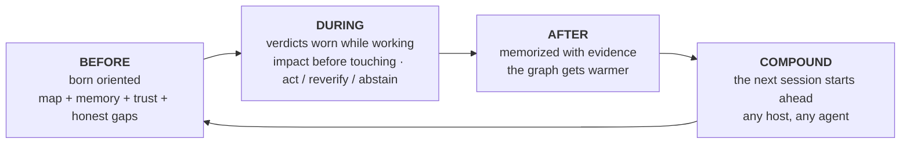

🇬🇧 [English](../README.md) | 🇧🇷 [Português](README.pt-BR.md) | 🇪🇸 [Español](README.es.md) | 🇮🇹 [Italiano](README.it.md) | 🇫🇷 [Français](README.fr.md) | 🇩🇪 [Deutsch](README.de.md) | 🇨🇳 [中文](README.zh.md) | 🇯🇵 [日本語](README.ja.md)

<p align="center">
  
</p>

<h1 align="center">コーディングエージェントのためのオペレーショナルインテリジェンス</h1>

<p align="center">
  <strong>あなたのコーディングエージェントは盲目でのスタートを卒業する。</strong><br/>
  <em>ローカルファースト。MCPネイティブ。エージェントホスト向けのグラフメモリ、トラスト、変更推論。</em>
</p>

<p align="center">
  <a href="https://www.npmjs.com/package/@maxkle1nz/m1nd"></a>
  <a href="https://crates.io/crates/m1nd-mcp"></a>
  <a href="https://github.com/maxkle1nz/m1nd/actions"></a>
  <a href="../LICENSE"></a>
  <a href="https://registry.modelcontextprotocol.io/?search=io.github.maxkle1nz/m1nd"></a>
  <a href="https://glama.ai/mcp/servers/maxkle1nz/m1nd"></a>
  <a href="https://docs.rs/m1nd-core"></a>
</p>

<p align="center">
  <a href="https://github.com/openai/codex"></a>
  <a href="https://claude.ai/download"></a>
  <a href="https://cursor.sh"></a>
  <a href="https://codeium.com/windsurf"></a>
  <a href="https://github.com/features/copilot"></a>
  <a href="https://zed.dev"></a>
  <a href="https://github.com/cline/cline"></a>
  <a href="https://roocode.com"></a>
  <a href="https://github.com/continuedev/continue"></a>
  <a href="https://opencode.ai"></a>
  <a href="https://aistudio.google.com"></a>
  <a href="https://aws.amazon.com/q/developer"></a>
</p>

---

**m1nd はあなたのコーディングエージェントを包むシェルだ——エージェントがその中で生きる操作ループ：行動する前に方向づけられ、働いている間は誠実なバーディクトを身につけ、終えた後には証拠つきのメモリを残し、セッションをまたいで複利していく。**

<p align="center">
  
</p>

<p align="center"><em>ある実際のセッション——ライブのオーナーからキャプチャ（<code>m1nd-mcp 1.3.0</code>、このリポジトリ上の 6,453 ノードのグラフ）：<code>north</code> はトラスト + 誠実なギャップでエージェントにブリーフィングし、<code>seek</code> は自信ありげな推測ではなく <code>reverify</code> のバーディクトを身につけて答え、<code>memorize</code> は発見をコードに固定して書き戻す。</em></p>

<p align="center"></p>

> `grep` はテキストを見つける。ベクトル検索は類似チャンクを見つける。`m1nd` はエージェントに、何が繋がっていて、何が変わって、何が壊れて、何がドリフトして、どこから再開すべきかを示すローカルグラフを与える。

## 60秒で始める

3つのコマンド。1つ目は runtime が見えていることを証明し、2つ目はあなたのホストの正確な配線を出力し、3つ目はあなたのエージェントのもの——もう二度と手で呼ぶことはない。

```bash
# 1 · runtime がインストールされ見えていることを確認する（ビルド不要、設定不要）
npx -y @maxkle1nz/m1nd doctor
#    → JSON のバーディクトを出力：runtime 発見 + バージョン、なければ正確な修正方法
```

```bash
# 2 · あなたのホストの配線を出力する（claude · codex · gemini · cursor · cline · …）
npx -y @maxkle1nz/m1nd hosts plan --host claude --project .
#    → dry-run：貼り付ける MCP 設定 JSON + session-start フック——何も書き込まない
```

```jsonc
// 3 · これ以降はあなたの AGENT が運転する——各セッションの最初の一手は1回の呼び出し:
north({ "agent_id": "dev", "task": "harden the JWT auth token validation flow" })
//    → 1つのパケット：binding のトラスト · フォーカスノード + アンカー · 過去のメモリ · honest_gaps
```

本気で配線する準備はできた？（skills + MCP 設定、すべてのホスト）→ [クイックスタート](#クイックスタート)。エージェントから自己インストール？→ [`llms-install.md`](../llms-install.md)。

## m1nd とは：エージェントを包むシェル

*m1nd はあなたのコーディングエージェントをループで包む：行動する前に方向づけ、働いている間は誠実に保ち、終えたときに学んだことを覚えておく。*

- **エージェントで作る人なら** — 新しく学ぶことは何もない：一度インストールして、いつも通りエージェントと話し続けるだけ。エージェントは当て推量をやめ、記憶し始め、「わからない」が真実のときはそう言うようになる。
- **エンジニアなら** — MCP サーバーの背後にあるローカルファーストの Rust グラフエンジン：因果コードグラフ（構造・意味・時間・因果のエッジ）、コンフォーマルにキャリブレーションされたバーディクト、プロヴェナンスつきでコードノードに固定されたメモリ。何一つあなたのマシンから出ていかない。

実際のコードベースで働くエージェントが失敗するのは、検索できないからではない——操作モデルを持っていないからだ。毎セッションゼロからコンテキストを再構築し、爆発半径を知らずに編集し、「何もない」という空の結果と「間違ったリポジトリ」という空の結果を区別できない。m1nd はエージェントにコードベースの永続モデルを与える——拡散活性化と Hebbian 可塑性を持つ因果グラフ——そしてエージェントのループ全体をその周りに巻きつける。ここにある機能はカタログではない；このシェルのステーションだ：


```mermaid
flowchart LR
    B["<b>BEFORE</b><br/>born oriented<br/>map + memory + trust + honest gaps"]
    D["<b>DURING</b><br/>verdicts worn while working<br/>impact before touching · act / reverify / abstain"]
    A["<b>AFTER</b><br/>memorized with evidence<br/>the graph gets warmer"]
    C["<b>COMPOUND</b><br/>the next session starts ahead<br/>any host, any agent"]
    B --> D --> A --> C --> B
```

**m1nd を操作するのはあなたのエージェントであって、あなたではない。** 以下のすべてのツールはエージェント自身が呼び出す——働く前と後に、自動的に。通常の使用で人間がそれらを実行することはない；一度インストールしたら（[クイックスタート](#クイックスタート)）、いつも通りエージェントと話し続けるだけだ。

**一つのシェル、三種類の読者。** 同じ方向づけパケットが、これから行動する者のためにレンダリングされる：**メインエージェント**はそれを `north` として読む（出荷済み——下のフロントドア）；**サブエージェント**はそれを Delegation Packet として受け取ることになる——スポーン仕様の検索半分だ（設計済み——[docs/NEXTGEN-AGENT-PRD.md](../docs/NEXTGEN-AGENT-PRD.md)、§O.12）；**人間**はそれを Living Tree 上の Pre-Flight Card として見ることになる——メモリの付箋が貼られたナビゲート可能なツリーとしてのあなたのプロジェクトで、編集が着地する前にエージェントが何を検証し何を推測したかを示す（設計済み、開発中——[docs/HUMAN-LAYER-PRD.md](../docs/HUMAN-LAYER-PRD.md)）。一つの真実、一度だけ計算される。

<p align="center"></p>

<p align="center">
  
</p>

### メッセージを送ると何が起きるか

あなたはエージェントに何かの修正を頼む。シェルはそのメッセージの周りでこう動く：

1. **エージェントが行動する前に**、m1nd はプロジェクトの生きた地図、過去のセッションが学んだこと、各情報をどれだけ信頼すべきか——そして m1nd が*知らない*ことを手渡す（`north`）。
2. **働いている間**、エージェントはバーディクトを身につける：コードに触れる*前に*編集が何を壊すかを確認し（`impact`）、証拠が薄いところでは自信ありげな推測の代わりに誠実な「わからない」を受け取る（`abstain`）。
3. 二つのコードがなぜ繋がっているのかを尋ね、答えが推測に依存しているときには警告され（`why`）、アーキテクチャの境界を越える前にはアラートを受ける（`xray_gate`）。
4. **終えたとき**、その決定は裏づけとなる証拠とともに書き留められる（`memorize`）。
5. そのメモリは実コードに固定されている——後でコードが変わったら、メモリは黙って嘘をつく代わりに自分自身を古いものとしてフラグする（`cross_verify`）。
6. **次のセッションは、すでに知った状態で始まる**——どのエージェントでも、どのツールでも：Claude Code、Codex、Cursor、Gemini。一つのエージェントが学んだことを、次のエージェントが継承する。

## BEFORE — 方向づけられて生まれる

*あなたのエージェントは、毎セッションをプロジェクトをすでに知った状態で始める——そして自分が知らないことも知っている。*

<p align="center"></p>

MCP セッション内では、フロントドアは一回の呼び出しだ——`north(task)` はトラスト、タスクコンテキスト（focus ノード + PageRank アンカー）、以前のクロスセッションメモリ、十分性シグナル、一つの `next_move`、そして `honest_gaps`（m1nd が*まだ*知らないこと）を、いかなるクエリよりも先に一つのパケットに合成する：

```jsonc
{"method":"tools/call","params":{"name":"north",
  "arguments":{"agent_id":"dev","task":"harden the JWT auth token validation flow"}}}
```

レスポンスは一つの方向づけパケット——トラスト判定、前のセッションが残したメモリ、そして誠実なギャップのリスト。`main` バイナリからの実際のキャプチャ、軽くトリム済み：

```jsonc
{
  "binding": { "trust_mode": "full_trust", "ok": true },      // verdict before retrieval
  "memory": [                                                 // recalled from a PRIOR session
    { "claim": "AuthTokenFlow", "source_agent": "authbot", "age_ms": 221, "stale": false }
    // …other claims from the same authored note, trimmed…
  ],
  "sufficiency": { "state": "gathering", "top_score": 0.64,
    "why": "the strongest match left out still scores 0.30 — relevant context did not fit …" },
  "next_move": "Call `surgical_context` on the top focus node to ground the task before editing.",
  "honest_gaps": []                                           // nothing withheld on this graph
}
```

`north` は `trust_selftest` + `orient` + `boot_memory` + `focus` を合成する——エージェントが個々の部品に直接手を伸ばすのは、まさに一つだけが必要なときだけだ。`focus` はこのステーションのアテンションランタイム：ゴールに対する最小限で予算に制限された作業セットを、切り捨てたものの誠実なテールと、それが*十分な*コンテキストかどうかのシグナルとともに渡す。`needs_ingest` は空のグラフに対する本物の答えだ。

`north` が `needs: "needs_ingest"` を報告した場合、または L1GHT リコール合成のない 1.2.1 以前のバイナリを使っている場合、エージェントは明示的なトラストループにフォールバックする——検索結果を信じる*前に*トラストを確立する：

```jsonc
// 0. Trust the binding in one call (verdict before retrieval)
{"method":"tools/call","params":{"name":"trust_selftest","arguments":{"agent_id":"dev"}}}

// 1. If the verdict is not full_trust, ask for the deterministic recovery path
{"method":"tools/call","params":{"name":"recovery_playbook","arguments":{"agent_id":"dev"}}}

// 2. Build graph truth
{"method":"tools/call","params":{"name":"ingest","arguments":{"path":"/your/project","agent_id":"dev"}}}

// 3. Ask a structural question — empty results say *why*, never just "no results"
{"method":"tools/call","params":{"name":"activate","arguments":{"query":"authentication flow","agent_id":"dev"}}}
```

**初回セッションループ、四ステップで：** `north`（または `trust_selftest` → `ingest`）→ `seek`/`audit` → `memorize` で永続的な発見を残し、次のセッションを先行スタートさせる。

## DURING — 働きながら身につけるバーディクト

*働いている間、すべての答えはどれだけ信頼すべきかとともに届く——そして「わからない」は本物の答えだ。*

<p align="center"></p>

エージェントは m1nd に問い合わせるのではなく、身にまとう。作業中のすべての答えは、感覚ではなくキャリブレーションされたバーディクトだ：

- **触れる前の `impact`** は、読んでいなかった爆発半径を見せる；`ghost_edges` は import 関係がないのに常に一緒に変更されるファイルを浮かび上がらせる。
- **`why` は `closure` 判定を運ぶ** — `blocked` は、パスが未解決または推測されたエッジに依存していることを意味する：そのパスに頼る前に、そのエッジを検証すること。
- **`predict` はコンフォーマルにキャリブレーションされている** — `calibrate_predict` がリポジトリごとのゲートを起動する；その後、判定は `act` / `reverify` / `abstain` を読み、`abstain` は*キャリブレーションされていないか不十分*を意味する——弱い「イエス」ではなく、止まれというシグナルだ。ダークで出荷される：キャリブレーションするまで、判定は `reverify` で頭打ちになる。共変更の結合は生のコミット数ではなく平滑化 Jaccard で正規化される（キャリブレーションで +3 ポイントが実証済み）。*注意：*`predict` は `ghost_edges` が git 共変更マトリクスをロードするまで構造的フォールバックのみ——本当の共変更可能性が必要なら先に実行すること。
- **`xray_gate` はアーキテクチャの境界を守る** — 編集の前に呼ばれ、「この変更は禁止されたモジュール境界を越えるか？」に `clear` / `caution` / `blocked` で答える；ブロックできるのは批准されたマニフェストだけだ（ガードレール疲労対策）。
- **Mission Control は証明の規律** — `mission_next` はちょうど一つのアクションと `do_not` ガードレールを返す；`bug_hunt` モードではクローズ前に最終の直接スイープが要求され、エージェントが負の空間を確認するようにする。

同じ誠実さが検索にも乗っている。`seek` のヒットは `sufficiency` の読みと `trust_envelope` を運ぶ——そしてエンベロープにまだ計測されたキャリブレーション行がないとき、誇張する代わりに自らの判定に上限をかける。実際のキャプチャ、トリム済み（先頭のヒットは前のセッションが著述したメモリ）：

```jsonc
{
  "results": [
    { "label": "AuthTokenFlow", "source_agent": "authbot", "authored_ms_ago": 101161, "score": 0.48 }
    // …code-node hits, trimmed…
  ],
  "sufficiency": { "state": "gathering", "top_score": 0.48,
    "why": "the strongest match left out still scores 0.25 — relevant context did not fit …" },
  "trust_envelope": {
    "calibrated": false,               // no calibration row measured
    "verdict": "reverify",             // …so the verdict is capped below `act`
    "next_repair_call": "trust_selftest"
  }
}
```

<p align="center"></p>

## AFTER — グラフが温まっていく

*仕事が着地したとき、学んだことは裏づけの証拠とともに書き留められる——そしてコードが先に進んでも誠実であり続ける。*

<p align="center"></p>

ほとんどのツールはエージェントにより良い*検索*を与える。このステーションでは、エージェントが**永続的で機械可読な知識を著述**し、その知識はセッションをまたいで複利し、コードに対して誠実であり続ける。L1GHT は著述された知識をグラフネイティブな構造に変換し、引用しているコードが変更されると自動でフラグを立てる——高確信度の主張はより多くの活性化を伝播する。

1. **結論を出す** — エージェントが永続的なもの（決定、検証済みの発見、コードがそうなっている理由）に到達し、構造化された主張と `evidence` パスを持って `memorize` を呼ぶ。

```jsonc
memorize({
  "agent_id": "authbot",
  "node_label": "AuthTokenFlow",
  "claims": [
    { "label": "TokenValidator",
      "text": "TokenValidator validates JWTs via HMAC — rotate keys via KMS only",
      "confidence": "high", "evidence": ["src/auth/token.rs"] }
  ]
})
```

呼び出しは着地の証明を返す——これは実際にキャプチャされたレスポンス、トリム済み：

```jsonc
{
  "ok": true,
  "claims_written": 1,
  "light_evidence_resolved": 1, "light_evidence_unresolved": 0,   // the evidence path bound to a real code node
  "path": ".../agent-memory/authtokenflow.light.md",
  "next_action": "Memory anchored to code and will auto-load next session; cross_verify(check:[\"evidence_freshness\"]) flags it if the cited code changes."
}
```

2. **固定する** — m1nd は `<runtime>/agent-memory/` 下にグラフネイティブな `.light.md` を書き、インジェストし（`adapter=light mode=merge`）、`grounded_in` エッジで各 `evidence` パスを実際のコードノードに解決する——知識がコードと同じ活性化空間に存在し、`seek` / `activate` / `impact` でサーフェスされるようになる。
3. **自動ロード** — すべての将来のセッション開始時に、`m1nd` は `agent-memory/` を自動的にインジェストし、`session_handshake.agent_memory` で報告する。過去の発見は `mode=replace` インジェストを生き延び、ただそこに*存在する*。
4. **古さの自己フラグ立て** — `cross_verify(check: ["evidence_freshness"])` はすべての引用ファイルを再ハッシュし、コードが変更されたために古くなった主張を名指しする——だからメモリは、誤解させるのではなく、嘘をつくときに教えてくれる。メモリはプロヴェナンスの背骨を持つ：主張は本物の経過時間 + 著者を表明し、古い主張を上書きし、時とともに失効し、リーセンシー上限を尊重する——記憶された知識は、静かに古びていくのではなく、自分自身のフレッシュネスを表明する。

このループはエンドツーエンドでライブ実証されている：`memorize` → `grounded_in` エッジ → 編集されたファイルのフレッシュネスフラグ → `mode=replace` を生き延びる → 起動時の自動ロード。有界ミッションを閉じるとき？`write_light_memory: true` を `mission_close` に渡すと、その検証済みの主張を同じ方法で永続化できる。

**COMPOUND — 次のセッションは温まったシェルの中で生まれる。** そのプロセスを殺し、同じランタイムに対して**新しい**プロセスを起動すると、その最初の `north(task)` はすでに前のセッションの主張を運んでいる——これは実際にキャプチャされたやりとり（上の二つの呼び出しは別々のプロセスで実行された）、トリム済み：

```jsonc
// north.memory, from a process that never called memorize itself:
"memory": [
  { "claim": "AuthTokenFlow",                   "source_agent": "authbot", "age_ms": 221, "stale": false },
  { "claim": "𝔻 evidence: src/auth/token.rs",   "source_agent": "authbot", "age_ms": 221, "stale": false },
  { "claim": "⍂ entity: TokenValidator",        "source_agent": "authbot", "age_ms": 221, "stale": false },
  { "claim": "𝔻 confidence: high",              "source_agent": "authbot", "age_ms": 221, "stale": false }
  // …the authored-note file node, trimmed…
]
```

`source_agent` は誰が著述したかを名指しし、`stale` は引用されたコードを再チェックする——次のセッションは知識を*そのプロヴェナンスごと*継承する。裸の文字列ではない。

### 一つのグラフ、多数のエージェント

<p align="center"></p>

下のクイックスタートはホストごとに stdio サーバーを接続する——一つのエージェントには十分だが、各プロセスは自身のグラフをロードし、自身のリースを保持する。m1nd が本来向けて作られているデプロイは、一人のオーナーと多数のアタッチされたエージェントだ。一つのオーナープロセスがライブグラフを保持する：

```bash
m1nd-mcp --serve --no-gui --port 1337 --runtime-dir /your/project/.m1nd
```

その後、各エージェントは薄い stdio↔HTTP ブリッジとしてアタッチする——グラフを**一切**ロードせず、エンジンを構築せず、リースを**一切**取らない：

```bash
m1nd-mcp --attach http://127.0.0.1:1337 --stdio    # or set M1ND_ATTACH_URL and omit the flag
```

任意の数のブリッジが一つのオーナーを指し、その単一のライブグラフを共有する。だから、あるエージェントが `memorize` したものを別のエージェントが即座にリコールする——再インジェストなし、エージェントごとのコピーなし。クエリは localhost を経由するので、ローカルファーストを保つ（`--bind 0.0.0.0` をオプトインしない限り、bind は `127.0.0.1` のままだ）。ブリッジ越しのウォームな `seek` は、一台のマシンの小さなグラフで ≈0.7ms を計測した——桁のオーダーであり、保証ではない：アタッチは localhost のラウンドトリップを加え、レイテンシはグラフサイズと負荷に応じてスケールする。

## 素材：誠実さ

*シェル全体が一つの素材でできている——m1nd はエージェントに推測させるくらいなら、「これを信頼するな」と告げるほうを選ぶ。*

これは m1nd が行う最も防御力の高いことであり、競合他社は誰も提供していない。教義：**信頼性は誠実さから来る、常に勝つことからではない。** 誠実な*ノー*は自信ありげな推測に勝る——上のすべてのステーションはこの素材でできている。

- **`trust_selftest`** は検索*前*に判定を返す：`full_trust`、`needs_ingest`、`wrong_workspace_binding`、`stale_binding_suspected`、または `degraded_host_tool_surface`。エージェントは進むべきか、インジェストすべきか、再バインドすべきか、フォールバックすべきかを知る。
- **`agent_runtime_contract`** はすべての検索レスポンスに乗り、`trust_mode` を運ぶ。空の結果は明確に区別される——間違ったリポジトリにバインドされているのか、本当に何もないのか——「結果なし」として静かに報告されることはない。
- **`trust_band: insufficient_evidence` は証拠ゼロを意味する——中リスクではない。** 誠実なコールドスタートの答えであり、低／中／高とは別物だ。
- **`non_claims` 配列** はすべてのミッションツールに付く。m1nd はエージェントに何を*証明していない*かを伝える。
- **`mission_verify` は「ノー」と言える——そして、テストされたコードで実際にそうする。** グラフのみの証拠を拒否する：ファイル読み取り、テスト実行、またはランタイムプローブなしには主張をクローズできない。テストは文字通り `graph_only_evidence_is_not_enough` という名前だ。
- **`recovery_playbook`** はバインディングを修復するための決定論的な順序付きステップリストを返す。

語るのではなく、見せる。バインドされていないランタイムで `trust_selftest` を呼ぶと、判定そのものが修復指示になる——実際のキャプチャ、トリム済み：

```jsonc
{
  "ok": false,
  "status": "blocked",
  "verdict": "needs_ingest",          // not "no results" — it says why
  "next_action": "call_ingest",
  "checks": { "graph_populated": false, "needs_ingest": true, "recovery_playbook_attached": true },
  "recovery_playbook": {
    "recovery_goal": "Populate this binding's active graph for the intended repository.",
    "steps": [ { "action": "Call ingest for the intended repository on this same binding." } /* …trimmed… */ ]
  }
}
```

この約束の証明は、そのために犠牲にしたもの：`savings` と `resonate` は beta.7 で公告サーフェスから削除された、なぜなら常に勝つと主張するツールは信頼できないからだ。競合他社——mem0、Zep、Letta、Sourcegraph、またはいかなるコードグラフ MCP も——エージェントに何を*信頼しないべきか*そして回復方法を伝えるレイヤーを提供していない。

<p align="center"></p>

**フィールドトリアージのループはそれ自身の上で閉じる。** エージェントが `~/.m1nd/field-reports.jsonl` に残すセッションテレメトリ（ローカル限定——m1nd は決して外部に通信しない）は受動的なログではない：レポートはトリアージされ、*確認された*フィールドバグは修正の**前に**赤いバッテリーケースになる——だからリグレッションは記述されるだけでなく、証明される。そのループはすでに完全なフィールドトリアージスイープでエンドツーエンドに回った：四つのフィールド報告バグが失敗するバッテリーケースになり、その後マージされた修正になり、すべて **1.2.1** で出荷された——`north` はいまや L1GHT リコールをそのメモリパケットに合成し、`temp` グラフのセンチネルは作業ディレクトリを散らかす代わりに本物の tempdir に解決され、`memorize` は数値の `confidence` を受け入れ、クロージャの曖昧さタグは本物の引き分けでのみ発火するようになった（オオカミ少年：ambiguous-blocked は 9/11 → 0/11 に低下）。

## クイックスタート

*一度インストールし、エージェントのホストを接続したら、あとは道を譲る——ここから先は、あなたのエージェントが運転する。*

```bash
git clone https://github.com/maxkle1nz/m1nd.git && cd m1nd
npm install -g .
m1nd doctor
```

次にホストを接続する——ホストごとに同じ二つのコマンド（`codex`、`claude`、`gemini`、`antigravity`、`generic`）：

| ホスト | エージェントパックをインストール | MCP 設定を接続 |
|---|---|---|
| Codex | `m1nd install-skills codex` | `m1nd mcp-config codex --project /your/project` |
| Claude Code | `m1nd install-skills claude --project /your/project` | `m1nd mcp-config claude --project /your/project` |
| Gemini | `m1nd install-skills gemini --project /your/project` | `m1nd mcp-config gemini --project /your/project` |
| Antigravity | `m1nd install-skills antigravity --project /your/project` | `m1nd mcp-config antigravity --project /your/project` |
| Generic | `m1nd install-skills generic --project /your/project` | `m1nd mcp-config generic --project /your/project` |

または npm から：`npm install -g @maxkle1nz/m1nd`。`install-skills` が届けるのはエージェントパック——五つの命名されたプロトコルとしての操作ループそのものであり、装飾的なドキュメントではない。

**オペレーターのサーフェスはこの CLI；エージェントのサーフェスは MCP。** 人間が時折実行するのは `m1nd doctor`、`install-skills`、`mcp-config`——残りすべてはエージェントが実行する。`north` を呼べるライブ MCP セッションがないとき（古くなっている、間違ったリポジトリにバインドされている、まだロードされていない）のために、ホスト中立のエスケープハッチが一つ存在する：独立したランタイムを起動し、リポジトリにバインドし、スコープを定め、トラストを確立し、必要に応じてインジェストし、アンカーを返し、直接証明へとハンドオフする、機械可読な単一のエンベロープを返す：

```bash
m1nd agent first-minute --repo /your/project --query "understand this system" --json
```

必要ならバイナリを固定できる：`--version` は `1.2.x (<sha>)` を印字し、`M1ND_EXPECTED_VERSION` / `M1ND_EXPECTED_SHA`（+ `M1ND_STRICT_VERSION`）により、ホストはドリフトしたバイナリを検出して拒否できる。

完全なインストールマップ、ホストパック、ネイティブランタイムビルド、更新フラグ：[docs/AGENT-PACKS.md](../docs/AGENT-PACKS.md) · クライアント別セットアップ：[統合マトリクス](../docs/IDE-INTEGRATIONS.md)。

## 証拠

<p align="center"></p>

各行は正確に測定されたものにヘッジされている。m1nd は節約や ROI の数値を先頭に置かない——それこそが要点だ。

| 主張 | 結果 | ソース／ヘッジ |
|---|---|---|
| `activate` / `impact` レイテンシ | 1K ノード合成グラフで `activate` ~1µs、`impact` サブマイクロ秒 | Criterion ベンチマーク——**自分で再現せよ：`cargo bench -p m1nd-core`**（Apple シリコン Mac で `activate_1k_nodes` ≈1.4µs、`impact_depth3` ≈0.5µs を計測）；[方法論](https://m1nd.world/wiki/benchmarks.html)；桁のオーダー、ハードウェア依存。 |
| 言語マトリクス | 10 言語の calls + クロスファイル imports（+ Ruby クロスファイル） | 単一のポリグロットインジェストでエンドツーエンド検証；言語ごとのテストは `m1nd-ingest` にある。[言語カバレッジ](#言語カバレッジ)参照。 |
| 書き込み後検証サンプル | 12/12 を正しく分類 | 内部ランタイムチェック。 |
| シードされたバグハント | 最初に受け入れられた `humanize` シード欠陥ラウンドで 16/20（m1nd 訓練済み）；`m1nd-basic` と直接はそれぞれ 8/15 | 内部製品証拠、`public_claim_worthy=false`——ユニバーサルベンチマークではない。 |
| メモリの自己検証 | エンドツーエンドでライブ実証済み | `memorize` → `grounded_in` → 編集されたファイルのフレッシュネスフラグ → replace を生き延びる → 起動時の自動ロード。 |
| ケイパビリティバッテリー vs grep | 37/37 パス；直接対決 16 m1nd 勝ち / 12 引き分け / **0 grep 勝ち** | リポジトリ内ハーネス `scratchpad/m1nd_battery.py`（37 ケース、フレッシュインジェスト + グラウンドトゥルース PASS/FAIL + `rg` 直接対決）。**再現：`python3 scratchpad/m1nd_battery.py ./target/release/m1nd-mcp . --suite m1nd`。** ヘッジ：一つのリポジトリ（m1nd 自身）、自己著述のケース；引き分けのうち約 5 件は、答えを表現できないリテラル grep プロキシに対してスコアされた構造ツールだ。 |
| コンフォーマルキャリブレーション（`predict`） | act バンド ≈32% 精度 @ ≈13.5% カバレッジ（α=0.10） | m1nd 自身の git 履歴上（n≈9.2k のホールドアウト予測）、平滑化 Jaccard 変更後に生の数え上げに対して +3pts。ヘッジ：一つのリポジトリ、粗い数え上げベースのシグナル——ゲートは今日ほとんど棄権する、**設計どおりに**：棄権は弱いシグナルの誠実な出力であって、失敗ではない。 |

<details>
<summary><strong>さらなるビジュアル — 完全なメカニズムシリーズ</strong></summary>
<br/>
<p align="center">
  
  
</p>
<p align="center">
  
  
</p>
</details>

## 制限事項

`m1nd` は LSP、コンパイラ、テストランナー、セキュリティスキャナー、オブザーバビリティスタックを補完するものであり、置き換えるものではない。検索、レビュー、変更の前、そしてドキュメント、影響、または継続性が重要なときに最も有用だ。

以下の場合は**有用性が低い**：

- 正確なテキスト検索で既に質問に答えられる場合
- コンパイラまたはランタイムの真実だけが必要な場合
- 構造的な不確実性のない単純なローカルファイル操作の場合

**フィーディングが必要：** `trust` と `tremor` は `learn` フィードバック / `ghost_edges` データが蓄積されるまで中立的な事前分布から始まり、`predict` はその共変更シグナルが意味を持つ前にまず `ghost_edges` のロードが必要だ。これらは使うほど改善する；起動時に情報がないことについて誠実だ。

## m1nd ではないもの

`m1nd` は単なる：

- より大きなインデックスを持つコード検索ツールではない
- ファイルやチャンクを取得するだけのリポジトリ RAG レイヤーではない
- ワークフローの決定をクライアントに任せるグラフデータベースではない
- コンパイラ、テスト、またはセキュリティツールの代替となる静的解析ツールではない
- 無関係なユーティリティの MCP バンドルではない
- 人間が学ばなければならないツールサーフェスではない——動詞はエージェントのもの；あなたのものは小さな[セットアップ CLI](#クイックスタート)だ

それらのサーフェスをエージェントが推論し行動できる運用システムに変えるレイヤーこそが m1nd だ。単一ファイルの検索、単純な grep、コンパイラの真実には向かない——そこでは普通のツールを使え。

## 言語カバレッジ

グラフ推論（`impact`、`why`、`predict`、`trace`、`taint_trace`）はエクストラクターの品質に依存する。m1nd は言語ごとに **`calls` エッジ**（コールグラフ）と**クロスファイル `imports`**（ファイル→ファイルの依存解決）の両方を解決する。以下のマトリクスは単一のポリグロットインジェストでライブ実証された：

| 言語 | `calls` | クロスファイル imports |
|---|:---:|:---:|
| Rust | ✅ | ✅ (`mod`/`use crate::`) |
| Python | ✅ | ✅ |
| JavaScript / TypeScript | ✅ | ✅ |
| Go | ✅ | ✅（パッケージ） |
| Java | ✅ | ✅（FQCN + ワイルドカード） |
| C / C++ | ✅ | ✅ (`#include "..."`) |
| Kotlin | ✅ | ✅（パッケージ） |
| PHP | ✅ | ✅（PSR-4） |
| Scala | ✅ | ✅（パッケージ） |
| Ruby | ⏳ | ✅ (`require_relative`) |
| C# | ✅ | —（名前空間はファイルに 1:1 でマップされない） |
| Swift | ✅ | — |

すべての ✅ 行はエンドツーエンドで検証されている（`caller`→`callee` の import が解決され、呼び出し元がコールエッジを発する）。他の言語はジェネリックエクストラクター（`contains` のみ）にフォールバックする。解決できない import（外部パッケージ、gem、stdlib、システムヘッダー）は、推測せず誠実に未解決のままにされる。

## アーキテクチャ概観

三つのコア Rust クレートと一つの補助ブリッジ：

- **`m1nd-mcp`** — MCP サーバーと運用ランタイムサーフェス。
- **`m1nd-core`** — グラフエンジン：拡散活性化、Hebbian 可塑性、CSR 隣接、git 由来のゴーストエッジを処理する `WavefrontEngine`。
- **`m1nd-ingest`** — 抽出、ルーティング、グラフ構築アダプター（コード、ユニバーサルドキュメント、L1GHT）。
- **`m1nd-openclaw`** — 補助 OpenClaw ブリッジ（Unix ソケットレーン、独立バージョニング）。

現在のクレートバージョン：`m1nd-core`、`m1nd-ingest`、`m1nd-mcp` はすべて `1.2.0`（`m1nd-openclaw` は `0.1.0` で独立にバージョニングされている）。

<p align="center">
  
</p>

ライブ MCP サーフェスはリリースとともに進化する——使用中のビルドにおける正確なツール数と名前は `tools/list` で確認すること。**コアメニュー：** デフォルトでは約 15 のツールが公告される——オーナーが批准したコアに、ホストバインディングの基盤を加えたもの。6 週間の実測トラフィックで、公告 141 に対し実際に呼ばれたのは 13 だったためである。`M1ND_TOOL_TIER=full` を設定するとレジストリ全体（140 以上のツール：RETROBUILDER、perspectives、federation、daemon）が公告される。何も削除されていない：隠されたツールは `tools/call` で名前を指定すればそのまま呼び出せ、`help` はどのティアでもレジストリ全体をカタログ化して説明する——それが入口である。ツールごとのカタログはこの README には載っていない：深掘りは[公式 wiki](https://m1nd.world/wiki/)、[docs/AGENT-PACKS.md](../docs/AGENT-PACKS.md)、[EXAMPLES.md](../EXAMPLES.md) を、リリース履歴は [CHANGELOG.md](../CHANGELOG.md) を参照。

## コントリビューション

エクストラクターとアダプター、MCP/ランタイムツール、ベンチマーク、ドキュメント、グラフアルゴリズムにわたるコントリビューションを歓迎する。[CONTRIBUTING.md](../CONTRIBUTING.md) を参照。

## ライセンス

MIT。[LICENSE](../LICENSE) 参照。
