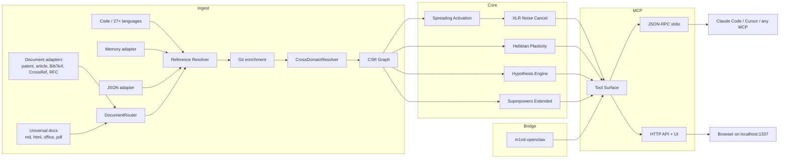

🇬🇧 [English](../README.md) | 🇧🇷 [Português](README.pt-BR.md) | 🇪🇸 [Español](README.es.md) | 🇮🇹 [Italiano](README.it.md) | 🇫🇷 [Français](README.fr.md) | 🇩🇪 [Deutsch](README.de.md) | 🇨🇳 [中文](README.zh.md) | 🇯🇵 [日本語](README.ja.md)

<p align="center">
  
</p>

<h3 align="center">Feito primeiro para agentes. Humanos são bem-vindos.</h3>

<p align="center">
  <strong>Antes de mudar código, veja o que quebra.</strong><br/>
  <strong>Pergunte algo ao codebase. Receba o mapa, não o labirinto.</strong><br/><br/>
  m1nd entrega inteligência estrutural para agentes de código antes que eles se percam em loops de grep e leitura. Ingerir o codebase uma vez, transformá-lo em um grafo e deixar o agente perguntar o que realmente importa: o que quebra se isso mudar, o que mais se move com isso e o que deve ser verificado em seguida.<br/>
  <em>Execução local. MCP sobre stdio. Superfície HTTP/UI opcional no build padrão atual.</em>
</p>

<p align="center">
  <strong>Baseado no código atual, nos testes atuais e nas superfícies de ferramentas já entregues.</strong>
</p>

<p align="center">
  
</p>

<p align="center">
  <a href="https://crates.io/crates/m1nd-core"></a>
  <a href="https://github.com/maxkle1nz/m1nd/actions"></a>
  <a href="../LICENSE"></a>
  <a href="https://docs.rs/m1nd-core"></a>
</p>

<p align="center">
  <a href="#identidade">Identidade</a> &middot;
  <a href="#o-que-m1nd-faz">O Que m1nd Faz</a> &middot;
  <a href="#in%C3%ADcio-r%C3%A1pido">Início Rápido</a> &middot;
  <a href="#configure-seu-agente">Configure Seu Agente</a> &middot;
  <a href="#resultados-e-medi%C3%A7%C3%B5es">Resultados</a> &middot;
  <a href="#superf%C3%ADcie-de-ferramentas">Ferramentas</a> &middot;
  <a href="https://github.com/maxkle1nz/m1nd/wiki">Wiki</a> &middot;
  <a href="../EXAMPLES.md">Exemplos</a>
</p>

<h4 align="center">Funciona com qualquer cliente MCP</h4>

<p align="center">
  <a href="https://claude.ai/download"></a>
  <a href="https://cursor.sh"></a>
  <a href="https://codeium.com/windsurf"></a>
  <a href="https://github.com/features/copilot"></a>
  <a href="https://zed.dev"></a>
  <a href="https://github.com/cline/cline"></a>
  <a href="https://roocode.com"></a>
  <a href="https://github.com/continuedev/continue"></a>
  <a href="https://opencode.ai"></a>
  <a href="https://aws.amazon.com/q/developer"></a>
</p>

---

<p align="center">
  
</p>

## Identidade

m1nd é inteligência estrutural para agentes de código.

Ingerir o codebase uma vez, transformá-lo em um grafo e deixar o agente fazer perguntas estruturais diretamente.

Antes de uma edição, m1nd ajuda o agente a enxergar blast radius, contexto conectado, co-changes prováveis e o que verificar em seguida — antes que ele desapareça em loops de grep e leitura.

> Pare de pagar a taxa de orientação a cada turno.
>
> `grep` encontra o que você pediu. `m1nd` encontra o que você deixou passar.

## O Que m1nd Faz

m1nd existe para o momento anterior ao agente se perder.

Você ingere o repositório uma vez, transforma tudo em um grafo e para de fazer o agente redescobrir a estrutura a partir de texto cru a cada turno.

Isso significa que ele consegue responder às perguntas que realmente importam:

- o que está relacionado a isso?
- o que quebra se eu mudar isso?
- o que mais provavelmente precisa se mover?
- onde está o contexto conectado para uma edição?
- o que devo verificar depois?

Nos bastidores, o workspace tem três crates core mais um crate ponte auxiliar:

- `m1nd-core`: motor de grafo
- `m1nd-ingest`: caminhada do repositório, extração, resolução de referências e construção do grafo
- `m1nd-mcp`: servidor MCP sobre stdio, além de uma superfície HTTP/UI no build padrão atual
- `m1nd-openclaw`: crate ponte auxiliar para superfícies de integração voltadas ao OpenClaw

O projeto é mais forte em grounding estrutural:

- ingestão de código em grafo, em vez de navegação apenas por busca textual
- resolução de relações entre arquivos, funções, tipos, módulos e vizinhanças do grafo
- exposição desse grafo por meio de ferramentas MCP para navegação, análise de impacto, rastreamento, previsão e fluxos de edição
- mescla de código com markdown ou grafos de memória estruturada quando necessário
- retenção de memória heurística ao longo do tempo, para que o feedback molde a recuperação futura por meio de `learn`, `trust`, `tremor` e sidecars `antibody`
- indicação do motivo pelo qual um resultado foi ranqueado, e não apenas do que correspondeu

Hoje ele já inclui:

- extractors nativos/manuais para Python, TypeScript/JavaScript, Rust, Go e Java
- 22 linguagens adicionais baseadas em tree-sitter nas Tier 1 e Tier 2
- fallback genérico para tipos de arquivo não suportados
- resolução de referências no fluxo de ingestão ao vivo
- enriquecimento de Cargo workspace para repositórios Rust
- ingestão de documentos para patentes (USPTO/EPO XML), artigos científicos (PubMed/JATS), bibliografias BibTeX, metadados DOI da CrossRef e RFCs da IETF — com detecção automática de formato via `DocumentRouter` e resolução de arestas entre domínios
- sinais heurísticos inspecionáveis em rotas de recuperação de nível mais alto, para que `seek` e `predict` possam expor mais do que uma nota bruta
- uma lane documental universal para markdown, HTML/wiki, documentos office e PDFs
- artefatos canônicos locais como `source.<ext>`, `canonical.md`, `canonical.json`, `claims.json` e `metadata.json`
- workflows MCP documentais como `document_resolve`, `document_bindings`, `document_drift`, `document_provider_health` e `auto_ingest_*`

A abrangência de linguagens é ampla, mas a profundidade semântica varia por linguagem. Python e Rust atualmente recebem tratamento mais especializado do que muitas das linguagens apoiadas por tree-sitter.

## Resultados e Medições

Estes são resultados observados nos docs e testes atuais, não marketing de benchmark.

Trate-os como pontos de referência, não como garantias rígidas para qualquer codebase.

Auditoria de estudo de caso em um codebase Python/FastAPI:

| Métrica | Resultado |
|--------|--------|
| Bugs encontrados em uma sessão | 39 (28 corrigidos com confirmação + 9 de alta confiança) |
| Invisíveis para grep | 8 de 28 (28,5%) -- exigiram análise estrutural |
| Precisão das hipóteses | 89% em 10 afirmações ao vivo |
| Conjunto de validação pós-escrita | 12/12 cenários classificados corretamente na amostra documentada |
| Tokens LLM consumidos | 0 -- binário local em Rust |
| Queries do m1nd vs operações de grep | 46 vs ~210 |
| Latência total estimada | ~3,1 segundos vs ~35 minutos estimados |

Microbenchmarks do Criterion registrados na documentação atual:

| Operação | Tempo |
|-----------|------|
| `activate` em 1K nós | **1,36 &micro;s** |
| `impact` com depth=3 | **543 ns** |
| `flow_simulate` com 4 partículas | 552 &micro;s |
| `antibody_scan` com 50 padrões | 2,68 ms |
| `layer_detect` com 500 nós | 862 &micro;s |
| `resonate` com 5 harmônicos | 8,17 &micro;s |

## Início Rápido

Se você quer o caminho mais curto até valor, é este:

```bash
git clone https://github.com/maxkle1nz/m1nd.git
cd m1nd
cargo build --release
./target/release/m1nd-mcp
```

```jsonc
// 1. Ingira sua codebase (910ms para 335 arquivos)
{"method":"tools/call","params":{"name":"ingest","arguments":{"path":"/your/project","agent_id":"dev"}}}
// -> 9,767 nós, 26,557 arestas, PageRank calculado

// 2. Pergunte: "O que está relacionado à autenticação?"
{"method":"tools/call","params":{"name":"activate","arguments":{"query":"authentication","agent_id":"dev"}}}
// -> auth dispara -> se propaga para session, middleware, JWT, model de usuário
//    ghost edges revelam conexões não documentadas

// 3. Diga ao grafo o que foi útil
{"method":"tools/call","params":{"name":"learn","arguments":{"feedback":"correct","node_ids":["file::auth.py","file::middleware.py"],"agent_id":"dev"}}}
// -> 740 arestas fortalecidas via Hebbian LTP. A próxima consulta fica mais inteligente.
```

Adicione ao Claude Code (`~/.claude.json`):

```json
{
  "mcpServers": {
    "m1nd": {
      "command": "/path/to/m1nd-mcp",
      "env": {
        "M1ND_GRAPH_SOURCE": "/tmp/m1nd-graph.json",
        "M1ND_PLASTICITY_STATE": "/tmp/m1nd-plasticity.json"
      }
    }
  }
}
```

Funciona com qualquer cliente MCP que possa se conectar a um servidor MCP: Claude Code, Codex, Cursor, Windsurf, Zed ou o seu próprio.

**Para bases grandes, veja [Deployment & Production Setup](../docs/deployment.md) para executar o m1nd como servidor persistente com ingestão inteligente por namespace e latência quase zero.**

---

## Grafo Primeiro Em Vez De Texto Primeiro

A maioria dos fluxos de trabalho de codificação com IA ainda gasta muito tempo em navegação: grep, glob, leitura de arquivos e recarga repetida de contexto. m1nd adota uma abordagem diferente, pré-computando um grafo e expondo esse grafo via MCP.

Isso muda a forma da pergunta. Em vez de pedir ao modelo que reconstrua a estrutura do repositório a partir de arquivos brutos toda vez, o agente pode perguntar por:

- caminhos de código relacionados
- blast radius
- buracos estruturais
- caminhos do grafo entre nós
- contexto conectado para uma edição

Isso não substitui um LSP, um compilador ou uma suíte completa de análise estática/segurança. Ele dá ao agente um mapa estrutural do repositório para que ele passe menos tempo navegando e mais tempo executando a tarefa.

---

**Funcionou?** [Marque este repositório com estrela](https://github.com/maxkle1nz/m1nd) -- isso ajuda outras pessoas a encontrá-lo.
**Bug ou ideia?** [Abra uma issue](https://github.com/maxkle1nz/m1nd/issues).
**Quer ir mais fundo?** Veja [EXAMPLES.md](../EXAMPLES.md) para pipelines reais.

---

## Configure Seu Agente

m1nd é mais útil quando o agente para de tratar o repositório como uma pilha de arquivos e começa a tratá-lo como um grafo.

**É fundamental estabelecer uma regra estrita no system prompt do seu agente:** a IA deve usar m1nd *antes* de recorrer a ferramentas tradicionais como `grep`, `ls` ou `cat`.

### O que adicionar ao system prompt do seu agente

```text
REGRA CRÍTICA: você tem m1nd disponível via MCP. Você DEVE usar m1nd ANTES de recorrer a ferramentas tradicionais como grep, glob ou leitura de arquivos.
- search(mode="literal") substitui grep — encontra strings exatas com contexto do grafo
  Use `auto_ingest=true` quando `scope` apontar para um caminho real fora das ingest roots atuais. A autoingestão só acontece quando o scope resolve para exatamente um caminho.
- activate substitui glob — encontra código relacionado por significado, não por nome de arquivo
- heuristics_surface explica por que um nó ou arquivo ficou ranqueado como arriscado ou importante
- validate_plan anexa `heuristics_surface_ref` a hotspots e lacunas para que o agente pule direto para a explicação
- surgical_context_v2 substitui Read — retorna source + todos os arquivos conectados em uma chamada, com `heuristic_summary` no arquivo principal e em cada arquivo conectado para trust/tremor/antibody/blast-radius risk
- impact substitui a verificação manual de dependências — mostra o blast radius antes das edições
- apply substitui Edit — escreve código e atualiza o grafo automaticamente
- apply_batch(verify=true) — grava múltiplos arquivos + verificação pós-escrita em 5 camadas
- help() — chame quando não tiver certeza de qual ferramenta usar
```

### Claude Code (`CLAUDE.md`)

Copie e cole isto no `CLAUDE.md` do seu projeto:

```markdown
## Inteligência de Código
m1nd é sua ferramenta primária de navegação de código. Use-a antes de grep/glob/Read.
Ferramentas-chave: search (substitui grep), activate (encontra relacionados), heuristics_surface (por que isso ficou ranqueado?),
surgical_context_v2 (contexto completo + heuristic_summary), impact (blast radius), apply (editar + reingestão),
apply_batch(verify=true) (batch edit + verificação),
help (quando houver dúvida).

Nota de busca: `auto_ingest=true` pode ingerir um scope fora das raízes atuais antes da busca, mas apenas quando o scope resolve para um único caminho. Scopes ambíguos retornam um erro com a lista de candidatos.
```

### Cursor (`.cursorrules`)

Copie e cole isto no `.cursorrules`:

```text
Ao explorar código, use ferramentas MCP do m1nd em vez de grep:
- search para encontrar código
- activate para entender relações
- impact antes de fazer mudanças
```

### Por Que Isso Importa

m1nd é útil quando um agente precisa de contexto ancorado em grafo em vez de loops repetidos de grep, glob e leitura de arquivos. Na sessão de auditoria documentada, ele reduziu a exploração pesada em grep e revelou achados estruturais que a busca textual simples não encontrou.

Em vez de pagar para ler 20.000 linhas de código só para entender como o provider funciona, o agente pergunta ao grafo.

Se o seu agente ainda está abrindo arquivos um por um para reconstruir a estrutura do repositório, ele não está explorando. Está vagando.

Faça do m1nd o primeiro passo obrigatório antes das ferramentas tradicionais.

---

## Onde m1nd Se Encaixa

m1nd é mais útil quando o texto simples deixa de bastar.

Ele ajuda quando um agente precisa de contexto de repositório ancorado em grafo em vez de mais uma rodada de grep, glob e leitura de arquivos:

- estado persistente do grafo em vez de resultados pontuais de busca
- consultas de impacto e vizinhança antes de editar
- investigações salvas entre sessões
- verificações estruturais como teste de hipóteses, remoção contrafactual e inspeção de camadas
- grafos mistos de código + documentação por meio dos adaptadores `memory`, `json` e `light`

Ele não tenta substituir seu LSP, Sourcegraph, CodeQL ou compilador. Ele fica no meio do caminho: mais rápido do que reconstruir a estrutura a partir de texto cru a cada turno, mais leve do que análise estática completa.

## O Que o Torna Diferente

**Ele mantém um grafo persistente, não uma pilha de resultados pontuais de busca.** Caminhos confirmados podem ser reforçados por `learn`, e consultas futuras podem reutilizar essa estrutura em vez de começar do zero.

**Ele coloca afirmações estruturais à prova.** Ferramentas como `hypothesize`, `why`, `impact` e `counterfactual` operam sobre relações do grafo, não apenas sobre correspondências de texto.

**Ele pode mesclar código e documentação no mesmo grafo.** m1nd oferece nove adaptadores de ingestão:

- **`code`** (padrão) — extractors de código em 27+ linguagens e formatos. Constrói o grafo completo de código a partir dos arquivos-fonte.
- **`json`** — descritores de grafo personalizados e importações de dados estruturados.
- **`memory`** — corpus `.md`/`.txt` não estruturado como um grafo de conhecimento leve.
- **`light`** — [Protocolo L1GHT](https://m1nd.world/wiki/l1ght.html): markdown estruturado com frontmatter YAML tipado e marcadores semânticos inline. Transforma specs, decisões de design e bases de conhecimento em nós de grafo de primeira classe com arestas tipadas.
- **`patent`** — USPTO Red Book / Yellow Book e XML EPO DocDB. Analisa claims, descrições, inventores, applicants e códigos de classificação em nós de grafo com arestas de citação.
- **`article`** — PubMed NLM e XML NISO JATS Z39.96. Extrai metadados de artigo, autores (com ORCID quando disponível), abstracts e listas de referências.
- **`bibtex`** / **`bib`** — arquivos de bibliografia `.bib`. Extrai entradas com autor, veículo, ano e DOI, construindo arestas de citação entre entradas.
- **`crossref`** / **`doi`** — JSON da API CrossRef (DOI works endpoint). Ingere metadados DOI estruturados com autor, financiador, licença e links de referência.
- **`rfc`** — XML v3 de RFCs da IETF. Analisa seções, autores, referências e cross-references entre RFCs.

A detecção de formato é automática: `DocumentRouter` inspeciona extensões de arquivo e conteúdo (elementos raiz XML, chaves JSON) para rotear ao adaptador correto. Use `adapter="auto"` ou `adapter="document"` via MCP.

`CrossDomainResolver` mescla múltiplas saídas de adaptadores e descobre conexões entre domínios automaticamente — arestas de identidade DOI, matches por ORCID, autores compartilhados, pontes por palavras-chave e cadeias de citação.

Com `mode: "merge"`, esses grafos podem ser consultados em conjunto. Isso significa que uma consulta pode retornar código, patentes, papers e specs do mesmo grafo.

```text
# Example L1GHT document (any .md file)
---
Protocol: L1GHT/1.0
Node:     AuthService
State:    production
Depends on:
- JWTService
- SessionStore
---

## Token Validation

The [⍂ entity: TokenValidator] runs HMAC-SHA256 checks.
[⟁ depends_on: RedisSessionStore]
[RED blocker: Connection pool not yet tuned for peak load]
```

```python
# Ingest code + specs into a unified graph
ingest({"path": "./src", "adapter": "code", "mode": "replace"})
ingest({"path": "./docs/specs", "adapter": "light", "mode": "merge"})
activate({"query": "auth token refresh"})  # dispara nos dois domínios
```

**Ele expõe mais do que travessia básica.**
- antibody scanning para padrões de bugs conhecidos
- propagação estilo epidemia para risco em vizinhos
- sinais de tremor/trust vindos do histórico de mudanças
- detecção de camadas para violações arquiteturais

**Ele verifica writes em vez de torcer para que tenham funcionado.** `apply_batch(verify=true)` executa múltiplas checagens pós-escrita e retorna um verdict no estilo SAFE / RISKY / BROKEN. Veja [Post-Write Verification](#verificação-pós-escrita).

**Ele pode persistir investigações em vez de descartá-las entre sessões.** `trail.save`, `trail.resume` e `trail.merge` permitem que agentes mantenham e combinem o estado de investigação ancorado no grafo.

**Ele tem uma camada canônica de hot state.** `boot_memory` armazena doutrina/estado pequeno e durável ao lado do grafo sem poluir trails ou transcripts.

## Fluxo Operacional Para Agentes

m1nd é opinativo sobre como agentes devem se mover por um repositório. O bloco interno de `M1ND_INSTRUCTIONS` do servidor define uma coreografia preferida:

- **Início da sessão**: `health -> drift -> ingest`
- **Pesquisa**: `ingest -> activate -> why -> missing -> learn`
- **Mudança de código**: `impact -> predict -> counterfactual -> warmup -> caminho surgical/apply`
- **Navegação com estado**: `perspective.*` e `trail.*`
- **Hot state canônico**: `boot_memory`

Isso importa porque m1nd não é só um endpoint de busca. Ele é uma camada opinativa de operação em grafo para agentes, e funciona melhor quando o grafo vira parte do workflow em vez de recurso de último caso.

## Superfície de Ferramentas

A implementação atual de `tool_schemas()` em [server.rs](https://github.com/maxkle1nz/m1nd/blob/main/m1nd-mcp/src/server.rs) expõe **93 ferramentas MCP**. Esse número pode mudar. As categorias abaixo importam mais, mas a contagem atual está ancorada no registro vivo.

| Categoria | Destaques |
|----------|------------|
| **Base** | ingest, health, activate, impact, why, learn, drift, seek, scan, warmup, federate |
| **Inteligência Documental** | document.resolve, document.bindings, document.drift, document.provider_health, auto_ingest.start/status/tick/stop |
| **Navegação por Perspective** | start, follow, peek, routes, branch, compare, inspect, suggest, affinity |
| **Sistema de Lock** | prende regiões do subgrafo, monitora mudanças, diff do estado travado |
| **Análise de Grafo** | hypothesize, counterfactual, missing, resonate, fingerprint, trace, predict, trails |
| **Análise Estendida** | antibody, flow_simulate, epidemic, tremor, trust, layers, heuristics_surface, validate_plan |
| **Relatórios e Estado** | report, panoramic, savings, persist, boot_memory |
| **Cirúrgico** | surgical_context, surgical_context_v2, view, symbol_splice, apply, edit_preview, edit_commit, apply_batch (+ verify=true) |

<details>
<summary><strong>Base</strong></summary>

| Ferramenta | O que faz | Velocidade |
|------|-------------|-------|
| `ingest` | Faz parsing do codebase em grafo semântico | 910ms / 335 files |
| `activate` | Spreading activation com scoring em 4D | 1.36&micro;s (bench) |
| `impact` | Blast radius de uma mudança de código | 543ns (bench) |
| `why` | Caminho mais curto entre dois nós | 5-6ms |
| `learn` | Feedback hebbiano -- o grafo fica mais inteligente | <1ms |
| `drift` | O que mudou desde a última sessão | 23ms |
| `health` | Diagnósticos do servidor | <1ms |
| `seek` | Encontra código por intenção em linguagem natural | 10-15ms |
| `scan` | 8 padrões estruturais (concorrência, auth, erros...) | 3-5ms cada |
| `warmup` | Prepara o grafo para uma tarefa futura | 82-89ms |
| `federate` | Unifica vários repositórios em um grafo só | 1.3s / 2 repos |
</details>

<details>
<summary><strong>Navegação por Perspective</strong></summary>

| Ferramenta | O que faz |
|------|---------|
| `perspective.start` | Abre uma perspective ancorada em um nó |
| `perspective.routes` | Lista rotas disponíveis a partir do foco atual |
| `perspective.follow` | Move o foco para um alvo de rota |
| `perspective.back` | Navega para trás |
| `perspective.peek` | Lê código-fonte no nó focado |
| `perspective.inspect` | Metadados profundos + breakdown de score em 5 fatores |
| `perspective.suggest` | Recomendação de navegação |
| `perspective.affinity` | Checa a relevância da rota para a investigação atual |
| `perspective.branch` | Faz fork de uma cópia independente da perspective |
| `perspective.compare` | Diff entre duas perspectives (nós compartilhados/únicos) |
| `perspective.list` | Todas as perspectives ativas + uso de memória |
| `perspective.close` | Libera o estado da perspective |
</details>

<details>
<summary><strong>Sistema de Lock</strong></summary>

| Ferramenta | O que faz | Velocidade |
|------|---------|-------|
| `lock.create` | Snapshot de uma região do subgrafo | 24ms |
| `lock.watch` | Registra estratégia de mudanças | ~0ms |
| `lock.diff` | Compara atual vs baseline | 0.08&micro;s |
| `lock.rebase` | Avança baseline para o estado atual | 22ms |
| `lock.release` | Libera o estado do lock | ~0ms |
</details>

<details>
<summary><strong>Análise de Grafo</strong></summary>

| Ferramenta | O que faz | Velocidade |
|------|-------------|-------|
| `hypothesize` | Testa afirmações contra a estrutura do grafo (89% accuracy) | 28-58ms |
| `counterfactual` | Simula remoção de módulo -- cascata completa | 3ms |
| `missing` | Encontra buracos estruturais | 44-67ms |
| `resonate` | Análise de onda estacionária -- encontra hubs estruturais | 37-52ms |
| `fingerprint` | Encontra gêmeos estruturais por topologia | 1-107ms |
| `trace` | Mapeia stacktraces para causas raiz | 3.5-5.8ms |
| `validate_plan` | Risk assessment pré-execução para mudanças com sinais heurísticos de memória e referências diretas `heuristics_surface_ref` | 0.5-10ms |
| `predict` | Predição de co-change com referências `heuristics_surface_ref` para justificar o ranking | <1ms |
| `trail.save` | Persiste o estado da investigação | ~0ms |
| `trail.resume` | Restaura o contexto exato da investigação | 0.2ms |
| `trail.merge` | Combina investigações multiagente | 1.2ms |
| `trail.list` | Navega por investigações salvas | ~0ms |
| `differential` | Diff estrutural entre snapshots do grafo | ~ms |
| `boot_memory` | Hot state canônico para doutrina/config/estado curto e durável | ~0ms |
</details>

<details>
<summary><strong>Análise Estendida</strong></summary>

| Ferramenta | O que faz | Velocidade |
|------|-------------|-------|
| `antibody_scan` | Faz scan do grafo contra padrões de bug armazenados | 2.68ms |
| `antibody_list` | Lista antibodies armazenados com histórico de match | ~0ms |
| `antibody_create` | Cria, desativa, ativa ou deleta um antibody | ~0ms |
| `flow_simulate` | Fluxo de execução concorrente -- detecção de race condition | 552&micro;s |
| `epidemic` | Predição SIR de propagação de bugs | 110&micro;s |
| `tremor` | Detecção de aceleração da frequência de mudança | 236&micro;s |
| `trust` | Scores de confiança por histórico de defeitos por módulo | 70&micro;s |
| `layers` | Auto-detecta camadas arquiteturais + violações | 862&micro;s |
| `layer_inspect` | Inspeciona uma camada específica: nós, arestas, saúde | varies |
</details>

<details>
<summary><strong>Cirúrgico</strong></summary>

| Ferramenta | O que faz | Velocidade |
|------|-------------|-------|
| `surgical_context` | Contexto completo para um nó de código: source, callers, callees, testes, mais `heuristic_summary` com trust/tremor/antibody/blast radius — em uma chamada | varies |
| `heuristics_surface` | Explica por que um nó ou arquivo ficou ranqueado como arriscado ou importante usando o mesmo substrato heurístico do surgical_context e apply_batch | varies |
| `surgical_context_v2` | Todos os arquivos conectados com source code em UMA chamada, mais `heuristic_summary` no arquivo principal e em cada arquivo conectado — contexto completo sem múltiplas idas e voltas | 1.3ms |
| `edit_preview` | **Pré-visualiza uma mudança de código sem gravar no disco** — retorna diff, snapshot e validação. Segurança em duas fases: veja antes de escrever | <1ms |
| `edit_commit` | **Confirma uma mudança pré-visualizada** — exige `confirm=true`, TTL de 5 min e verificação de hash da fonte. Evita writes obsoletos ou adulterados | <1ms + apply |
| `apply` | Grava o código editado de volta ao arquivo, faz write atômico, reingere o grafo e roda predict | 3.5ms |
| `apply_batch` | Grava vários arquivos atomicamente, uma única passada de reingestão, retorna diffs por arquivo | 165ms |
| `symbol_splice` | Reescreve um símbolo/corpo/região específica sem montar um patch de arquivo inteiro na mão | varies |
| `apply_batch(verify=true)` | Tudo acima + **verificação pós-escrita em 5 camadas** (detecção de padrões, compile check, impacto BFS do grafo, execução de testes, análise de anti-patterns) com `heuristic_summary` em `verification.high_impact_files`; hotspots heurísticos podem promover o verdict para `RISKY` | 165ms + verify |
</details>

<details>
<summary><strong>Relatórios e Estado</strong></summary>

| Ferramenta | O que faz | Velocidade |
|------|-------------|-------|
| `report` | Relatório de sessão com consultas recentes, savings, stats do grafo e top heuristic hotspots; o resumo em markdown inclui `### Heuristic Hotspots` | ~0ms |
| `panoramic` | Visão unificada do repo/módulo: blast radius, heurísticas e alertas críticos em uma passada | varies |
| `savings` | Resumo de savings de tokens, CO2 e custo da sessão/global | ~0ms |
| `persist` | Força a persistência agora do grafo + estado dos sidecars | varies |
| `boot_memory` | Define/obtém/lista/apaga valores pequenos de hot state canônico ao lado do grafo | ~0ms |
</details>

[Referência completa da API com exemplos ->](https://github.com/maxkle1nz/m1nd/wiki/API-Reference)

## Verificação Pós-Escrita

`apply_batch` com `verify=true` executa 5 camadas independentes de verificação em cada arquivo gravado e retorna um único `VerificationReport` com verdict SAFE / RISKY / BROKEN.
Quando `verification.high_impact_files` carrega hotspots heurísticos, o relatório pode ser promovido para `RISKY` mesmo que o blast radius estrutural por si só tivesse ficado mais baixo.
Na amostra de validação documentada, 12/12 cenários foram classificados corretamente.

```jsonc
// Grava vários arquivos + verifica tudo em uma única chamada
{
  "method": "tools/call",
  "params": {
    "name": "apply_batch",
    "arguments": {
      "agent_id": "my-agent",
      "verify": true,
      "edits": [
        { "file_path": "/project/src/auth.py",    "new_content": "..." },
        { "file_path": "/project/src/session.py", "new_content": "..." }
      ]
    }
  }
}
// -> {
//      "all_succeeded": true,
//      "verification": {
//        "verdict": "RISKY",
//        "total_affected_nodes": 14,
//        "blast_radius": [{ "file_path": "auth.py", "reachable_files": 7, "risk": "high" }],
//        "high_impact_files": [{ "file_path": "auth.py", "risk": "high", "heuristic_summary": { "...": "..." } }],
//        "antibodies_triggered": ["bare-except-swallow"],
//        "layer_violations": [],
//        "compile_check": "ok",
//        "tests_run": 42, "tests_passed": 42, "tests_failed": 0,
//        "verify_elapsed_ms": 340.2
//      }
//    }
```

### As 5 Camadas

| Camada | O que verifica | Contribuição para o verdict |
|-------|---------------|-----------------------------|
| **A — Detecção de padrões** | Graph diff: compara nós antes/depois do write para detectar deleções estruturais e mudanças topológicas inesperadas | BROKEN se nós-chave desaparecerem |
| **B — Análise de anti-pattern** | Analisa o diff textual em busca de remoção de `todo!()` sem substituição, adição de `unwrap()` nu, erros engolidos e padrões de preenchimento de stub | RISKY se padrões forem detectados |
| **C — Impacto BFS do grafo** | Reachability de 2 hops via arestas CSR: conta quantos outros nós de nível de arquivo suas mudanças conseguem alcançar | RISKY se blast radius > 10 arquivos |
| **D — Execução de testes** | Detecta o tipo de projeto (Rust/Go/Python) e roda a suíte de testes relevante (`cargo test` / `go test` / `pytest`) limitada aos módulos afetados | BROKEN se qualquer teste falhar |
| **E — Compile check** | Roda `cargo check` / `go build` / `python -m py_compile` no projeto após os writes | BROKEN se a compilação falhar |

Regras do verdict: qualquer camada BROKEN => overall BROKEN. Qualquer camada RISKY ou hotspot heurístico em `verification.high_impact_files` => overall RISKY. Tudo limpo => SAFE. As 5 camadas rodam em paralelo quando possível. A verificação adiciona ~340ms medianos em uma codebase de 52K linhas.

---

## Arquitetura

Três crates core em Rust mais um crate ponte auxiliar. Execução local. Nenhuma API key é necessária para o caminho principal do servidor.

```text
m1nd-core/     Graph engine, spreading activation, plasticidade hebbiana, hypothesis engine,
               antibody system, flow simulator, epidemic, tremor, trust, layer detection
m1nd-ingest/   Language extractors, adapters estruturados e universais,
               artefatos canônicos locais, git enrichment, cross-file resolver, incremental diff
m1nd-mcp/      Servidor MCP, JSON-RPC sobre stdio, runtime documental e suporte HTTP/UI
m1nd-openclaw/ Ponte auxiliar para superfícies de integração voltadas ao OpenClaw
```



27+ linguagens/formats de arquivo no total.
Hoje isso significa 5 extractors nativos/manuais (`Python`, `TypeScript/JavaScript`, `Rust`, `Go`, `Java`) mais 22 linguagens baseadas em tree-sitter nas Tier 1 + Tier 2.
O build padrão já inclui Tier 2, o que inclui ambas as tiers tree-sitter.
A contagem de linguagens é ampla, mas a profundidade varia por linguagem. [Detalhes das linguagens ->](https://github.com/maxkle1nz/m1nd/wiki/Ingest-Adapters)

Além disso, a lane universal agora fecha o ciclo entre código e documentos com cache canônico local (`source.<ext>`, `canonical.md`, `canonical.json`, `claims.json`, `metadata.json`) e com as superfícies `document_resolve`, `document_bindings`, `document_drift`, `document_provider_health` e `auto_ingest_*`.

O build padrão atual também inclui uma superfície HTTP/UI. Mantenha-a presa a localhost, a menos que você queira acesso remoto de propósito; não há camada de autenticação embutida para exposição pública arbitrária.

## Quando NÃO Usar m1nd

- **Você precisa de retrieval centrado em embeddings, de nível frontier, como mecanismo principal de busca.** m1nd tem recuperação semântica e por intenção (`seek`, índices semânticos híbridos, re-ranking por grafo), mas é otimizado para grounding estrutural, não para busca puramente embedding-first.
- **Você tem 400K+ arquivos e quer que isso pareça barato.** O grafo ainda é em memória. Ele funciona nessa escala, mas foi otimizado para repositórios onde a velocidade de orientação do agente importa mais do que densidade extrema do grafo.
- **Você precisa de garantias de dataflow em nível CodeQL por variável.** m1nd agora tem capacidades orientadas a fluxo e taint, mas ainda deve complementar -- e não substituir -- ferramentas SAST/dataflow dedicadas para análise formal de segurança.
- **Você precisa de propagação estilo SSA, argumento por argumento.** m1nd acompanha bem arquivos, símbolos, chamadas, vizinhanças, contexto cirúrgico de edição e caminhos do grafo; ele não é um motor completo de value-flow em nível de compilador.
- **Você precisa de indexação na velocidade de cada tecla a cada salvamento.** A ingestão é rápida, mas m1nd ainda é inteligência de nível de sessão, não infraestrutura de cada tecla do editor. Use seu LSP para isso.

## Casos de Uso

**Caça a bugs:** comece com `hypothesize` -> `missing` -> `flow_simulate` -> `trace`.
Na auditoria documentada, isso reduziu a exploração pesada em grep e encontrou problemas que a busca textual simples deixou passar. [Estudo de caso ->](../EXAMPLES.md)

**Gate pré-deploy:** `antibody_scan` -> `validate_plan` -> `epidemic`.
Procura formas de bug conhecidas, mede blast radius e prevê propagação da infecção.

**Auditoria de arquitetura:** `layers` -> `layer_inspect` -> `counterfactual`.
Detecta camadas, encontra violações e simula o que quebra se você remover um módulo.

**Onboarding:** `activate` -> `layers` -> `perspective.start` -> `perspective.follow`.
O novo dev pergunta "como a auth funciona?" e o grafo ilumina o caminho.

**Busca cross-domain:** `ingest(adapter="memory", mode="merge")` -> `activate`.
Código + docs no mesmo grafo. Uma pergunta retorna a spec e a implementação.

**Edição segura em múltiplos arquivos:** `surgical_context_v2` -> `apply_batch(verify=true)`.
Grave N arquivos de uma vez. Receba um verdict SAFE/RISKY/BROKEN antes de o CI rodar.

## Contribuindo

m1nd ainda está no começo e evolui rápido. Contribuições são bem-vindas: extractors de linguagem, algoritmos de grafo, ferramentas MCP e benchmarks.
Veja [CONTRIBUTING.md](CONTRIBUTING.md).

## Licença

MIT -- veja [LICENSE](../LICENSE).

---

<p align="center">
  Criado por <a href="https://github.com/maxkle1nz">Max Elias Kleinschmidt</a><br/>
  <em>A IA deve amplificar, nunca substituir. Humano e máquina em simbiose.</em><br/>
  <em>Se você pode imaginar, você pode construir. m1nd encurta a distância.</em>
</p>
