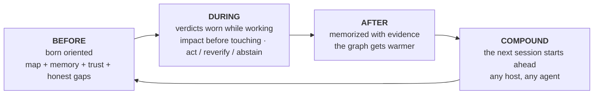

🇬🇧 [English](../README.md) | 🇧🇷 [Português](README.pt-BR.md) | 🇪🇸 [Español](README.es.md) | 🇮🇹 [Italiano](README.it.md) | 🇫🇷 [Français](README.fr.md) | 🇩🇪 [Deutsch](README.de.md) | 🇨🇳 [中文](README.zh.md) | 🇯🇵 [日本語](README.ja.md)

<p align="center">
  
</p>

<h1 align="center">Inteligência Operacional para Agentes de Código</h1>

<p align="center">
  <strong>Seu agente de código para de começar às cegas.</strong><br/>
  <em>Local-first. MCP-nativo. Memória em grafo, confiança e raciocínio sobre mudanças para hosts de agentes.</em>
</p>

<p align="center">
  <a href="https://www.npmjs.com/package/@maxkle1nz/m1nd"></a>
  <a href="https://crates.io/crates/m1nd-core"></a>
  <a href="https://github.com/maxkle1nz/m1nd/actions"></a>
  <a href="../LICENSE"></a>
  <a href="https://docs.rs/m1nd-core"></a>
</p>

<p align="center">
  <a href="https://github.com/openai/codex"></a>
  <a href="https://claude.ai/download"></a>
  <a href="https://cursor.sh"></a>
  <a href="https://codeium.com/windsurf"></a>
  <a href="https://github.com/features/copilot"></a>
  <a href="https://zed.dev"></a>
  <a href="https://github.com/cline/cline"></a>
  <a href="https://roocode.com"></a>
  <a href="https://github.com/continuedev/continue"></a>
  <a href="https://opencode.ai"></a>
  <a href="https://aistudio.google.com"></a>
  <a href="https://aws.amazon.com/q/developer"></a>
</p>

---

**m1nd é a casca em volta do seu agente de código — o loop operacional dentro do qual ele vive: orientado antes de agir, vereditos honestos enquanto trabalha, memória com evidência depois que termina, acumulando entre sessões.**

<p align="center"></p>

> `grep` encontra texto. Busca vetorial encontra chunks similares. `m1nd` dá aos agentes um grafo local do que se conecta, o que mudou, o que quebra, o que derivou e onde retomar.

## O que o m1nd é: a casca em volta do seu agente

*O m1nd envolve seu agente de código em um loop que o orienta antes de agir, o mantém honesto enquanto trabalha e lembra o que ele aprendeu quando termina.*

- **Se você constrói com agentes** — nada novo para aprender: instale uma vez e continue conversando com seu agente. Ele para de chutar, começa a lembrar e diz "não sei" quando essa é a verdade.
- **Se você é engenheiro** — um motor de grafo em Rust, local-first, atrás de um servidor MCP: um grafo causal de código (arestas estruturais, semânticas, temporais e causais), vereditos com calibração conformal e memória ancorada a nós de código com proveniência. Nada sai da sua máquina.

Agentes em codebases reais não falham porque não sabem pesquisar — falham porque não têm um modelo operacional. Cada sessão reconstrói contexto do zero, edita sem conhecer o blast radius e não consegue distinguir um resultado vazio que significa "não existe nada" de um que significa "repositório errado". O m1nd dá ao agente um modelo durável do codebase — um grafo causal com spreading activation e plasticidade Hebbiana — e envolve o loop inteiro do agente em torno dele. As funcionalidades aqui não são um catálogo; são as estações dessa casca:


```mermaid
flowchart LR
    B["<b>BEFORE</b><br/>born oriented<br/>map + memory + trust + honest gaps"]
    D["<b>DURING</b><br/>verdicts worn while working<br/>impact before touching · act / reverify / abstain"]
    A["<b>AFTER</b><br/>memorized with evidence<br/>the graph gets warmer"]
    C["<b>COMPOUND</b><br/>the next session starts ahead<br/>any host, any agent"]
    B --> D --> A --> C --> B
```

**O m1nd é operado pelo seu agente, não por você.** Cada ferramenta abaixo é chamada pelo próprio agente — automaticamente, antes e depois de trabalhar. Um humano nunca as executa no uso normal; você instala uma vez ([Início Rápido](#início-rápido)) e continua conversando com seu agente como sempre.

**Uma casca, três leitores.** O mesmo pacote orientado é renderizado para quem está prestes a agir: o **agente principal** o lê como `north` (entregue — a porta de entrada abaixo); um **subagente** vai recebê-lo como o Delegation Packet, a metade de recuperação da sua spec de spawn (projetado — [docs/NEXTGEN-AGENT-PRD.md](../docs/NEXTGEN-AGENT-PRD.md), §O.12); o **humano** vai vê-lo como o Pre-Flight Card sobre a Living Tree — seu projeto como uma árvore navegável com post-its de memória, mostrando o que o agente verificou vs. chutou antes de uma edição aterrissar (projetado, em desenvolvimento — [docs/HUMAN-LAYER-PRD.md](../docs/HUMAN-LAYER-PRD.md)). Uma verdade, computada uma vez.

<p align="center"></p>

<p align="center">
  
</p>

### O que acontece quando você manda uma mensagem

Você pede ao seu agente para consertar algo. Eis o que a casca faz em volta dessa mensagem:

1. **Antes de o seu agente agir**, o m1nd entrega a ele o mapa vivo do seu projeto, o que sessões passadas aprenderam, quanto confiar em cada peça — e o que ele *não* sabe (`north`).
2. **Enquanto trabalha**, ele veste vereditos: verifica o que uma edição quebraria *antes* de tocar no código (`impact`), e onde a evidência é fina recebe um honesto "não sei" em vez de um chute confiante (`abstain`).
3. Ele pode perguntar por que duas partes do código estão conectadas e ser avisado quando a resposta se apoia em um palpite (`why`), e é alertado antes de cruzar uma fronteira de arquitetura (`xray_gate`).
4. **Quando termina**, a decisão é anotada junto com a evidência que a sustenta (`memorize`).
5. Essa memória é ancorada ao código real — se o código mudar depois, a memória se marca sozinha como obsoleta em vez de mentir em silêncio (`cross_verify`).
6. **Sua próxima sessão já começa sabendo** — qualquer agente, qualquer ferramenta: Claude Code, Codex, Cursor, Gemini. O que um agente aprende, o próximo herda.

## BEFORE — nasce orientado

*Seu agente começa cada sessão já conhecendo o seu projeto — e sabendo o que não sabe.*

<p align="center"></p>

Dentro de uma sessão MCP, a porta de entrada é uma única chamada — `north(task)` compõe confiança, contexto da tarefa (nós de foco + âncoras de PageRank), memória prévia entre sessões, um sinal de suficiência, um `next_move` e `honest_gaps` (o que o m1nd ainda *não* sabe) em um único pacote, antes de qualquer consulta:

```jsonc
{"method":"tools/call","params":{"name":"north",
  "arguments":{"agent_id":"dev","task":"harden the JWT auth token validation flow"}}}
```

A resposta é um pacote orientado — veredito de confiança, a memória que a última sessão deixou e uma lista honesta de lacunas. Uma captura real do binário da `main`, levemente aparada:

```jsonc
{
  "binding": { "trust_mode": "full_trust", "ok": true },      // verdict before retrieval
  "memory": [                                                 // recalled from a PRIOR session
    { "claim": "AuthTokenFlow", "source_agent": "authbot", "age_ms": 221, "stale": false }
    // …other claims from the same authored note, trimmed…
  ],
  "sufficiency": { "state": "gathering", "top_score": 0.64,
    "why": "the strongest match left out still scores 0.30 — relevant context did not fit …" },
  "next_move": "Call `surgical_context` on the top focus node to ground the task before editing.",
  "honest_gaps": []                                           // nothing withheld on this graph
}
```

`north` compõe `trust_selftest` + `orient` + `boot_memory` + `focus` — o agente só recorre a uma peça isolada quando precisa de apenas uma. `focus` é o runtime de atenção desta estação: o conjunto de trabalho mínimo e delimitado por orçamento para um objetivo, com uma cauda honesta do que ficou de fora e um sinal de se aquilo já é contexto *suficiente*. `needs_ingest` é uma resposta real para um grafo vazio.

Se o `north` reportar `needs: "needs_ingest"`, ou você estiver em um binário anterior à 1.2.1 sem a composição de recall L1GHT, o agente recorre ao loop explícito de confiança — estabelecer confiança *antes* de acreditar em qualquer recuperação:

```jsonc
// 0. Trust the binding in one call (verdict before retrieval)
{"method":"tools/call","params":{"name":"trust_selftest","arguments":{"agent_id":"dev"}}}

// 1. If the verdict is not full_trust, ask for the deterministic recovery path
{"method":"tools/call","params":{"name":"recovery_playbook","arguments":{"agent_id":"dev"}}}

// 2. Build graph truth
{"method":"tools/call","params":{"name":"ingest","arguments":{"path":"/your/project","agent_id":"dev"}}}

// 3. Ask a structural question — empty results say *why*, never just "no results"
{"method":"tools/call","params":{"name":"activate","arguments":{"query":"authentication flow","agent_id":"dev"}}}
```

**Loop de primeira sessão, em quatro movimentos:** `north` (ou `trust_selftest` → `ingest`) → `seek`/`audit` → `memorize` a descoberta durável para que a próxima sessão comece à frente.

## DURING — vereditos vestidos durante o trabalho

*Enquanto ele trabalha, cada resposta chega com quanto se pode confiar nela — e "não sei" é uma resposta real.*

<p align="center"></p>

O agente não consulta o m1nd; ele o veste. Cada resposta no meio do trabalho é um veredito calibrado, não uma vibe:

- **`impact` antes de tocar** mostra o blast radius que você não leu; `ghost_edges` revela arquivos que sempre mudam juntos mas não compartilham nenhum import.
- **`why` carrega um veredito `closure`** — `blocked` significa que o caminho se apoia em uma aresta não resolvida ou adivinhada: verifique essa aresta antes de confiar no caminho.
- **`predict` tem calibração conformal** — `calibrate_predict` arma um gate por repositório; os vereditos passam a ler `act` / `reverify` / `abstain`, onde `abstain` significa *não calibrado ou insuficiente* — um sinal para parar, não um sim fraco. Vem desativado: até você calibrar, os vereditos ficam limitados a `reverify`. O acoplamento de co-mudança é normalizado com Jaccard suavizado, não contagens brutas de commits (comprovado em calibração: +3 pontos). *Ressalva:* `predict` tem fallback somente estrutural até que `ghost_edges` carregue a matriz de co-mudança do git — rode-o primeiro para probabilidade real de co-mudança.
- **`xray_gate` guarda as fronteiras da arquitetura** — chamado antes de uma edição, responde "esta mudança cruza uma fronteira de módulo proibida?" com `clear` / `caution` / `blocked`; só um manifesto ratificado pode bloquear (anti-fadiga de guardrail).
- **Mission Control é disciplina de prova** — `mission_next` retorna exatamente um movimento mais guardrails `do_not`; no modo `bug_hunt` uma varredura direta final é exigida antes do encerramento, para que agentes chequem o espaço negativo.

A mesma honestidade acompanha a recuperação. Um hit de `seek` carrega uma leitura de `sufficiency` e um `trust_envelope` — e quando o envelope ainda não tem nenhuma linha de calibração medida, ele limita o próprio veredito em vez de exagerar. Uma captura real, aparada (o primeiro hit é uma memória que a última sessão escreveu):

```jsonc
{
  "results": [
    { "label": "AuthTokenFlow", "source_agent": "authbot", "authored_ms_ago": 101161, "score": 0.48 }
    // …code-node hits, trimmed…
  ],
  "sufficiency": { "state": "gathering", "top_score": 0.48,
    "why": "the strongest match left out still scores 0.25 — relevant context did not fit …" },
  "trust_envelope": {
    "calibrated": false,               // no calibration row measured
    "verdict": "reverify",             // …so the verdict is capped below `act`
    "next_repair_call": "trust_selftest"
  }
}
```

<p align="center"></p>

## AFTER — o grafo fica mais quente

*Quando o trabalho aterrissa, o que foi aprendido é anotado com a evidência que o sustenta — e continua honesto quando o código segue em frente.*

<p align="center"></p>

A maioria das ferramentas dá ao agente melhor *recuperação*. Nesta estação o agente **produz conhecimento durável e legível por máquina** que se acumula entre sessões e se mantém honesto com relação ao código. L1GHT transforma o conhecimento produzido em estrutura nativa de grafo que se auto-sinaliza quando o código que cita muda — afirmações confiantes propagam mais ativação do que as incertas.

1. **Concluir** — o agente chega a algo durável (uma decisão, uma descoberta verificada, por que o código é do jeito que é) e chama `memorize` com afirmações estruturadas e caminhos de `evidence`.

```jsonc
memorize({
  "agent_id": "authbot",
  "node_label": "AuthTokenFlow",
  "claims": [
    { "label": "TokenValidator",
      "text": "TokenValidator validates JWTs via HMAC — rotate keys via KMS only",
      "confidence": "high", "evidence": ["src/auth/token.rs"] }
  ]
})
```

A chamada retorna a prova de que aterrissou — esta é uma resposta real capturada, aparada:

```jsonc
{
  "ok": true,
  "claims_written": 1,
  "light_evidence_resolved": 1, "light_evidence_unresolved": 0,   // the evidence path bound to a real code node
  "path": ".../agent-memory/authtokenflow.light.md",
  "next_action": "Memory anchored to code and will auto-load next session; cross_verify(check:[\"evidence_freshness\"]) flags it if the cited code changes."
}
```

2. **Ancorar** — o m1nd grava um `.light.md` nativo de grafo em `<runtime>/agent-memory/`, ingere (`adapter=light mode=merge`) e resolve cada caminho de `evidence` ao nó de código real via aresta `grounded_in` — fazendo o conhecimento viver no mesmo espaço de ativação que o código e emergir em `seek` / `activate` / `impact`.
3. **Carga automática** — a cada início de sessão futuro, o `m1nd` ingere `agent-memory/` automaticamente e o reporta em `session_handshake.agent_memory`. Descobertas passadas sobrevivem a uma ingestão `mode=replace` e simplesmente *estão lá*.
4. **Auto-sinalização de obsolescência** — `cross_verify(check: ["evidence_freshness"])` re-faz o hash de cada arquivo citado e nomeia quais afirmações ficaram obsoletas porque seu código mudou — assim a memória avisa quando está mentindo, em vez de induzir ao erro. A memória carrega uma espinha de proveniência: afirmações declaram idade + autor reais, substituem afirmações mais antigas, expiram e respeitam um teto de recência — o conhecimento lembrado declara seu próprio frescor em vez de silenciosamente ficar obsoleto.

Este loop foi provado ao vivo de ponta a ponta: `memorize` → aresta `grounded_in` → flag de frescor em arquivo editado → sobrevive a `mode=replace` → carga automática no boot. Encerrando uma missão delimitada? Passe `write_light_memory: true` para `mission_close` para persistir suas afirmações verificadas da mesma forma.

**COMPOUND — a próxima sessão nasce dentro da casca aquecida.** Mate esse processo, inicie um **novo** contra o mesmo runtime, e seu primeiro `north(task)` já carrega a afirmação da sessão anterior — esta é uma troca real capturada (as duas chamadas acima rodaram em processos separados), aparada:

```jsonc
// north.memory, from a process that never called memorize itself:
"memory": [
  { "claim": "AuthTokenFlow",                   "source_agent": "authbot", "age_ms": 221, "stale": false },
  { "claim": "𝔻 evidence: src/auth/token.rs",   "source_agent": "authbot", "age_ms": 221, "stale": false },
  { "claim": "⍂ entity: TokenValidator",        "source_agent": "authbot", "age_ms": 221, "stale": false },
  { "claim": "𝔻 confidence: high",              "source_agent": "authbot", "age_ms": 221, "stale": false }
  // …the authored-note file node, trimmed…
]
```

`source_agent` nomeia quem a escreveu e `stale` re-verifica o código citado — a próxima sessão herda o conhecimento *e* sua proveniência, não uma string solta.

### Um grafo, muitos agentes

<p align="center"></p>

O Início Rápido abaixo conecta um servidor stdio por host — ótimo para um agente, mas cada processo carrega seu próprio grafo e mantém seu próprio lease. O deployment para o qual o m1nd foi construído é um dono, muitos agentes conectados. Um processo dono mantém o grafo vivo:

```bash
m1nd-mcp --serve --no-gui --port 1337 --runtime-dir /your/project/.m1nd
```

Cada agente então se conecta como uma ponte fina stdio↔HTTP — ele não carrega **nenhum** grafo, não constrói nenhum motor e não toma **nenhum** lease:

```bash
m1nd-mcp --attach http://127.0.0.1:1337 --stdio    # or set M1ND_ATTACH_URL and omit the flag
```

Qualquer número de pontes aponta para o único dono e compartilha seu único grafo vivo, de modo que o que um agente `memorize` outro recupera imediatamente — sem reingestão, sem cópia por agente. As consultas passam por localhost, então continua local-first (o bind permanece `127.0.0.1` a menos que você opte por `--bind 0.0.0.0`). Um `seek` quente sobre a ponte mediu ≈0.7ms em um grafo pequeno em uma máquina — ordem de grandeza, não uma garantia: o attach adiciona um round-trip de localhost, e a latência escala com o tamanho e a carga do grafo.

## O material: honestidade

*A casca inteira é feita de um único material — o m1nd prefere dizer ao seu agente "não confie nisto" a deixá-lo chutar.*

Esta é a coisa mais defensável que o m1nd faz, e nenhum concorrente a entrega. A doutrina: **credibilidade vem da honestidade, não de sempre vencer.** Um *não* honesto vence um chute confiante — cada estação acima é feita desse material.

- **`trust_selftest`** retorna um veredito *antes* de qualquer recuperação: `full_trust`, `needs_ingest`, `wrong_workspace_binding`, `stale_binding_suspected` ou `degraded_host_tool_surface`. O agente sabe se deve prosseguir, ingerir, rebindar ou recuar.
- **`agent_runtime_contract`** acompanha toda resposta de recuperação, carregando um `trust_mode`. Um resultado vazio é disambiguado — vinculado ao repositório errado versus genuinamente nada lá — nunca reportado silenciosamente como "sem resultados."
- **`trust_band: insufficient_evidence` significa NENHUMA evidência — não risco médio.** A resposta honesta de partida a frio, distinta de baixo/médio/alto.
- **Arrays `non_claims`** são enviados em toda ferramenta de missão. O m1nd diz ao agente o que ele *não* provou.
- **`mission_verify` pode dizer não — e diz, em código testado.** Ele rejeita evidência apenas de grafo: uma afirmação não pode ser fechada sem uma leitura de arquivo, uma execução de teste ou uma sonda de runtime. O teste literalmente se chama `graph_only_evidence_is_not_enough`.
- **`recovery_playbook`** retorna uma lista de passos determinística e ordenada para reparar o binding.

Mostrado, não contado. Chame `trust_selftest` em um runtime sem binding e o veredito *é* a instrução de reparo — uma captura real, aparada:

```jsonc
{
  "ok": false,
  "status": "blocked",
  "verdict": "needs_ingest",          // not "no results" — it says why
  "next_action": "call_ingest",
  "checks": { "graph_populated": false, "needs_ingest": true, "recovery_playbook_attached": true },
  "recovery_playbook": {
    "recovery_goal": "Populate this binding's active graph for the intended repository.",
    "steps": [ { "action": "Call ingest for the intended repository on this same binding." } /* …trimmed… */ ]
  }
}
```

A prova do compromisso está no que foi sacrificado por ele: `savings` e `resonate` foram removidos da superfície anunciada no beta.7 porque uma ferramenta que sempre afirma vencer não é crível. Nenhum concorrente — nem mem0, Zep, Letta, Sourcegraph ou qualquer MCP de grafo de código — entrega uma camada que diz ao agente no que *não* confiar e como se recuperar.

<p align="center"></p>

**O loop de triagem de campo se fecha sobre si mesmo.** A telemetria de sessão que os agentes deixam em `~/.m1nd/field-reports.jsonl` (apenas local — o m1nd nunca liga para casa) não é um log passivo: os relatórios são triados, e um bug de campo *confirmado* vira um caso de bateria vermelho **antes** da correção, de modo que a regressão é provada, não apenas descrita. Esse loop já rodou de ponta a ponta em uma varredura completa de triagem de campo: quatro bugs reportados em campo viraram casos de bateria que falhavam e depois correções mergeadas, todos entregues na **1.2.1** — o `north` agora compõe recall L1GHT em seu pacote de memória, a sentinela de grafo `temp` resolve para um tempdir real em vez de sujar o diretório de trabalho, `memorize` aceita uma `confidence` numérica, e a tag de ambiguidade de closure agora só dispara em empates genuínos (o alarme-falso: ambiguous-blocked caiu de 9/11 → 0/11).

## Início Rápido

*Instale uma vez, conecte o host do seu agente e saia da frente — daqui em diante, quem dirige é o seu agente.*

```bash
git clone https://github.com/maxkle1nz/m1nd.git && cd m1nd
npm install -g .
m1nd doctor
```

Depois conecte seu host — os mesmos dois comandos, um por host (`codex`, `claude`, `gemini`, `antigravity`, `generic`):

| Host | Instalar o pacote de agente | Conectar a config MCP |
|---|---|---|
| Codex | `m1nd install-skills codex` | `m1nd mcp-config codex --project /your/project` |
| Claude Code | `m1nd install-skills claude --project /your/project` | `m1nd mcp-config claude --project /your/project` |
| Gemini | `m1nd install-skills gemini --project /your/project` | `m1nd mcp-config gemini --project /your/project` |
| Antigravity | `m1nd install-skills antigravity --project /your/project` | `m1nd mcp-config antigravity --project /your/project` |
| Generic | `m1nd install-skills generic --project /your/project` | `m1nd mcp-config generic --project /your/project` |

Ou pelo npm: `npm install -g @maxkle1nz/m1nd`. `install-skills` entrega o pacote de agente — o próprio loop operacional em cinco protocolos nomeados, não documentação decorativa.

**A superfície do operador é este CLI; a superfície do agente é MCP.** Um humano ocasionalmente roda `m1nd doctor`, `install-skills`, `mcp-config` — o agente roda todo o resto. Existe um escape hatch neutro de host para quando não há uma sessão MCP viva para chamar `north` (obsoleta, vinculada ao repositório errado ou ainda não carregada): ele inicia um runtime isolado, vincula ao repositório e retorna um único envelope legível por máquina que delimita o escopo, estabelece confiança, ingere se necessário, retorna âncoras e faz o handoff para prova direta:

```bash
m1nd agent first-minute --repo /your/project --query "understand this system" --json
```

Fixe o binário se precisar: `--version` imprime `1.2.x (<sha>)`, e `M1ND_EXPECTED_VERSION` / `M1ND_EXPECTED_SHA` (+ `M1ND_STRICT_VERSION`) permitem que um host detecte e recuse um binário que derivou.

Mapa completo de instalação, pacotes de host, build nativo do runtime e flags de atualização: [docs/AGENT-PACKS.md](../docs/AGENT-PACKS.md) · configuração por cliente: [matriz de integração](../docs/IDE-INTEGRATIONS.md).

## Evidências

<p align="center"></p>

Cada linha é calibrada exatamente ao que foi medido. O m1nd não lidera com números de economia ou ROI — esse é o ponto.

| Afirmação | Resultado | Fonte / ressalva |
|---|---|---|
| Latência de `activate` / `impact` | ~1µs `activate`, sub-µs `impact` em um grafo sintético de 1K nós | Benchmarks Criterion — **reproduza você mesmo: `cargo bench -p m1nd-core`** (medido `activate_1k_nodes` ≈1.4µs, `impact_depth3` ≈0.5µs em um Mac com Apple silicon); [metodologia](https://m1nd.world/wiki/benchmarks.html); ordem de grandeza, dependente de hardware. |
| Matriz de linguagens | calls + imports entre arquivos para 10 linguagens (+ Ruby entre arquivos) | Verificado de ponta a ponta em uma única ingestão poliglota; testes por linguagem em `m1nd-ingest`. Veja [Cobertura de Linguagens](#cobertura-de-linguagens). |
| Amostra de validação pós-escrita | 12/12 classificados corretamente | Verificação de runtime interna. |
| Caça a bugs com seeds | 16/20 na primeira rodada aceita de defeitos com seed `humanize` (treinado com m1nd); `m1nd-basic` e direto cada um 8/15 | Evidência interna de produto, `public_claim_worthy=false` — não é um benchmark universal. |
| Auto-verificação de memória | provado ao vivo de ponta a ponta | `memorize` → `grounded_in` → flag de frescor em arquivo editado → sobrevive a replace → carga automática no boot. |
| Bateria de capacidades vs grep | 37/37 passam; frente a frente 16 vitórias do m1nd / 12 empates / **0 vitórias do grep** | Harness in-repo `scratchpad/m1nd_battery.py` (37 casos, ingestão nova + PASS/FAIL de ground-truth + confronto direto com `rg`). **Reproduza: `python3 scratchpad/m1nd_battery.py ./target/release/m1nd-mcp . --suite m1nd`.** Ressalva: um repo (o próprio m1nd), casos escritos por nós mesmos; ~5 dos empates são ferramentas estruturais pontuadas contra um proxy de grep literal que não consegue expressar o que elas respondem. |
| Calibração conformal (`predict`) | banda act ≈32% de precisão @ ≈13.5% de cobertura (α=0.10) | Sobre o próprio histórico git do m1nd (n≈9.2k predições held-out), +3pts sobre contagens brutas após a mudança para Jaccard suavizado. Ressalva: um repo, um sinal grosseiro baseado em contagem — o gate hoje majoritariamente se abstém, **por design**: a abstenção é a saída honesta de um sinal fraco, não uma falha. |

<details>
<summary><strong>Mais visuais — a série completa dos mecanismos</strong></summary>
<br/>
<p align="center">
  
  
</p>
<p align="center">
  
  
</p>
</details>

## Limites

`m1nd` complementa, em vez de substituir, seu LSP, compilador, test runner, scanners de segurança e stack de observabilidade. É mais útil antes de busca, revisão ou mudança, e sempre que docs, impacto ou continuidade importam.

É **menos útil** quando:

- busca exata de texto já responde à pergunta
- verdade do compilador ou runtime é a única coisa que você precisa
- a tarefa é uma ação local trivial em arquivo sem incerteza estrutural

**Precisa ser alimentado:** `trust` e `tremor` começam com priors neutros até que o feedback de `learn` / os dados de `ghost_edges` se acumulem, e `predict` precisa que `ghost_edges` esteja carregado primeiro para que seu sinal de co-mudança seja significativo. Eles melhoram com o uso; são honestos sobre estarem sem informação no boot.

## O Que o m1nd Não É

`m1nd` não é apenas:

- uma ferramenta de busca de código com índice maior
- uma camada de RAG de repositório que só recupera arquivos ou chunks
- um banco de dados de grafo que deixa as decisões de workflow para o cliente
- um substituto de análise estática para o compilador, testes ou ferramentas de segurança
- um bundle MCP de utilitários sem relação entre si
- uma superfície de ferramentas que o humano precisa aprender — os verbos são do agente; o seu é o pequeno [CLI de setup](#início-rápido)

Ele é a camada que transforma essas superfícies em um sistema operacional sobre o qual um agente pode raciocinar e agir. Não serve para lookups de um único arquivo, grep simples ou verdade do compilador — use ferramentas simples nesses casos.

## Cobertura de Linguagens

O raciocínio de grafo (`impact`, `why`, `predict`, `trace`, `taint_trace`) é tão bom quanto o extrator. O m1nd resolve tanto **arestas `calls`** (grafo de chamadas) quanto **`imports` entre arquivos** (resolução de dependência arquivo→arquivo) por linguagem. A matriz abaixo foi provada ao vivo em uma única ingestão poliglota:

| Linguagem | `calls` | imports entre arquivos |
|---|:---:|:---:|
| Rust | ✅ | ✅ (`mod`/`use crate::`) |
| Python | ✅ | ✅ |
| JavaScript / TypeScript | ✅ | ✅ |
| Go | ✅ | ✅ (package) |
| Java | ✅ | ✅ (FQCN + wildcard) |
| C / C++ | ✅ | ✅ (`#include "..."`) |
| Kotlin | ✅ | ✅ (package) |
| PHP | ✅ | ✅ (PSR-4) |
| Scala | ✅ | ✅ (package) |
| Ruby | ⏳ | ✅ (`require_relative`) |
| C# | ✅ | — (namespaces não mapeiam 1:1 para arquivos) |
| Swift | ✅ | — |

Todas as linhas ✅ são verificadas de ponta a ponta (um import `caller`→`callee` resolve e o caller emite arestas de chamada). Outras linguagens recaem no extrator genérico (somente `contains`). Imports não resolvíveis (pacotes externos, gems, stdlib, cabeçalhos de sistema) são honestamente deixados sem resolução em vez de serem adivinhados.

## Arquitetura em Resumo

Três crates core em Rust mais uma bridge auxiliar:

- **`m1nd-mcp`** — o servidor MCP e a superfície de runtime operacional.
- **`m1nd-core`** — o motor de grafo: um `WavefrontEngine` fazendo spreading activation, plasticidade Hebbiana, adjacência CSR e arestas ghost derivadas do git.
- **`m1nd-ingest`** — extração, roteamento e adapters de construção de grafo (código, docs universais, L1GHT).
- **`m1nd-openclaw`** — bridge auxiliar OpenClaw (lane de Unix socket, versionado independentemente).

Versões atuais dos crates: `m1nd-core`, `m1nd-ingest`, `m1nd-mcp` todos em `1.2.0` (`m1nd-openclaw` é versionado independentemente em `0.1.0`).

<p align="center">
  
</p>

A superfície MCP ativa evolui com os releases — use `tools/list` para a contagem exata de ferramentas e nomes no seu build. **Camadas:** 27 ferramentas essenciais são anunciadas por padrão para reduzir o custo de seleção de ferramentas; defina `M1ND_TOOL_TIER=full` para anunciar a superfície completa (100+ ferramentas: RETROBUILDER, perspectives, federação, daemon). Ferramentas ocultas são sempre chamáveis via `tools/call` — o tiering só controla o que `tools/list` anuncia. O catálogo ferramenta a ferramenta não vive neste README: veja a [wiki canônica](https://m1nd.world/wiki/), [docs/AGENT-PACKS.md](../docs/AGENT-PACKS.md) e [EXAMPLES.md](../EXAMPLES.md) para profundidade, e [CHANGELOG.md](../CHANGELOG.md) para o histórico de releases.

## Contribuindo

Contribuições são bem-vindas em extractors e adapters, tooling MCP/runtime, benchmarks, documentação e algoritmos de grafo. Veja [CONTRIBUTING.md](../CONTRIBUTING.md).

## Licença

MIT. Veja [LICENSE](../LICENSE).
