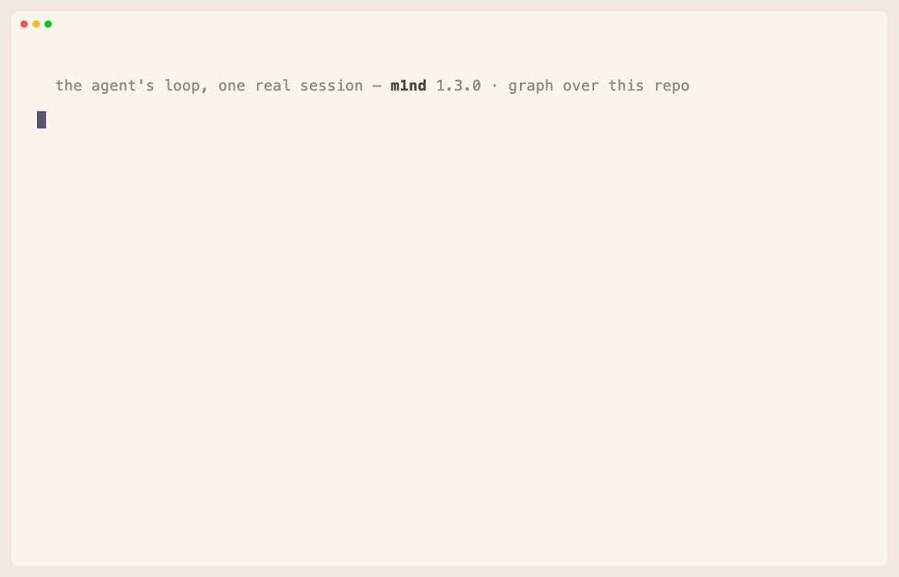
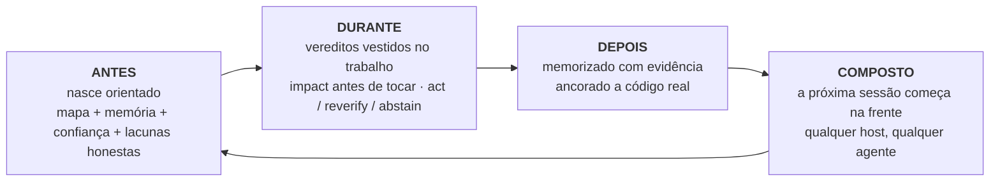

🇬🇧 [English](../README.md) | 🇧🇷 [Português](README.pt-BR.md) | 🇪🇸 [Español](README.es.md) | 🇮🇹 [Italiano](README.it.md) | 🇫🇷 [Français](README.fr.md) | 🇩🇪 [Deutsch](README.de.md) | 🇨🇳 [中文](README.zh.md) | 🇯🇵 [日本語](README.ja.md)

<p align="center">
  
</p>

**m1nd** dá ao seu coding agent um brain por repositório: um grafo de código local servido por MCP, memória ancorada ao código que ela cita, e um veredito de confiança em cada resposta. "Evidência insuficiente" aqui é uma resposta de verdade. "Não confie nisso ainda, e aqui está como reparar" também.

Nada sai da sua máquina. Um binário Rust. MIT.

Pense num raio-X do teu repo que o teu agente consegue ler: uma estrutura só, que combina tudo e diz onde mora cada coisa, para que serve aquele programa, o que está sendo trabalhado, o que está pronto e o que ainda está aberto. Essa panorâmica é o que nenhum outro software entrega ao teu agente.

<p align="center">
  <a href="https://www.npmjs.com/package/@maxkle1nz/m1nd"></a>
  <a href="https://crates.io/crates/m1nd-mcp"></a>
  <a href="https://github.com/maxkle1nz/m1nd/actions"></a>
  <a href="../LICENSE"></a>
  <a href="https://registry.modelcontextprotocol.io/?search=io.github.maxkle1nz/m1nd"></a>
</p>

<p align="center">Quatro comandos para instalar: <a href="#sessenta-segundos">Sessenta segundos</a>. Motivos para fechar a aba antes: <a href="#quando-não-usar-o-m1nd">Quando NÃO usar o m1nd</a>.</p>

<p align="center">
  
</p>

<p align="center"><em>Uma sessão real no grafo de 6.453 nós deste repo (m1nd-mcp 1.4.0): <code>north</code> orienta, <code>seek</code> responde vestindo um veredito <code>reverify</code>, <code>memorize</code> ancora o achado ao código.</em></p>

## O audit que o teu agente para de pagar

Você conhece o ritual. O agente abre um arquivo, grepa, abre outro, grepa de novo, queima a maior parte do contexto só reconstruindo o que o repo é, e só então começa a tarefa de verdade. Com o m1nd essa varredura vira uma pergunta. Em menos de um segundo o agente tem o mapa: o que chama o quê, o que quebra o quê, onde mora cada coisa. Não uma pilha de matches para interpretar. A estrutura conectada, já montada.

E ele lembra. Entre sessões, e entre agentes. O que um agente aprende hoje à noite, outro herda amanhã, com a evidência junto e uma flag se o código mudou desde então. Toda conclusão deixa rastro, então você, ou qualquer agente que vier depois, sempre sabe o que aconteceu com aquele código e por quê.

Aí o l1ght leva mais longe: papers, artigos, RFCs, rascunhos e notas se conectam às partes do teu código que eles explicam, dentro da mesma estrutura. O agente recebe o contexto CERTO em vez do que soa mais parecido, e inventar código que não existe deixa de ser o caminho mais fácil: a estrutura diz o que existe, e o veredito diz quanto confiar até nisso.

Antes do m1nd, uma função era só uma função, perdida em algum manual. Hoje ela mora na inteligência do agente, combinada com o código, o histórico, os documentos e os riscos dela. Eu não encontrei nada parecido em lugar nenhum.

## O grep responde boas perguntas. O m1nd responde as mais profundas.

Perguntas que o teu agente agora faz e recebe resposta estrutural:

- O que quebra se eu tocar nesta função?
- Onde o token refresh acontece de verdade neste repo?
- Por que estes dois arquivos estão conectados, e esse caminho é sólido ou é palpite?
- O que a última sessão aprendeu sobre este código, e ainda é verdade?
- O que sempre muda junto aqui, mesmo sem nenhum import entre eles?
- Este edit cruza uma fronteira de arquitetura que eu não deveria cruzar?
- Qual claim daquele paper esta função implementa?
- O bug que eu acabei de consertar está escondido em outro lugar, como forma?
- O que está faltando aqui que esse padrão costuma ter?
- Eu estou no repo certo, pelo menos?
- Eu ajo com essa resposta, ou verifico primeiro?

Cada uma é um verbo na superfície MCP (`impact`, `seek`, `why`, `north`, `ghost_edges`, `xray_gate`, `antibody_scan`, `missing`, `trust_selftest`, `predict`), não um truque de prompt.

## E não para em mostrar a estrutura

Antibodies: um bug consertado vira um padrão estrutural nomeado, e toda sessão seguinte caça aquela forma no repo inteiro. Conserta uma vez, caça para sempre.

Ghost edges: arquivos que sempre mudam juntos sem nenhum import entre eles, minerados do teu histórico git. O acoplamento invisível que quebra refactors.

Buracos estruturais: o `missing` procura o código que não está lá. O guard, o retry, o timeout que esse padrão costuma carregar e esta instância não tem.

Hipóteses contra o grafo: declare uma claim em linguagem natural ("settings consegue chegar no boot sem validação") e teste contra a estrutura viva.

Tremor: arquivos cuja velocidade de mudança está acelerando são flagados antes de alguém abrir o bug report.

Grafo quente: resultados confirmados reforçam as próprias edges, estilo Hebbiano, e os caminhos que provaram valor sobem no ranking para o próximo agente.

Tudo isso flaga e sugere; quem prova continuam sendo o teu compilador e os teus testes.

## O m1nd não só procura. Ele escreve.

Aqui vem a parte que as pessoas demoram um segundo para acreditar. O grafo que lê o teu repo também opera nele. O teu agente aponta um símbolo e um destino, uns 48 tokens, e o `transplant` computa o move inteiro pelo grafo: a região ampliada (doc comments e atributos viajam junto), as dependências classificadas pelas call edges (as privadas viajam, as compartilhadas ficam e ganham back-import), cada referenciador re-qualificado em cada arquivo que o nomeia. Aí escreve atômico, re-ingere, e devolve um receipt honesto: o que moveu, o que ficou, o que não conseguiu resolver. `refs_unresolved` nunca fica vazio em silêncio quando algo deu errado.

É two-phase, `transplant_preview` antes de `transplant_commit`, e o commit re-valida o hash de cada arquivo que planejou tocar, então nada pousa num repo que mudou por baixo. A zona de dinheiro do teu repo (backend, schema, pagamentos, CI) é protegida server-side e falha fechado. Uma recusa nunca toca um byte e ensina o retry: colisão nomeia o ocupante, caminho de módulo inválido se nomeia, move cross-crate nomeia as duas crates.

Medido no caso real: o edit whole-file custou 12.235 tokens de saída; o transplant custou 48 de entrada e escreveu 3 arquivos em 1,3 segundo, com a crate compilando do outro lado. O rust-analyzer tem uma issue aberta pedindo move entre arquivos desde 2019.

Fronteiras da v1, ditas na cara: só Rust, só `fn` top-level, mesma crate, o arquivo de destino precisa existir, e referência nascida dentro de macro é invisível para ele. Cada fronteira é deliberada e está escrita em [docs/TRANSPLANT-PRD.md](../docs/TRANSPLANT-PRD.md), ao lado de 13 arquivos de teste que seguram o verbo nelas.

## E quando não é um agente, são cinco?

Roda vários agentes no mesmo repo e o grafo vira o lugar onde eles se coordenam. Cada sessão se registra como presença, e quando dois estão prestes a mexer em trabalho que se sobrepõe, os dois são avisados no próximo pacote de orientação, antes de qualquer um pousar mudança. O sistema avisa; quem decide é você.

Trabalho com começo e fim roda como missão, e missão aqui presta conta de um jeito que a maioria dos times humanos pula: toda tool de missão reporta `non_claims`, a lista do que NÃO foi provado. Uma claim não fecha só com evidência de grafo. Precisa de um file read, um teste rodado ou um probe de runtime, e o teste que segura isso se chama `graph_only_evidence_is_not_enough`.

E os guardrails não gritam lobo. O `xray_gate` só consegue dizer `blocked` a partir de um manifesto de fronteiras que um humano ratificou. Todo o resto chega como aviso com motivo, então o agente nunca aprende a ignorar o próprio trilho de segurança.

E cada brain tem uma caixa de correio. Um agente que acha um defeito de verdade fora da própria missão não conserta na hora e não engole: grava uma carta na caixa daquele repo, em disco, do lado do código. O agente seguinte que trabalhar naquele brain varre a caixa e já começa sabendo os defeitos que os outros encontraram, com o contexto junto. O conhecimento do que está quebrado para de morrer no scrollback do chat. A varredura é um gesto deliberado (CLI ou REST, nunca dentro do loop de query), então as cartas informam o trabalho em vez de interromper.

## Nascido agent-first

Não existe conta, não existe telemetria, e não tem API no caminho, que é também o motivo de o grafo responder em microssegundos.

O desenvolvimento do m1nd também não é muito normal. Criar ele exigiu criar um workflow inteiro onde agentes dirigem, verificam e provam o trabalho, e a lógica do produto mira a dor do agente, não o dashboard do humano. Quando o m1nd se comporta mal em campo, os próprios agentes que o usam abrem o report, e bug confirmado vira teste vermelho antes do fix pousar. Pouquíssimos programas nascem assim no design inicial. Então o m1nd já nasce diferente: os verbos, as recusas e os pacotes têm a forma do leitor que realmente os usa, e você nem precisa lembrar o modelo de que a tool existe. O `m1nd hosts apply` instala hooks de sessão (`SessionStart`, `agentSpawn`, `TaskStart`, por host) que injetam a orientação no spawn: o teu agente, e cada subagente que ele criar, nasce orientado antes de alguém digitar uma palavra.

Um brain por repositório segura tudo isso: um grafo, memória própria, persistência própria, amarrado a um root. Um owner servido hospeda vários brains e roteia cada sessão para o certo; sessão de repo que ele não hospeda recebe recusa tipada em vez de resposta errada.

## O que o seu agente ganha

O m1nd envolve o loop inteiro do agente em torno de um grafo do seu repo que sobrevive à sessão:


```mermaid
flowchart LR
    B["<b>ANTES</b><br/>nasce orientado<br/>mapa + memória + confiança + lacunas honestas"]
    D["<b>DURANTE</b><br/>vereditos vestidos no trabalho<br/>impact antes de tocar · act / reverify / abstain"]
    A["<b>DEPOIS</b><br/>memorizado com evidência<br/>ancorado a código real"]
    C["<b>COMPOSTO</b><br/>a próxima sessão começa na frente<br/>qualquer host, qualquer agente"]
    B --> D --> A --> C --> B
```

A porta de entrada é uma chamada. `north(task)` devolve a orientação inteira num pacote só, antes de qualquer retrieval:

```jsonc
{"method":"tools/call","params":{"name":"north",
  "arguments":{"agent_id":"dev","task":"harden the JWT auth token validation flow"}}}
```

```jsonc
{
  "binding": { "trust_mode": "full_trust", "ok": true },      // veredito antes do retrieval
  "memory": [                                                 // lembrado de uma sessão ANTERIOR
    { "claim": "AuthTokenFlow", "source_agent": "authbot", "age_ms": 221, "stale": false }
  ],
  "sufficiency": { "state": "gathering", "top_score": 0.64 },
  "next_move": "Call `surgical_context` on the top focus node before editing.",
  "honest_gaps": []                                           // nada retido neste grafo
}
```

Enquanto o agente trabalha, `impact` mostra o raio de impacto antes do edit cair, `why` explica uma conexão e admite quando o caminho depende de um palpite, e `xray_gate` avisa antes de uma mudança cruzar uma fronteira de arquitetura. Quando o trabalho termina, `memorize` grava a conclusão com a evidência que a sustenta. A próxima sessão já começa com as conclusões da anterior em mãos, em qualquer host MCP: Claude Code, Codex, Cursor, Gemini, Zed, 22 hosts no total.

Você nunca roda nenhum desses verbos. O agente roda. A sua superfície é uma CLI pequena de setup, e depois você continua falando com o seu agente como sempre.

## Sessenta segundos

O pacote npm é o instalador. O runtime nativo é um binário Rust separado que o passo 1 baixa como release assinado.

```bash
# 1 · instala o runtime nativo (assinado, verificado, com rollback)
npx -y @maxkle1nz/m1nd update apply --yes

# 2 · confirma (imprime um veredito JSON; bom é "status": "ok")
npx -y @maxkle1nz/m1nd doctor

# 3 · fia o seu host: config MCP + os hooks que tornam o m1nd ambiente
npx -y @maxkle1nz/m1nd hosts apply --host claude --project . --yes

# 4 · primeiro valor: o pacote de orientação do SEU repo, read-only
npx -y @maxkle1nz/m1nd agent first-minute --repo . --query "map this repo" --json
```

O passo 1 verifica a assinatura com [`cosign`](https://docs.sigstore.dev/cosign/system_config/installation/); instale-o antes se não estiver no PATH. Se preferir o registry de fonte e aceitar pular a verificação, `cargo install m1nd-mcp` também funciona. Prefere ver antes de escrever: `hosts plan` imprime tudo que o `apply` tocaria, sem escrever nada. Ainda não existe comando de uninstall; o `hosts plan` dobra como a lista do que remover à mão.

Os hooks do passo 3 são o que torna o m1nd ambiente: o pacote de orientação é injetado em cada sessão e em cada spawn de subagente, e o agente se dirige sozinho dali em diante. Instalando a partir de um agente em vez de um terminal? Existe um gêmeo legível por máquina desta seção em [`llms-install.md`](../llms-install.md).

Um release adulterado ou truncado não pousa na sua máquina, e um upgrade ruim está a um rollback de distância: o updater checa a assinatura contra a identidade exata do build, depois o SHA-256 e o tamanho, antes de tocar em qualquer coisa. Se a verificação falha, ele recusa em vez de cair num caminho não verificado. Detalhes em [docs/AGENT-PACKS.md](../docs/AGENT-PACKS.md).

## Se eu desaparecer

O m1nd é MIT e não existe servidor para perder. O runtime é um binário Rust que já está no seu disco. A memória que ele escreve é markdown puro em `agent-memory/`, legível e greppável sem nenhum m1nd instalado. O grafo deriva do seu código e se reconstrói do zero em qualquer máquina. Se este projeto parar amanhã, você fica com os arquivos e perde uma ferramenta. Isso é deliberado. É por isso que a memória é markdown e por isso que não existe nuvem entre o seu agente e o próprio conhecimento dele.

## Por que confiar nas respostas

Foi por isto que eu construí o m1nd. Camadas de retrieval são boas em responder. Quase nenhuma é boa em recusar. O m1nd trata a recusa como resultado de primeira classe:

```jsonc
// trust_selftest num runtime sem binding. O veredito É a instrução de reparo:
{
  "ok": false,
  "verdict": "needs_ingest",          // nunca um "no results" seco
  "next_action": "call_ingest",
  "recovery_playbook": {
    "steps": [ { "action": "Call ingest for the intended repository on this same binding." } ]
  }
}
```

Um hit de `seek` carrega uma leitura de suficiência e um envelope de confiança. Quando nenhuma calibração foi medida ainda, o envelope limita o próprio veredito a `reverify` em vez de prometer demais. O gate do `predict` é ajustado para cobertura (α=0.10); na história deste repo isso dá mais ou menos um terço de precisão na banda `act`, e na maior parte do tempo ele se abstém, que é a saída honesta de um sinal fraco. `abstain` manda o agente parar. `insufficient_evidence` significa evidência nenhuma, o que é diferente de risco médio, e a API mantém os dois separados.

Duas tools, `savings` e `resonate`, foram deletadas de vez ainda em beta (handlers, tipos e state files, tudo fora) porque devolviam vitória em qualquer input que eu desse, e uma ferramenta que nunca perde parou de medir. Essa é a régua contra a qual cada claim deste arquivo é medida.

O vizinho mais próximo que eu conheço é o GitHub Copilot Memory (preview público, 2026): ele guarda fatos com citações no código e re-checa as citações contra a branch atual antes de usar. Isso é detecção de staleness de verdade, e o crédito é dele. Também é cloud, binário, e vive dentro do Copilot. O que eu ainda não encontrei em lugar nenhum é o resto do veredito: um `act` / `reverify` / `abstain` graduado com calibração por repo, recusas tipadas com plano de reparo, num grafo local que qualquer agente MCP compartilha. Chequei a documentação pública de Mem0, Zep, Letta, Cognee, Supermemory e Copilot Memory, em julho de 2026. Conhece um mais próximo? Abre uma issue que eu linko aqui.

## Memória que sabe quando ficou velha

A maioria das camadas de memória guarda texto e esperança. O m1nd ancora a memória ao grafo. Quando um agente chama `memorize`, o caminho de `evidence` de cada claim é resolvido para o nó de código real, então a nota aparece sempre que o agente tocar naquele código, sem ninguém precisar lembrar que ela existe:

```jsonc
memorize({
  "agent_id": "authbot",
  "node_label": "AuthTokenFlow",
  "claims": [{
    "label": "TokenValidator",
    "text": "TokenValidator validates JWTs via HMAC. Rotate keys via KMS only.",
    "confidence": "high", "evidence": ["src/auth/token.rs"]
  }]
})
```

Como a memória é ancorada, ela pode ser auditada contra a realidade. `cross_verify` re-hasheia cada arquivo citado e nomeia quais claims ficaram velhas porque o código delas mudou. Claims carregam idade e autor, substituem claims mais antigas, e expiram. Esse loop está provado ao vivo de ponta a ponta neste repo: memorize, âncora, edita o arquivo citado, vê a claim se marcar, sobrevive a um re-ingest completo, auto-carrega no boot seguinte. Mate o processo, suba um novo, e o primeiro `north` já carrega as claims da sessão anterior com a proveniência junto.

## Um grafo para código e conhecimento (l1ght)

O l1ght é a segunda pista do mesmo motor: documentos viram nós de grafo no mesmo espaço de ativação do código, então uma query atravessa os dois. Não é uma pasta de RAG aparafusada. São 7.400 linhas de adapters dedicados nesta árvore: Markdown, HTML, PDF, texto puro, RST e JSON, mais rotas acadêmicas para BibTeX, DOI/Crossref, papers JATS, RFCs e patentes.

Pessoas diferentes tiram produtos diferentes da mesma pista:

- Uma pesquisadora larga uma pasta de PDFs e DOIs ao lado do código de análise e pergunta qual paper contradiz a claim que esta função implementa.
- Um estudante percorre o capítulo do livro e o código do exercício como um grafo só, e o agente explica um em termos do outro.
- Um professor ingere as notas do curso uma vez; o agente de cada aluno responde do mesmo corpus fundamentado em vez de improvisar.
- Um engenheiro amarra RFCs e design docs às funções que os implementam; a seção da spec fica a um hop do código.
- A pilha de exports de chat e notas soltas de um vibecoder deixa de ser uma pasta e vira memória que o agente consulta no meio do edit.

Mesmo binário, mesmos verbos MCP, mesma camada de confiança. `seek` num grafo misto devolve código e documentos numa resposta ranqueada só.

## Quando NÃO usar o m1nd

Alguns motivos honestos para fechar esta aba:

- Repos pequenos. Abaixo de algumas centenas de arquivos, grep já é barato e a vantagem do grafo encolhe até quase nada. Medição independente de ferramenta comparável num repo de ~110 arquivos deu vantagem de uns 20 por cento. Real, e não vale rodar um runtime por isso.
- Perguntas difusas. Um grafo de símbolos responde "o que conecta com o quê". Ele não responde "por que isso parece lento". Busca agêntica é melhor em pergunta aberta.
- Verdade de compilador e runtime. Seu LSP, seus testes e seu profiler estão certos e o m1nd está chutando. O m1nd aponta; eles provam.
- Tarefa minúscula. Um arquivo e vinte linhas não precisam de ingest. Pula.
- O `predict` se abstém na maior parte do tempo, hoje. Calibrado na própria história deste repo, ele chega a mais ou menos um terço de precisão na banda `act` com cobertura baixa. Abstenção é a saída honesta de um sinal fraco, e agora ela também é a maior parte da saída.

O m1nd complementa o compilador, o test runner e o seu tooling de segurança. Não substitui nenhum deles.

## Evidência

Tudo acima está no release atual; os documentos em `docs/` marcados PRD são intenção de design, rotulados à parte. Cada linha é limitada ao que foi exatamente medido. O m1nd não lidera com economia de token nem ROI, e isso é deliberado: são os números menos falsificáveis desta categoria.

| Claim | Resultado | Reprodução / ressalva |
|---|---|---|
| Latência do grafo | ~1,4µs `activate`, ~0,5µs `impact` em grafo sintético de 1K nós | `cargo bench -p m1nd-core` em Apple silicon. Ordem de grandeza, depende do hardware. |
| Bateria de capacidade vs grep | 37/37 passam; frente a frente 16 vitórias, 12 empates, 0 vitórias do grep | `python3 scratchpad/m1nd_battery.py ./target/release/m1nd-mcp . --suite m1nd`. Um repo só (este), casos autorais. |
| `predict` ajustado por cobertura | mais ou menos um terço de precisão na banda `act` com cobertura baixa (α=0.10) | Medido na história git deste repo, n≈9,2k predições held-out. O gate se abstém na maioria, por design. |
| Auto-verificação de memória | loop de 6 passos provado ao vivo | memorize → âncora → flag de frescor no arquivo editado → sobrevive replace → auto-load no boot. |
| Persistência entre boots e crash | o gate dirige o binário real via stdio por quatro boots limpos e um kill -9 | `m1nd-mcp/tests/persist_runtime_root.rs`. Reverter qualquer fix de boot deixa ele vermelho nomeando a regressão. |

## Um grafo, muitos agentes

Para um agente só, o servidor stdio de [Sessenta segundos](#sessenta-segundos) basta, e o agente pode chamar `ingest` direto num grafo vazio. Para trabalho de verdade, rode um owner servido que segura o grafo vivo, e anexe cada agente como uma ponte fina:

```bash
m1nd-mcp --serve --no-gui --port 1337 --runtime-dir /your/project/.m1nd
m1nd-mcp --attach auto --stdio     # cada agente: sem carregar grafo, sem lease, memória compartilhada
```

O que um agente memoriza, o outro lembra na hora, e os avisos de presença e colisão descritos acima rodam por este mesmo owner. Ele também hospeda brains por repo e renderiza a UI web. As queries ficam em localhost; todo bind fora de loopback é recusado até existir transporte autenticado.

Um gate para conhecer: um owner servido recusa `ingest` genérico para repos que ele ainda não hospeda. Cunhar um brain novo num owner servido é um gesto governado, e falha fechado por design. Para a primeira sessão num repo novo, use o caminho stdio ou `m1nd agent first-minute`. Anexe ao owner quando ele já hospedar o seu repo. Guia completo de deployment: [docs/deployment.md](../docs/deployment.md).

## Cobertura de linguagens

Extractors dedicados cobrem mais de vinte linguagens, então um repo poliglota não volta mapeado pela metade: de Python e TypeScript até Elixir, Haskell e Zig, roteados por extensão de arquivo no `m1nd-ingest`. A tabela abaixo é a claim mais estrita, provada de ponta a ponta num único ingest poliglota: edges de call-graph mais resolução de import entre arquivos.

| Linguagem | `calls` | imports entre arquivos |
|---|:---:|:---:|
| Rust | ✅ | ✅ |
| Python | ✅ | ✅ |
| JavaScript / TypeScript | ✅ | ✅ |
| Go | ✅ | ✅ |
| Java | ✅ | ✅ |
| C / C++ | ✅ | ✅ |
| Kotlin | ✅ | ✅ |
| PHP | ✅ | ✅ |
| Scala | ✅ | ✅ |
| Ruby | ⏳ | ✅ |
| C# | ✅ | namespaces não mapeiam 1:1 para arquivos |
| Swift | ✅ | ainda não |

Imports não resolvíveis (pacotes externos, stdlib, headers de sistema) ficam honestamente não resolvidos em vez de chutados. Todo o resto cai num extractor genérico só com edges `contains`.

## O humano é o segundo leitor

A maioria das ferramentas de dev é construída para uma pessoa e depois ganha uma API. O m1nd corre no sentido contrário: o agente é o usuário, e os verbos são dele.

Essa escolha molda o design de formas que você pode checar. As recusas são tipadas e carregam um playbook de recuperação, porque quem age sobre elas é uma máquina. Uma mensagem de erro que precisa de interpretação humana aqui é falha de design. O mesmo pacote de orientação que o agente lê como `north` é renderizado para você como um card curto na conversa e como a Living Tree na UI web servida (o seu repo desenhado como uma árvore navegável, com notas de memória penduradas nela): computado uma vez, projetado por leitor, para a vista humana nunca derivar numa segunda verdade.

Humanos são bem-vindos. Você só é o segundo leitor, e o sistema é mais honesto com os dois leitores por causa disso.

## Como este repo é construído

Leia o log de commits com a sobrancelha levantada, e depois leia isto. Eu sou o Max. Eu construo o m1nd dirigindo um sistema de coding agents, sob regras mais duras que a maioria dos times humanos em que já trabalhei:

- Toda mudança substancial começa como spec confrontada por um modelo-oráculo independente antes de qualquer código. As objeções ficam registradas dentro dos próprios arquivos de spec.
- Todo fix pousa com um teste demonstrado falhando primeiro. Teste que nunca ficou vermelho não provou nada.
- O revisor nunca é o autor. Cada mão de agente trabalha num worktree isolado.
- Gate verde é candidato. O gesto de pousar é meu, e eu respondo por cada linha.
- As leis são nomes de teste: `letter_cannot_color_the_store`, `gate_zero_cannot_land`, `graph_only_evidence_is_not_enough`.
- A árvore tem 2.462 funções de teste, e o gate completo roda verde em Linux, macOS e Windows.

A pergunta do cético ("nenhum humano escreve tanto assim tão rápido") está correta. Nenhum humano escreve. Um humano dirigindo um sistema de agentes preso a prova escreve. Esta árvore é o que saiu disso. A camada de confiança do m1nd nasceu dessa prática diária: eu precisava que os meus próprios agentes parassem de confiar em resposta velha antes de conseguir entregar nesse ritmo.

## Arquitetura num relance

Três crates Rust principais mais auxiliares: `m1nd-mcp` (o servidor MCP e a superfície de runtime), `m1nd-core` (o motor de grafo: spreading activation, plasticidade Hebbiana, adjacência CSR, ghost edges derivadas do git), `m1nd-ingest` (extractors e adapters de código, documentos e memória). O seu agente vê um **cardápio central de cerca de 15 tools** por padrão em vez do registro inteiro, então escolhe a certa com mais frequência e paga uma lista curta em cada request. O resto fica escondido, nunca removido: qualquer verbo responde quando chamado pelo nome, esteja listado ou não, o `help` cataloga e explica todos eles em qualquer tier, e o cardápio completo está a uma env var de distância (`M1ND_TOOL_TIER=full`). O núcleo foi cortado contra seis semanas de tráfego medido, em que 141 verbos anunciados geraram chamadas a 13.

<p align="center">
  
</p>

A profundidade mora na [wiki](https://m1nd.world/wiki/), em [docs/AGENT-PACKS.md](../docs/AGENT-PACKS.md), [EXAMPLES.md](../EXAMPLES.md) e [CHANGELOG.md](../CHANGELOG.md).

## Traduções

🇧🇷 [Português](README.pt-BR.md) · 🇪🇸 [Español](README.es.md) · 🇮🇹 [Italiano](README.it.md) · 🇫🇷 [Français](README.fr.md) · 🇩🇪 [Deutsch](README.de.md) · 🇨🇳 [中文](README.zh.md) · 🇯🇵 [日本語](README.ja.md)

As traduções seguem o texto em inglês com algum atraso. Quando divergirem, o inglês é canônico.

## Contribuindo

Contribuições são bem-vindas em extractors, adapters, tooling MCP, benchmarks, docs e algoritmos de grafo. Veja [CONTRIBUTING.md](../CONTRIBUTING.md). Tem uma sala ao vivo no [CodeRooms](https://coderooms.com/github/maxkle1nz/m1nd) se você quiser conversar antes. E se você leu até aqui e quer experimentar: [quatro comandos](#sessenta-segundos).

## Licença

MIT. Veja [LICENSE](../LICENSE).
