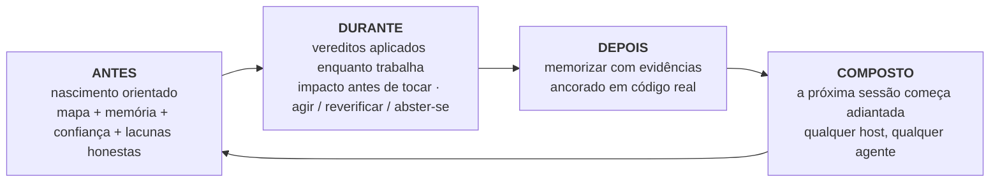

```markdown
<p align="center">
  
</p>

**m1nd** dá ao seu agente de codificação um cérebro por repositório: um gráfico de código local servido via MCP, memória ancorada ao código citado e um veredito de confiança para cada resposta. "Evidência insuficiente" é uma resposta real aqui. Assim como "não confie nisso ainda, e aqui está como corrigir".

Nada sai da sua máquina. Um binário em Rust. MIT.

Pense nisso como um raio-X do seu repositório que o agente pode ler: uma estrutura que combina tudo e diz onde cada coisa está, para que serve aquele programa, no que se está trabalhando, o que está concluído e o que ainda está em aberto. Esse panorama é algo que nenhuma outra ferramenta fornece ao seu agente.

<p align="center">
  <a href="https://www.npmjs.com/package/@maxkle1nz/m1nd"></a>
  <a href="https://crates.io/crates/m1nd-mcp"></a>
  <a href="https://github.com/maxkle1nz/m1nd/actions"></a>
  <a href="LICENSE"></a>
  <a href="https://registry.modelcontextprotocol.io/?search=io.github.maxkle1nz/m1nd"></a>
</p>

<p align="center">Quatro comandos para instalar: <a href="#sixty-seconds">Sessenta segundos</a>. Razões para fechar esta aba agora: <a href="#when-not-to-use-m1nd">Quando não usar o m1nd</a>.</p>

<p align="center">
  
</p>

<p align="center"><em>Uma sessão real no gráfico deste repositório com 6.453 nós (m1nd-mcp 1.4.0): <code>north</code> orienta, <code>seek</code> responde com um veredito <code>reverify</code>, <code>memorize</code> ancora a descoberta ao código.</em></p>

## A auditoria pela qual seu agente para de pagar

Você conhece o ritual. O agente abre um arquivo, faz grep, abre outro arquivo, faz grep novamente, gasta a maior parte do contexto reconstruindo o que é o repositório, e só então começa a tarefa real. Com o m1nd, essa varredura se torna uma única pergunta. Em menos de um segundo, o agente tem o mapa: o que chama o quê, o que quebra o quê, onde tudo está. Não é um monte de correspondências para interpretar. É a estrutura conectada, já montada.

E ele lembra. Entre sessões e entre agentes. O que um agente aprende hoje à noite, outro agente herda amanhã, com as evidências anexadas e um sinalizador caso o código tenha mudado desde então. Cada conclusão deixa um rastro, para que você, ou qualquer agente que venha depois, sempre veja o que aconteceu com aquele código e por quê.

Então o l1ght vai além: artigos, RFCs, rascunhos e notas se conectam às partes do seu código que explicam, dentro da mesma estrutura. O agente obtém o contexto CERTO em vez do mais próximo, e inventar código que não existe deixa de ser o caminho de menor resistência: a estrutura diz o que existe, e o veredito diz o quanto confiar até mesmo nisso.

Antes do m1nd, uma função era apenas uma função, perdida em algum manual. Agora ela vive dentro da inteligência do agente, combinada com o código, sua história, seus documentos e seus riscos. Eu não encontrei nada assim em nenhum outro lugar.

## grep responde boas perguntas. m1nd responde às mais profundas.

Perguntas que seu agente agora pode fazer e obter uma resposta estrutural:

- O que quebra se eu tocar nesta função?
- Onde acontece a atualização do token neste repositório?
- Por que esses dois arquivos estão conectados, e esse caminho é sólido ou uma suposição?
- O que a última sessão aprendeu sobre este código, e ainda é verdade?
- O que sempre muda junto aqui, mesmo sem nenhuma importação entre eles?
- Essa edição cruza um limite de arquitetura que não deveria cruzar?
- Qual afirmação neste artigo essa função implementa?
- O bug que acabei de corrigir está escondido em outro lugar, como um padrão?
- O que está faltando aqui que esta estrutura geralmente possui?
- Estou no repositório certo?
- Devo agir com base nesta resposta ou verificá-la primeiro?

Cada uma é um verbo na superfície MCP (`impact`, `seek`, `why`, `north`, `ghost_edges`, `xray_gate`, `antibody_scan`, `missing`, `trust_selftest`, `predict`), não um truque de prompt.

## E não para apenas em mostrar a estrutura

Anticorpos: um bug corrigido se torna um padrão estrutural nomeado, e cada sessão futura verifica se aquela forma ainda está presente no repositório. Corrija uma vez, caça para sempre.

Conexões fantasmas: arquivos que sempre mudam juntos, sem uma importação explícita entre eles, extraídos do seu histórico git. O acoplamento invisível que quebra refatorações.

Lacunas estruturais: `missing` procura pelo código que não está lá. O guardião, o retry, o timeout que esse padrão geralmente possui mas que esta instância não tem.

Hipóteses contra o gráfico: declare uma afirmação em linguagem simples ("configurações podem alcançar o boot sem validação") e teste contra a estrutura ao vivo.

Tremor: arquivos cujo ritmo de mudança está acelerando são identificados antes de qualquer relatório de bug.

Um gráfico vivo: resultados confirmados reforçam suas conexões, estilo hebbiano, para que os caminhos que provaram ser úteis tenham maior prioridade para o próximo agente.

Cada um desses recursos sinaliza e sugere; seu compilador e testes ainda fazem a prova final.

## m1nd não apenas busca. Ele escreve.

Aqui está a parte que as pessoas demoram a acreditar. O gráfico que lê seu repositório também pode operar nele. Seu agente nomeia um símbolo e um destino, cerca de 48 tokens, e `transplant` calcula toda a movimentação a partir do gráfico: a região ampliada (comentários de documentação e atributos viajam junto), dependências classificadas por suas relações de chamada (privadas viajam, compartilhadas permanecem e ganham um back-import), cada referenciador requalificado em cada arquivo que o nomeia. Em seguida, ele escreve de forma atômica, reingere e entrega um recibo honesto: o que foi movido, o que permaneceu, o que não conseguiu resolver. `refs_unresolved` nunca está silenciosamente vazio quando algo deu errado.

É um processo em duas fases, `transplant_preview` antes de `transplant_commit`, e o commit revalida o hash de cada arquivo que planejou tocar, então nada cai em um repositório que mudou enquanto isso. A zona crucial do seu repositório (backend, esquema, pagamentos, CI) é protegida no lado do servidor e falha fechada. Uma recusa nunca altera um byte e ensina a tentativa: uma colisão nomeia o ocupante, um caminho de módulo inválido se identifica, um movimento entre crates nomeia ambas as raízes dos crates.

Medido no caso real: a edição de arquivo inteiro custou 12.235 tokens de saída; o transplante custou 48 de entrada e escreveu 3 arquivos em 1,3 segundos, com o crate compilando do outro lado. rust-analyzer tem uma issue aberta pedindo movimentos entre arquivos desde 2019.

Limites da v1, explicitamente: apenas Rust, apenas `fn` de nível superior, mesmo crate, o arquivo de destino já deve existir, e referências nascidas dentro de macros são invisíveis para ele. Cada limite é deliberado e escrito em [docs/TRANSPLANT-PRD.md](docs/TRANSPLANT-PRD.md), junto de 13 arquivos de teste que validam o verbo.

## E quando não é apenas um agente, mas cinco?

Execute vários agentes no mesmo repositório e o gráfico se torna o lugar onde eles se coordenam. Cada sessão se registra como uma presença, e quando dois desses agentes estão prestes a tocar em trabalhos sobrepostos, ambos recebem um aviso no próximo pacote de orientação, antes de qualquer um registrar uma alteração. O sistema avisa; você decide.

Trabalhos delimitados funcionam como missões e as missões respondem por si mesmas de uma maneira que a maioria das equipes humanas ignora: cada ferramenta da missão relata `non_claims`, a lista do que NÃO foi provado. Uma afirmação não pode ser concluída apenas com evidências gráficas. É necessário ler um arquivo, executar um teste ou um teste em tempo de execução, e o teste que garante isto se chama `graph_only_evidence_is_not_enough`.

E os limitadores não exageram nos alertas. `xray_gate` pode dizer `blocked` apenas com base em um manifesto de limites ratificado por um humano. Todo o resto chega como um aviso com uma razão, para que o agente nunca aprenda a ignorar seus próprios limitadores de segurança.

Cada cérebro também tem uma caixa de correio. Quando um agente encontra um defeito real fora de sua própria missão, ele não o corrige imediatamente, nem ignora: ele deixa uma carta nessa caixa, no disco, ao lado do código. O próximo agente a trabalhar nesse cérebro varre a caixa e já começa o dia sabendo os defeitos que outros agentes encontraram, com o contexto anexado. O conhecimento sobre o que está quebrado deixa de morrer nas conversas do chat. A varredura é um gesto intencional (CLI ou REST, nunca dentro do loop de consulta), então as cartas informam o trabalho em vez de interrompê-lo.

## Nascido primeiro para agentes

Sem conta, sem telemetria e sem API no caminho, o que também é a razão pela qual o gráfico responde em microssegundos.

O desenvolvimento do m1nd também não é muito normal. Construí-lo significou criar todo um fluxo de trabalho onde os agentes direcionam, verificam e provam o trabalho, e a lógica do produto é voltada para a dor do agente, não para o painel de controle do humano. Quando o m1nd se comporta mal em campo, os agentes que o utilizam registram o relatório, e um bug confirmado se torna um teste vermelho antes que a correção seja aplicada. Muito poucos programas começam assim em seu design inicial. Portanto, o m1nd nasceu diferente: os verbos, as recusas e os pacotes são moldados para o leitor que realmente os usa, e você nem precisará lembrar ao modelo que a ferramenta existe. `m1nd hosts apply` instala ganchos de sessão (`SessionStart`, `agentSpawn`, `TaskStart`, por host) que injetam a orientação no momento da execução: seu agente, e todo subagente que ele dispara, já começa orientado antes que alguém digite uma palavra.

Um cérebro por repositório mantém tudo junto: um gráfico, sua própria memória, sua própria persistência, vinculado a uma raiz de repositório. Um host servido abriga muitos cérebros e roteia cada sessão para o correto; uma sessão de um repositório que não é hospedado por ele recebe uma recusa digitada em vez de respostas erradas.

## O que seu agente recebe

m1nd envolve todo o loop do agente em torno de um gráfico do seu repositório que sobrevive à sessão:


```mermaid
flowchart LR
    B["<b>ANTES</b><br/>nascimento orientado<br/>mapa + memória + confiança + lacunas honestas"]
    D["<b>DURANTE</b><br/>vereditos aplicados enquanto trabalha<br/>impacto antes de tocar · agir / reverificar / abster-se"]
    A["<b>DEPOIS</b><br/>memorizar com evidências<br/>ancorado em código real"]
    C["<b>COMPOSTO</b><br/>a próxima sessão começa adiantada<br/>qualquer host, qualquer agente"]
    B --> D --> A --> C --> B
```

A porta de entrada é um comando. `north(task)` retorna toda a orientação em um único pacote, antes de qualquer recuperação:

```jsonc
{"method":"tools/call","params":{"name":"north",
  "arguments":{"agent_id":"dev","task":"fortalecer o fluxo de validação do token JWT"}}}
```

```jsonc
{
  "binding": { "trust_mode": "full_trust", "ok": true },      // veredito antes de recuperação
  "memory": [                                                 // recuperado de uma SESSÃO ANTERIOR
    { "claim": "AuthTokenFlow", "source_agent": "authbot", "age_ms": 221, "stale": false }
  ],
  "sufficiency": { "state": "gathering", "top_score": 0.64 },
  "next_move": "Call `surgical_context` on the top focus node before editing.",
  "honest_gaps": []                                           // nada omitido neste gráfico
}
```

Enquanto o agente trabalha, `impact` mostra o raio de ação antes de uma edição ser aplicada, `why` explica uma conexão e admite quando o caminho é baseado em uma suposição, e `xray_gate` avisa antes de uma alteração atravessar um limite de arquitetura. Quando o trabalho é concluído, `memorize` registra a conclusão junto com as evidências que a respaldam. A próxima sessão começa com as conclusões da sessão anterior já em mãos, em qualquer host MCP: Claude Code, Codex, Cursor, Gemini, Zed, 22 hosts no total.

Você nunca executa nenhum desses verbos diretamente. O agente faz isso. Sua interface é um CLI de configuração simples e, depois, você continua interagindo com seu agente como sempre.

## Sessenta segundos

O pacote npm é o instalador. O runtime nativo é um binário Rust separado que o passo 1 busca como um release assinado.

```bash
# 1 · instale o runtime nativo (assinado, verificado, com rollback)
npx -y @maxkle1nz/m1nd update apply --yes

# 2 · confirme que ele está visível (exibe um veredito em JSON; "status": "ok" indica sucesso)
npx -y @maxkle1nz/m1nd doctor

# 3 · conecte seu host: configuração MCP + ganchos de sessão que tornam o m1nd ambiente
npx -y @maxkle1nz/m1nd hosts apply --host claude --project . --yes

# 4 · primeiro valor: o pacote de orientação para seu REPO, somente leitura, sem tocar na configuração do host
npx -y @maxkle1nz/m1nd agent first-minute --repo . --query "map this repo" --json
```

O primeiro passo verifica a assinatura com [`cosign`](https://docs.sigstore.dev/cosign/system_config/installation/), então instale isso antes se não estiver no seu PATH. Se preferir o registro-fonte e aceitar pular a verificação, `cargo install m1nd-mcp` também funciona. Preferência por ver antes de executar: `hosts plan` exibe tudo que `hosts apply` tocaria e não escreve nada. Ainda não há comando de desinstalação; `hosts plan` também funciona como a lista do que remover manualmente.

Os ganchos do passo 3 são o que tornam o m1nd ambiente: o pacote de orientação é injetado em cada sessão e nos spawns de subagentes, e o agente se conduz a partir daí. Instalando a partir de um agente em vez de um terminal? Há uma versão legível por máquina desta seção em [`llms-install.md`](llms-install.md).

Um release adulterado ou truncado não será aceito na sua máquina, e uma atualização ruim é revertida com um rollback: o atualizador verifica a assinatura contra a identidade exata da compilação, depois o SHA-256 e o tamanho, antes de tocar em qualquer coisa. Se a verificação falhar, ele se recusa ao invés de recorrer a um caminho não verificado. Detalhes em [docs/AGENT-PACKS.md](docs/AGENT-PACKS.md).

## Se eu desaparecer

O m1nd é MIT e não há servidor para perder. O runtime é um binário Rust já no seu disco. A memória que ele escreve é markdown em texto simples sob `agent-memory/`, legível e possível de fazer grep mesmo sem o m1nd instalado. O gráfico é derivado do seu código e é reconstruído do zero em qualquer máquina. Se este projeto terminar amanhã, você fica com os arquivos e perde a ferramenta. Isso é deliberado. É por isso que a memória é markdown e não há nuvem entre o seu agente e o próprio conhecimento.

## Por que confiar nas respostas

É por isso que criei o m1nd. Camadas de recuperação são boas em responder. Quase nenhuma delas é boa em recusar. O m1nd trata a recusa como um resultado de primeira classe:

```jsonc
// trust_selftest em um runtime desassociado. O veredito É a instrução de correção:
{
  "ok": false,
  "verdict": "needs_ingest",          // nunca um "sem resultados" genérico
  "next_action": "call_ingest",
  "recovery_playbook": {
    "steps": [ { "action": "Call ingest for the intended repository on this same binding." } ]
  }
}
```

Um acerto de `seek` carrega uma leitura de suficiência e um envelope de confiança. Quando nenhuma calibração foi medida ainda, o envelope limita seu próprio veredito a `reverify` ao invés de exagerar. O portão de `predict` é ajustado para cobertura (α=0.10); no histórico deste repositório, isso resulta em aproximadamente um terço de precisão na faixa `act`, e na maioria das vezes ele opta por abstenção, que é a saída honesta de um sinal fraco. `abstain` diz ao agente para parar. `insufficient_evidence` significa nenhuma evidência, o que é diferente de risco médio, e a API mantém os dois separados.

Dois recursos, `savings` e `resonate`, foram completamente eliminados na fase beta (handlers, tipos e arquivos de estado, todos removidos) porque retornavam um ganho para toda entrada que eu lhes dava, e uma ferramenta que nunca perde parou de medir. Esse é o padrão ao qual cada afirmação neste arquivo é submetida.

O vizinho mais próximo que conheço é o GitHub Copilot Memory (public preview, 2026): ele armazena fatos com citações de código e os verifica novamente contra a branch atual antes de usá-los. Isso é uma detecção real de obsolescência e merece crédito. Também é baseado em nuvem, binário e vive dentro do Copilot. O que ainda não encontrei em nenhum lugar é o resto do veredito: um `act` / `reverify` / `abstain` graduado com calibração por repositório, recusas tipadas que carregam um plano de correção, em um gráfico local que qualquer agente MCP pode compartilhar. Consultei as documentações públicas de Mem0, Zep, Letta, Cognee, Supermemory e Copilot Memory, em julho de 2026. Conhece algo mais próximo? Abra uma issue e eu o adicionarei aqui.

## Memória que sabe quando está obsoleta

A maioria das camadas de memória armazena texto e espera. O m1nd ancora a memória no gráfico. Quando um agente chama `memorize`, cada caminho de `evidence` de uma afirmação é resolvido para o nó real do código, para que a nota apareça sempre que o agente tocar nesse código, sem que ninguém precise lembrar que ela existe:

```jsonc
memorize({
  "agent_id": "authbot",
  "node_label": "AuthTokenFlow",
  "claims": [{
    "label": "TokenValidator",
    "text": "TokenValidator valida JWTs via HMAC. Rode chave somente via KMS.",
    "confidence": "high", "evidence": ["src/auth/token.rs"]
  }]
})
```

Porque a memória está ancorada, ela pode ser auditada contra a realidade. `cross_verify` recalcula o hash de cada arquivo citado e identifica quais afirmações ficaram desatualizadas porque seu código mudou. Afirmações carregam idade e autor, substituem afirmações mais antigas e envelhecem. Este loop está provado ao vivo de ponta a ponta neste repositório: memorize, ancore, edite o arquivo citado, veja a afirmação se sinalizar, sobreviva a uma reingestão completa, carregue automaticamente no próximo boot. Mate o processo, inicie um novo, e o primeiro `north` já carrega as afirmações da sessão anterior com a proveniência anexada.

## Um gráfico para código e conhecimento (l1ght)

l1ght é a segunda faixa do mesmo motor: documentos se tornam nós do gráfico no mesmo espaço de ativação que o código, de forma que uma consulta percorra ambos. Não é uma pasta RAG acoplada. Há 7.400 linhas de adaptadores dedicados neste repositório: Markdown, HTML, PDF, texto simples, RST e JSON, além de rotas acadêmicas para BibTeX, DOI/Crossref, artigos JATS, RFCs e patentes.

Pessoas diferentes obtêm produtos diferentes a partir da mesma faixa:

- Um pesquisador coloca uma pasta de PDFs e DOIs ao lado do código de análise e pergunta qual artigo contradiz a afirmação que esta função implementa.
- Um estudante trabalha como um único gráfico um capítulo de livro didático e o código do exercício, e o agente explica cada um em termos do outro.
- Um professor ingesta as notas do curso uma vez; o agente de cada aluno responde do mesmo corpus fundamentado, em vez de improvisar.
- Um engenheiro vincula RFCs e documentos de design às funções que os implementam; a seção do spec está a um clique do código.
- Um programador básico deixa de ter um monte de exportações de chat e notas dispersas e passa a ter memória consultada pelo agente no meio da edição.

Mesmo binário, mesmos verbos MCP, mesma camada de confiança. `seek` em um gráfico misto retorna código e documentos em uma única resposta ranqueada.

## Quando não usar o m1nd

Algumas razões honestas para fechar esta aba:

- Repositórios pequenos. Em menos de algumas centenas de arquivos, o grep já é barato e a borda do gráfico encolhe até quase nada. Uma medição independente de ferramentas de gráfico comparáveis em um repositório com cerca de 110 arquivos mostrou uma vantagem de cerca de 20 por cento. Real, mas não vale a pena rodar um runtime.
- Perguntas vagas. Um gráfico de símbolos responde "o que conecta ao quê". Não responde "por que isso parece lento". A busca agêncial é melhor para perguntas abertas.
- Verdade do compilador e do runtime. Sua LSP, testes e profiler estão certos, e o m1nd está supondo. O m1nd aponta; eles provam.
- Tarefas pequenas. Um arquivo e vinte linhas não precisam de uma ingestão. Pule isso.
- `predict` se abstém na maior parte das vezes hoje. Calibrado no histórico deste repositório, alcança cerca de um terço de precisão na faixa `act` com baixa cobertura. Abstinência é a saída honesta de um sinal fraco, e atualmente também é a maioria da saída.

O m1nd complementa o compilador, o executor de testes e suas ferramentas de segurança. Não substitui nenhum deles.

## Evidências

Tudo acima está disponível no release atual; os documentos em `docs/` marcados como PRD são intenção de design, mantidos rotulados separadamente. Cada linha está vinculada exatamente ao que foi medido. O m1nd não incentiva economias de tokens ou ROI, e isso é proposital: esses são os números menos verificáveis nessa categoria.

| Afirmativa | Resultado | Reproduza / qualificação |
|---|---|---|
| Latência de gráfico | ~1.4µs `activate`, ~0.5µs `impact` em um gráfico sintético de 1K nós | `cargo bench -p m1nd-core` no Apple silicon. Apenas ordem de magnitude, dependente de hardware. |
| Capacidades versus grep | 37/37 passam; comparativo direto 16 vitórias, 12 empates, 0 vitórias do grep | `python3 scratchpad/m1nd_battery.py ./target/release/m1nd-mcp . --suite m1nd`. Um repositório (este), casos autoelaborados. |
| Predict ajustado para cobertura | Cerca de um terço de precisão na banda `act`, com baixa cobertura (α=0.10) | Medido no histórico git deste repositório, n≈9.2k previsões mantidas. O portão se abstém na maior parte das vezes, por design. |
| Verificação de memória própria | Loop de 6 etapas provado ao vivo | memorize → anchor → flag de frescor em um arquivo editado → sobrevive a substituição → carregamento automático no boot. |
| Persistência entre boots e crashes | O portão executa o binário real via stdio ao longo de quatro boots limpos e um kill -9 | `m1nd-mcp/tests/persist_runtime_root.rs`. Reverter qualquer fix no boot o transforma em vermelho com uma mensagem nomeando a regressão. |

## Um gráfico, muitos agentes

Para um agente, o servidor stdio de [Sessenta segundos](#sixty-seconds) é tudo o que você precisa, e o agente pode chamar `ingest` diretamente em um gráfico vazio. Para trabalho real, execute um proprietário servido que mantenha o gráfico ativo e conecte cada agente a ele como uma ponte leve:

```bash
m1nd-mcp --serve --no-gui --port 1337 --runtime-dir /your/project/.m1nd
m1nd-mcp --attach auto --stdio     # cada agente: sem carregamento de gráfico, sem lease, memória compartilhada
```

O que um agente memoriza, outro recupera imediatamente, e os avisos de presença e colisão descritos acima passam por este mesmo proprietário. Ele também hospeda cérebros por repositório e renderiza a interface web. Consultas permanecem no localhost; toda ligação a endereços não loopback é recusada até que exista transporte autenticado.

Um portão importante: um proprietário servido recusa `ingest` genérico para repositórios que não hospeda. Criar um novo cérebro em um proprietário servido é um gesto governado e falha fechado por design. Para uma primeira sessão em um novo repositório, use o caminho stdio ou `m1nd agent first-minute`. Anexe ao proprietário assim que ele hospedar seu repositório. Guia completo de implantação: [docs/deployment.md](docs/deployment.md).

## Cobertura de idiomas

Extratores dedicados cobrem mais de vinte linguagens, para que um repositório poliglota não volte apenas parcialmente mapeado: Python e TypeScript a Elixir, Haskell e Zig, roteados por extensão de arquivo em `m1nd-ingest`. A tabela abaixo é a reivindicação mais restrita, provada de ponta a ponta em uma única ingestão poliglota: arestas do gráfico de chamadas mais resolução de importações entre arquivos.

| Idioma | `calls` | importações entre arquivos |
|---|:---:|:---:|
| Rust | ✅ | ✅ |
| Python | ✅ | ✅ |
| JavaScript / TypeScript | ✅ | ✅ |
| Go | ✅ | ✅ |
| Java | ✅ | ✅ |
| C / C++ | ✅ | ✅ |
| Kotlin | ✅ | ✅ |
| PHP | ✅ | ✅ |
| Scala | ✅ | ✅ |
| Ruby | ⏳ | ✅ |
| C# | ✅ | namespaces não mapeiam 1:1 com arquivos |
| Swift | ✅ | ainda não |

Importações não resolvíveis (pacotes externos, stdlib, cabeçalhos do sistema) são deixadas sem resolução em vez de serem estimadas. Tudo o mais recai em um extrator genérico com apenas conexões `contains`.

## O humano é o segundo leitor

A maioria das ferramentas de desenvolvedor é projetada primeiro para humanos e depois ganha uma API. O m1nd funciona de maneira inversa: o agente é o usuário, e os verbos são os verbos dele.

Essa escolha molda o design de formas que você pode verificar. Recusas são tipadas e trazem um plano de recuperação, porque o leitor que agirá com base nelas é uma máquina. Uma mensagem de erro que requer interpretação humana é uma falha de design aqui. O mesmo pacote de orientação que o agente lê como `north` é renderizado para você como um cartão curto na conversa e como a Árvore Viva na interface web servida (seu repositório desenhado como uma árvore navegável, com notas de memória fixadas a ela): calculado uma vez, projetado por leitor, para que a visão humana nunca se desvie da verdade.

Humanos são bem-vindos. Você é apenas o segundo leitor, e o sistema é mais honesto para ambos os leitores por causa disso.

## Como este repositório é construído

Leia o log de commits com um ceticismo saudável, depois leia isto. Sou Max. Construí o m1nd dirigindo um sistema de agentes de codificação, sob regras mais rigorosas do que a maioria das equipes humanas com as quais trabalhei:

- Toda alteração substancial começa como uma especificação enfrentada por um modelo oráculo independente antes que o código seja escrito. As objeções são registradas nos arquivos de especificação.
- Toda correção é lançada com um teste demonstrado falhando primeiro. Um teste que nunca foi vermelho não prova nada.
- O revisor nunca é o autor. Cada agente trabalha manualmente em uma árvore de trabalho isolada.
- Um portão verde é um candidato. O gesto de integração é meu, e eu respondo por cada linha.
- As leis são nomes de testes: `letter_cannot_color_the_store`, `gate_zero_cannot_land`, `graph_only_evidence_is_not_enough`.
- A árvore contém 2.462 funções de teste, e o portão completo roda em verde no Linux, macOS e Windows.

A pergunta dos céticos ("nenhum humano escreve tudo isso tão rápido") está correta. Nenhum humano faz. Um humano dirigindo um sistema de agentes vinculado à prova faz. Esta árvore é o resultado. A camada de confiança do m1nd nasceu dessa prática diária: eu precisava que meus próprios agentes parassem de confiar em respostas desatualizadas antes de conseguir lançar qualquer coisa neste ritmo.

## Arquitetura em resumo

Três crates centrais em Rust mais auxiliares: `m1nd-mcp` (o servidor MCP e superfície runtime), `m1nd-core` (o motor do gráfico: ativação disseminada, plasticidade hebbiana, adjacência CSR, arestas fantasmas derivadas do git), `m1nd-ingest` (extratores e adaptadores para código, documentos e memória). Seu agente vê 48 ferramentas por padrão em vez de 130+, o que o ajuda a escolher a correta com mais frequência e paga por uma lista menor de ferramentas em cada solicitação; toda a superfície está a uma variável de ambiente de distância (`M1ND_TOOL_TIER=full`), e a separação de camadas só reduz o menu exibido, nunca a disponibilidade.

<p align="center">
  
</p>

Detalhes estão no [wiki](https://m1nd.world/wiki/), [docs/AGENT-PACKS.md](docs/AGENT-PACKS.md), [EXAMPLES.md](EXAMPLES.md) e [CHANGELOG.md](CHANGELOG.md).

## Traduções

🇧🇷 [Português](i18n/README.pt-BR.md) · 🇪🇸 [Español](i18n/README.es.md) · 🇮🇹 [Italiano](i18n/README.it.md) · 🇫🇷 [Français](i18n/README.fr.md) · 🇩🇪 [Deutsch](i18n/README.de.md) · 🇨🇳 [中文](i18n/README.zh.md) · 🇯🇵 [日本語](i18n/README.ja.md)

As traduções seguem o texto em inglês com algum atraso. Quando discordarem, o inglês é canônico.

## Contribuindo

Contribuições são bem-vindas para extratores, adaptadores, ferramentas MCP, benchmarks, documentos e algoritmos de gráfico. Veja [CONTRIBUTING.md](CONTRIBUTING.md). Há uma sala ao vivo no [CodeRooms](https://coderooms.com/github/maxkle1nz/m1nd) se quiser conversar antes. E se você leu até aqui e quer experimentar: [quatro comandos](#sixty-seconds).

## Licença

MIT. Veja [LICENSE](LICENSE).
```
