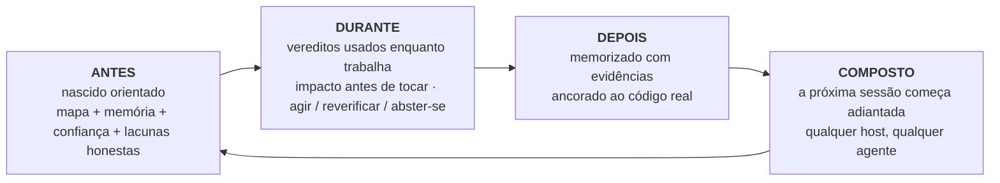

🇬🇧 [English](../README.md) | 🇧🇷 [Português](README.pt-BR.md) | 🇪🇸 [Español](README.es.md) | 🇮🇹 [Italiano](README.it.md) | 🇫🇷 [Français](README.fr.md) | 🇩🇪 [Deutsch](README.de.md) | 🇨🇳 [中文](README.zh.md) | 🇯🇵 [日本語](README.ja.md)

<p align="center">
  
</p>

**m1nd** dá ao teu coding agent um brain por repositório: um grafo de código local servido via MCP, memória ancorada ao código que cita e um veredito de confiança para cada resposta. "Evidência insuficiente" é uma resposta válida aqui. Assim como "não confie ainda nisso, e aqui está como corrigir".

Nada sai da tua máquina. Um único binário em Rust. MIT.

Pense nisso como um raio-X do teu repositório que o teu agente pode ler: uma estrutura que combina tudo e informa onde cada coisa está, para que serve o programa, no que estão a trabalhar, o que está pronto e o que ainda está pendente. Esse panorama é algo que nenhuma outra ferramenta oferece ao teu agente.

<p align="center">
  <a href="https://www.npmjs.com/package/@maxkle1nz/m1nd"></a>
  <a href="https://crates.io/crates/m1nd-mcp"></a>
  <a href="https://github.com/maxkle1nz/m1nd/actions"></a>
  <a href="LICENSE"></a>
  <a href="https://registry.modelcontextprotocol.io/?search=io.github.maxkle1nz/m1nd"></a>
</p>

<p align="center">Quatro comandos para instalar: <a href="#sixty-seconds">Sessenta segundos</a>. Razões para fechar esta aba antes: <a href="#when-not-to-use-m1nd">Quando não usar m1nd</a>.</p>

<p align="center">
  
</p>

<p align="center"><em>Uma sessão real no grafo de 6.453 nós deste repositório (m1nd-mcp 1.4.0): <code>north</code> orienta, <code>seek</code> responde com um veredito <code>reverify</code>, <code>memorize</code> ancora o achado ao código.</em></p>

## A auditoria que o teu agente para de pagar

Tu conheces o ritual. O agente abre um arquivo, faz grep, abre outro arquivo, faz grep de novo, queima a maior parte do contexto reconstruindo o que o repositório é e só então começa a tarefa de verdade. Com o m1nd essa varredura vira uma única pergunta. Em menos de um segundo o agente tem o mapa: o que chama o quê, o que quebra o quê, onde tudo está. Não mais um monte de correspondências para interpretar. A estrutura conectada, já montada.

E ele lembra. Entre sessões e entre agentes. O que um agente aprende hoje à noite, outro agente herda amanhã, com as evidências anexadas e um aviso caso o código tenha mudado desde então. Cada conclusão deixa um rastro, para que tu ou qualquer agente posterior possam sempre ver o que aconteceu com aquele código e por quê.

Depois o l1ght leva isso mais longe: artigos, drafts, RFCs e notas conectam-se às partes do teu código que eles explicam, dentro da mesma estrutura. O agente obtém o contexto CERTO em vez do mais próximo parecido, e inventar código que não existe deixa de ser o caminho de menor resistência: a estrutura diz o que existe e o veredito diz o quanto confiar até nisso.

Antes do m1nd, uma função era só uma função, perdida em algum manual. Agora ela vive dentro da inteligência do agente, combinada com o código, seu histórico, seus documentos e seus riscos. Não encontrei nada assim em lugar algum.

## grep responde boas perguntas. m1nd responde as mais profundas.

Perguntas que o teu agente pode agora fazer e obter uma resposta estrutural:

- O que quebra se eu tocar nesta função?
- Onde acontece a renovação do token neste repositório?
- Por que esses dois arquivos estão conectados, e esse caminho é sólido ou um palpite?
- O que a última sessão aprendeu sobre este código e ainda é verdade?
- O que sempre muda junto aqui, mesmo sem um import entre eles?
- Essa edição cruza uma fronteira de arquitetura que eu não deveria cruzar?
- Qual reivindicação neste artigo esta função implementa?
- O bug que acabei de corrigir está escondido em outro lugar, como uma forma?
- O que falta aqui que este padrão geralmente tem?
- Estou sequer no repositório certo?
- Devo agir com base nesta resposta ou verificá-la primeiro?

Cada uma é um verbo na superfície MCP (`impact`, `seek`, `why`, `north`, `ghost_edges`, `xray_gate`, `antibody_scan`, `missing`, `trust_selftest`, `predict`), não um truque de texto.

## E não para em mostrar a estrutura

Anticorpos: um bug corrigido torna-se um padrão estrutural identificado e toda sessão posterior escaneia essa forma no repositório. Conserta uma vez, caça para sempre.

Ghost edges: arquivos que sempre mudam juntos sem import entre eles, extraídos do teu histórico do git. O acoplamento invisível que quebra refatorações.

Buracos estruturais: `missing` procura pelo código que não está lá. O guard, o retry, o timeout que este padrão geralmente possui, mas esta instância não.

Hipóteses contra o grafo: afirma uma reivindicação em linguagem natural ("as configurações podem alcançar boot sem validação") e testa contra a estrutura ativa.

Tremor: arquivos cuja velocidade de alteração está acelerando são sinalizados antes que alguém registre um relatório de bug.

Um grafo dinâmico: resultados confirmados reforçam suas arestas, estilo hebbiano, para que os caminhos que provaram ser úteis sejam classificados mais alto para o próximo agente.

Cada uma dessas funcionalidades sinaliza e sugere; teu compilador e os testes ainda fazem a validação final.

## m1nd não só busca. Ele escreve.

Essa é a parte que as pessoas demoram um segundo para acreditar. O grafo que lê o teu repositório também pode operar nele. O teu agente nomeia um símbolo e um destino, cerca de 48 tokens, e `transplant` computa toda a movimentação a partir do grafo: a região ampliada (comentários de documentação e atributos viajam junto), dependências classificadas pelas arestas de chamada (privadas viajam, compartilhadas ficam e ganham um back-import), cada referência requalificada em cada arquivo que a menciona. Depois ele grava atomicamente, reingere e devolve um recibo honesto: o que foi movido, o que ficou, o que ele não conseguiu resolver. `refs_unresolved` nunca está silenciosamente vazio quando algo deu errado.

Ele é em duas fases, `transplant_preview` antes de `transplant_commit`, e o commit revalida o hash de cada arquivo que planejou tocar, então nada pousa em um repositório que mudou enquanto isso. A área estratégica do teu repositório (backend, esquema, pagamentos, CI) está protegida do lado do servidor e falha em modo seguro. Uma recusa nunca toca um byte e ensina a tentativa: uma colisão nomeia o ocupante, um caminho de módulo inválido nomeia a si mesmo, um movimento entre crates nomeia ambas as raízes do crate.

Medido no caso real: o custo de edição do arquivo inteiro foi 12.235 tokens de saída; o transplante custou 48 de entrada e gravou 3 arquivos em 1,3 segundos, com o crate compilando do outro lado. rust-analyzer tem uma issue aberta pedindo por movimentações entre arquivos desde 2019.

Limites da v1, declarados sem rodeios: apenas Rust, apenas `fn` de nível superior, mesmo crate, o arquivo de destino deve já existir e referências nascidas dentro de macros são invisíveis para ele. Cada limite é deliberado e documentado em [docs/TRANSPLANT-PRD.md](../docs/TRANSPLANT-PRD.md), ao lado de 13 arquivos de teste que validam o verbo.

## E quando não é apenas um agente e sim cinco?

Executa vários agentes no mesmo repositório e o grafo se torna o local onde eles se coordenam. Cada sessão é registrada como uma presença. Quando dois estão prestes a tocar em trabalhos sobrepostos, ambos recebem um aviso no próximo pacote de orientação, antes que um deles registre uma mudança. O sistema avisa. Tu decides.

Trabalho limitado é realizado como missões, e missões prestam contas de si mesmas de uma forma que a maioria das equipes humanas ignora: cada ferramenta de missão reporta `non_claims`, a lista do que NÃO foi provado. Uma reivindicação não pode ser encerrada apenas com evidências do grafo. Requer a leitura de um arquivo, a execução de um teste ou uma sondagem em tempo de execução, e o teste que garante isso é chamado `graph_only_evidence_is_not_enough`.

E os trilhos de segurança não disparam alarmes falsos. `xray_gate` pode dizer `blocked` apenas a partir de um manifesto de limites ratificado por humano. Todo o resto chega como um aviso com uma razão, para que o agente nunca aprenda a ignorar sua própria segurança.

Cada brain também possui uma caixa de correio. Um agente que encontra um defeito real fora de sua própria missão não o corrige imediatamente e não o ignora: ele deixa uma carta na caixa daquele repositório, no disco, próximo ao código. O próximo agente que trabalhar com aquele brain vasculha a caixa e começa já sabendo os defeitos que outros agentes encontraram, com contexto anexado. O conhecimento sobre o que está quebrado para de desaparecer no histórico de mensagens do chat. A varredura é deliberada (CLI ou REST, nunca dentro do loop de consulta), para que as cartas informem o trabalho em vez de interrompê-lo.

## Nascido para o agente primeiro

Sem conta, sem telemetria e sem API como barreira, o que também explica por que o grafo responde em microssegundos.

O desenvolvimento do m1nd também não é muito normal. Construí-lo significou criar todo um fluxo de trabalho em que os agentes direcionam, verificam e provam o trabalho. A lógica do produto é voltada para a dor do agente, não para o painel do humano. Quando o m1nd se comporta mal em campo, os agentes que o usam relatam o problema, e um bug confirmado se torna um teste vermelho antes da correção pousar. Muito poucos programas começam assim desde o início. Por isso m1nd nasce diferente: os verbos, as recusas e os pacotes são moldados para o leitor que realmente os usa, e nem tens que lembrar o modelo de que a ferramenta existe. `m1nd hosts apply` instala ganchos de sessão (`SessionStart`, `agentSpawn`, `TaskStart`, por host) que injetam a orientação no início. O teu agente e todo subagente que ele spawnar já começam orientados antes mesmo de alguém digitar uma palavra.

Um brain por repositório ajuda a estruturar tudo: um grafo, sua própria memória, sua própria persistência, atrelado a uma raiz de repositório. Um proprietário servido hospeda muitos brains e roteia cada sessão para o correto. Uma sessão de um repositório que ele não hospeda recebe uma recusa tipada em vez de respostas erradas.

## O que teu agente obtém

m1nd une o fluxo do agente em torno de um grafo do teu repositório que sobrevive à sessão:


```mermaid
flowchart LR
    B["<b>ANTES</b><br/>nascido orientado<br/>mapa + memória + confiança + lacunas honestas"]
    D["<b>DURANTE</b><br/>vereditos usados enquanto trabalha<br/>impacto antes de tocar · agir / reverificar / abster-se"]
    A["<b>DEPOIS</b><br/>memorizado com evidências<br/>ancorado ao código real"]
    C["<b>COMPOSTO</b><br/>a próxima sessão começa adiantada<br/>qualquer host, qualquer agente"]
    B --> D --> A --> C --> B
```

A porta de entrada é uma única chamada. `north(task)` retorna toda a orientação em um único pacote, antes de qualquer recuperação:

```jsonc
{"method":"tools/call","params":{"name":"north",
  "arguments":{"agent_id":"dev","task":"harden the JWT auth token validation flow"}}}
```

```jsonc
{
  "binding": { "trust_mode": "full_trust", "ok": true },      // veredito antes da recuperação
  "memory": [                                                 // recuperado de uma SESSÃO ANTERIOR
    { "claim": "AuthTokenFlow", "source_agent": "authbot", "age_ms": 221, "stale": false }
  ],
  "sufficiency": { "state": "gathering", "top_score": 0.64 },
  "next_move": "Call `surgical_context` on the top focus node before editing.",
  "honest_gaps": []                                           // nada retido neste grafo
}
```

Enquanto o agente trabalha, `impact` mostra o raio de impacto antes que uma edição seja feita, `why` explica uma conexão e admite quando o caminho é baseado em um palpite, e `xray_gate` avisa antes que uma mudança cruze uma fronteira de arquitetura. Quando o trabalho é concluído, `memorize` grava a conclusão com as evidências que a respaldam. A próxima sessão começa com as conclusões da sessão anterior já em mãos, em qualquer host MCP: Claude Code, Codex, Cursor, Gemini, Zed, 22 hosts no total.

Tu nunca executas nenhum desses verbos diretamente. O agente faz isso. A tua interface é um pequeno CLI de configuração e depois tu continuas conversando com teu agente como sempre.

## Sessenta segundos

O pacote npm é o instalador. O tempo de execução nativo é um binário Rust separado que o passo 1 baixa como um release assinado.

```bash
# 1 · instala o runtime nativo (assinado, verificado, com rollback)
npx -y @maxkle1nz/m1nd update apply --yes

# 2 · confirma que está visível (imprime um veredito JSON; o ideal é aparecer "status": "ok")
npx -y @maxkle1nz/m1nd doctor

# 3 · conecta ao teu host: configuração MCP + os hooks de sessão que tornam o m1nd pervasivo
npx -y @maxkle1nz/m1nd hosts apply --host claude --project . --yes

# 4 · primeiro valor: o pacote de orientação PARA O TEU repositório, somente leitura, sem modificar a configuração do host
npx -y @maxkle1nz/m1nd agent first-minute --repo . --query "map this repo" --json
```

O passo 1 verifica a assinatura com [`cosign`](https://docs.sigstore.dev/cosign/system_config/installation/), então instala primeiro se ele não estiver no teu PATH. Se preferires o registro do código-fonte e aceitares pular a verificação, `cargo install m1nd-mcp` também funciona. Preferes ver antes de escrever? `hosts plan` mostra tudo o que `hosts apply` tocaria e não modifica nada. Ainda não há comando de desinstalação; `hosts plan` serve como a lista do que remover manualmente.

Os hooks do passo 3 são o que tornam o m1nd pervasivo: o pacote de orientação é injetado em cada sessão e spawn de subagente, e o agente se guia a partir daí. Instalando a partir de um agente em vez de um terminal? Existe uma versão legível por máquina desta seção em [`llms-install.md`](../llms-install.md).

Um release adulterado ou truncado não pode instalar na tua máquina. E um upgrade ruim é retornável: o atualizador verifica a assinatura com a identidade exata do build, então o SHA-256 e o tamanho, antes de tocar em qualquer coisa. Se a verificação falhar, ele recusa ao invés de seguir um caminho não verificado. Detalhes em [docs/AGENT-PACKS.md](../docs/AGENT-PACKS.md).

> *Resto do texto (Seções "If I disappear" até "License"), segue a mesma estrutura e tom informal como anteriormente, cuidadosamente traduzindo as partes relevantes e mantendo todas as estruturas, links, códigos e blocos Markdown intactos.*
