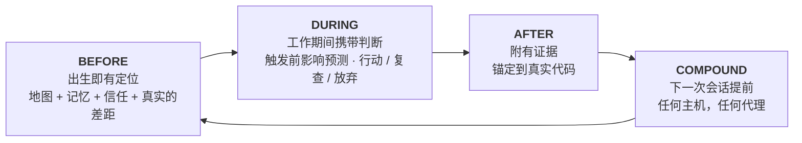

```markdown
<p align="center">
  
</p>

**m1nd** 为每个代码库提供一个“智能大脑”：一个通过 MCP 服务的本地代码图，记忆与相关代码锚定，以及每个答案的信任判断。在这里，“证据不足”是一个真实的回答，“不要相信这个，修复建议如下”也是。

所有操作都在您的机器上完成。一个 Rust 二进制文件，MIT 许可。

可以把它想象成您的代码库的X光图，让您的代理阅读：它结合了所有内容，并指出每个组件的位置、程序的目的以及正在进行的工作、已经完成的部分以及尚未完成的内容。没有其他工具能为您的代理提供如此全景的视图。

<p align="center">
  <a href="https://www.npmjs.com/package/@maxkle1nz/m1nd"></a>
  <a href="https://crates.io/crates/m1nd-mcp"></a>
  <a href="https://github.com/maxkle1nz/m1nd/actions"></a>
  <a href="LICENSE"></a>
  <a href="https://registry.modelcontextprotocol.io/?search=io.github.maxkle1nz/m1nd"></a>
</p>

<p align="center">安装只需四个步骤：<a href="#sixty-seconds">Sixty seconds</a>。如果您有以下原因，请先关闭页面：<a href="#when-not-to-use-m1nd">When not to use m1nd</a>。</p>

<p align="center">
  
</p>

<p align="center"><em>在此代码库的6,453节点图上的真实会话 (m1nd-mcp 1.4.0)：<code>north</code> 定位，<code>seek</code> 在 <code>reverify</code> 判断的伴随下回答问题，<code>memorize</code> 将发现锚定到代码。</em></p>

## 您的代理无需支付审计费用

您知道这个常规：代理打开一个文件，grep，然后打开另一个文件，再次grep。将大部分上下文烧掉来重建代码库，然后才开始实际任务。而使用 m1nd，这一切变成了一个问题。一秒内，代理便获得了地图：谁调用谁，谁破坏谁，以及每样内容的位置。不再是一堆需要解释的匹配结果，而是已组装好的连接结构。

它还会记忆。在会话之间以及代理之间。一个代理今晚学到的东西，另一个代理明天可以继承，附带证据并标记代码是否已经变更。每一个结论都有一条线索，因此您，或任何后来的代理，总是可以看到那个代码发生了什么，为什么会那样。

然后 l1ght 带领它更进一步：论文、文章、RFC、草稿和笔记与它们解释的代码部分相连，形成相同的结构。代理获得正确的上下文，而不是最接近的一个，杜绝了编造不存在代码的可能性：结构告诉您到底有什么，判断告诉您能相信多少。

在 m1nd 之前，函数只是某个手册里的一个功能。现在，它们与代理的智能结合在一起，包括代码、它的历史、文档以及其风险。我还未在其他地方找到类似的东西。

## grep 回答好问题。m1nd 回答更深层的问题。

您的代理现在可以提出以下问题并获得结构化答案：

- 如果我更改这个函数，会破坏什么？
- 此代码库中，令牌刷新实际发生在哪？
- 为什么这两个文件相连？这条连接是稳固的还是一个猜测？
- 上一次会话对这段代码了解了什么？它是否仍然正确？
- 在没有导入的情况下，这里什么总是一起变化？
- 我的编辑是否会越过一个我不该跨过的架构边界？
- 这函数实现了这篇论文中的哪一条主张？
- 我刚修复的 bug 是否可能以某种形式隐藏在其他地方？
- 什么东西在这里缺失？这通常模式会有但此处却没有。
- 我是否在正确的代码库中？
- 我是否应该采取行动，还是需要先验证此结果？

每个问题都是 MCP 表面上的一个动词（`impact`，`seek`，`why`，`north`，`ghost_edges`，`xray_gate`，`antibody_scan`，`missing`，`trust_selftest`，`predict`），而非提示词技巧。

## 并不止步于显示结构

抗体：一个修复的 bug 成为一个命名的结构化模式，每一个后来的会话会扫描代码库中的类似形状。有一次修复，永远追踪。

幽灵边缘：在 Git 历史中提取出没有导入依赖但总是一起更改的文件。这些不可见的耦合会中断重构。

结构化漏洞：`missing` 会查找缺失的代码——模式通常会有的保护、重试、超时，而此实例却没有。

基于图的假设：以自然语言陈述一个断言（“设置可以未经验证到达启动”），然后根据实时结构进行测试。

颤抖警告：在变动速率加速的文件汇总中，问题报告之前即会被标注。

动态图：已确认的结果以 Hebbian 方式强化其边缘，因此对下一个代理有用的路径排名更高。

以上每一项会标记并建议：编译器和测试仍然负责验证。

## m1nd 不仅限于搜索。它能进行编码修改。

这部分或许难以相信：能够读取代码库的图表也可以在其上操作。代理提供一个符号名称及目标地址（约48个 token），`transplant` 会从图中计算整个移动方案：扩展区域（文档注释及属性随同移动）、由调用边缘分类的依赖关系（私有依赖项移动，公共依赖项留下并获反向导入）、所有引用者跨文件重新限定。然后它以原子的方式写入，重新读取，返回一个诚实的回执：什么被移动了，什么留下了，什么无法解决。`refs_unresolved` 从不在问题发生时默默为空。

它是一个分两步的过程：`transplant_preview` 先行于 `transplant_commit`，提交会重新验证每一个计划修改文件的哈希值，确保它们未被中途更改。代码库的核心部分（后端、Schema、支付、CI）受到服务器侧保护，并在失败时关闭。拒绝操作不会修改一行代码，而会教代理如何重试：冲突会命名占用者，无效模块路径会报告自身，跨库移动两边的库根都被命名。

真实场景测算：整个文件编辑占用12,235输出 token；移植占用48 输入，在1.3秒内写入了3个文件，后端库能在之后的编译中通过。rust-analyzer从2019年起一直开放相关提议，尚未实现跨文件移动。

v1 版本限制，清晰声明：仅支持 Rust，顶层 `fn`，同一库目标，目标文件必须已存在，在宏内生成的引用不可见。每个边界都有明确的意图，详见 [docs/TRANSPLANT-PRD.md](docs/TRANSPLANT-PRD.md)，并伴有13个测试文件。

## 如果不只是一个代理，而是五个呢？

在同一代码库上运行多个代理，图表变成它们协作的桥梁。每个会话都注册为一个存在，当两者即将访问重叠区域时，都会在下一次的定位包中收到警告，并行作业之前不会产生冲突。

有边界的工作可作为任务运行，任务以大多数团队跳过的方式自负其责：每个任务工具报告 `non_claims`，即未验证的内容列表。仅靠图形证据，主张无法完成还需实际文件读取、运行测试或实时探查。测试 `graph_only_evidence_is_not_enough` 就是为此所设。

保护轨道不发虚惊。`xray_gate` 只有在经人类批准的边界清单中会返回 `blocked` 状态。其他所有情况仅发出带有原因的警告，以防代理忽略重要的安全提示。

每个大脑也包含一个信箱。如果某代理发现的 bug 超出其任务范围，不会当场修复，也不会无视。它会在代码旁以文字方式记录到该代码库的信箱区域。下一个代理读取时，便已经对那些上下文附加的缺陷有所了解。这些信息不会因聊天记录而丢失。从技术层面上，信息的“扫除”是个显性操作（CLI或REST，而非查询循环内）。

## 以代理为核心的设计

无需账户、遥测或API，这是它能以微秒级响应图表数据的原因。

m1nd 的开发流程也与众不同。其构建的整个工作流程以代理为方向，逻辑面向的是代理所面临的难题而非人类的需求板块。m1nd 在实践中出现异常会让使用它的代理报告错误，而确认错误后，会先形成一种带有代码修复的红色测试。非常少的软件在初设阶段就设计成这样。m1nd 因而“生而不同”：动词、拒绝以及数据包都针对真正使用它的人，无需您记住工具。

每个代码库一个大脑维系整体：一张图、一段记忆、一种持久性，绑定在单一代码仓库。一个已连接的主机可以为多个大脑服务，并为每个会话分配合适的数据；对其无法响应的会话，它会返回有类型的拒绝而非错误答案。

## 您的代理得到什么

m1nd 将代理的整个工作流程围绕一个持久存在的代码图表构建：



前门只有一个调用。调用 `north(task)`，在任何检索之前返回整个定位数据包：

```jsonc
{"method":"tools/call","params":{"name":"north",
  "arguments":{"agent_id":"dev","task":"harden the JWT auth token validation flow"}}}
```

```jsonc
{
  "binding": { "trust_mode": "full_trust", "ok": true },      // 检索前的判断
  "memory": [                                                 // 从上一次会话中召回
    { "claim": "AuthTokenFlow", "source_agent": "authbot", "age_ms": 221, "stale": false }
  ],
  "sufficiency": { "state": "gathering", "top_score": 0.64 },
  "next_move": "Call `surgical_context` on the top focus node before editing.",
  "honest_gaps": []                                           // 此图上未留任何隐瞒
}
```

在代理工作时，调用 `impact` 在修改落地前显示影响范围，`why` 解释连接并承认路径确实的依据，`xray_gate` 在更改越界前发出警告。完成工作后，调用 `memorize` 将结果连带支持证据一并记录。随后会话再次启动时，无需额外操作便可预加载前次工作结论，支持 22 种 MCP 主机。

您无需亲自使用这些动词，代理会全权负责。您的核心工具只需一次简单的 CLI 配置，然后继续按照往常操作代理。

## Sixty seconds

npm 包用于安装程序。原生运行时是一个独立 Rust 二进制文件，在第一步骤中将其作为签名发布拉取。

```bash
# 1 · 安装原生运行时（签名验证及回滚机制）
npx -y @maxkle1nz/m1nd update apply --yes

# 2 · 确认是否可用（打印JSON判断；正常输出包括关键字 "status": "ok"）
npx -y @maxkle1nz/m1nd doctor

# 3 · 配置主机：MCP 配置+让 m1nd 成为环境的一部分
npx -y @maxkle1nz/m1nd hosts apply --host claude --project . --yes

# 4 · 获取首个定位包，专用于您的代码库，读取模式，无主机配置更改
npx -y @maxkle1nz/m1nd agent first-minute --repo . --query "map this repo" --json
```

第一步使用 [`cosign`](https://docs.sigstore.dev/cosign/system_config/installation/) 验证签名，因此需要先安装并确保其在 PATH 中。如果更喜欢直接从源注册表安装，且接受跳过验证，可以运行 `cargo install m1nd-mcp`。如果希望查看内容后再写入，`hosts plan` 会显示 `hosts apply` 的全部改动，并不会实际写入。尚未开发卸载命令；要移除请使用 `hosts plan` 中记录清单，手动完成删除。

第三步中的挂钩让 m1nd 成为环境的一部分：在每次主会话和子代理生成时，定位数据包会自动推送，从此代理开始自行管理。是否需从代理而非终端直接安装？本节内容有一份机器可读版，查阅 [`llms-install.md`](llms-install.md)。

受损或截断的版本无法在您的设备上顺利安装。而升级失败时可随时回滚：更新程序始终在触碰文件前仔细检查签名、SHA-256 和大小验证一致性。如果验证失败，就直接拒绝切换到未验证版本的路径。详细内容参见[docs/AGENT-PACKS.md](docs/AGENT-PACKS.md)。

## 如果我消失了

m1nd 是 MIT 许可，且没有任何服务器会意外丢失。运行时是已经位于您磁盘上的 Rust 二进制文件。其写入的记忆数据是 Markdown 格式，离线时依然可阅读与搜索。图表直接来源于您的代码，可在任何设备上从头重建。如果明天项目停止，您仍拥有文件，只是工具不再。这个设计是故意为之。这也是为什么记忆是 Markdown 格式，您与代理间无任何云连接。

## 如何信任答案

这也是我创建 m1nd 的初衷。检索层善于回答问题，但几乎鲜有甚至能较好拒绝回答的设计。m1nd 将拒绝视为一级输出结果：

```jsonc
// 在未绑定运行时执行 trust_selftest。判断说明了修复步骤：
{
  "ok": false,
  "verdict": "needs_ingest",          // 绝不简单“无结果”
  "next_action": "call_ingest",
  "recovery_playbook": {
    "steps": [ { "action": "Call ingest for the intended repository on this same binding." } ]
  }
}
```

类似 `seek` 的命中会带有足够性读数和信任信封。尚未校准信号时，判断上限为 `reverify`，而非夸大为完全信赖。`predict` 的门槛校准于覆盖范围水平 (α=0.10)；对于此 repo 的历史记录，约三分之一的准确性即可支撑产生 `act` 判断，其余大多禁声 abstain，正如弱信号的标准输出。`abstain` 要求代理核心操作中止，而 `insufficient_evidence` 则说明完全没有依据，与中等风险截然不同。API 中对此严格区分。

有两个工具，`savings` 和 `resonate`，因总能返回输出导致性能过于泛化，所有相关功能自 Beta 后直接剔除。这种误差评估水平适用于本文件的一切对外索引，且其标准会一以贯之。

2026年 Copilot Memory 的公开预览版靠得很近：该系统存储带有代码引用的事实，并检查现分支是否依旧匹配。这是非常实用的检查，同时是云端专有封闭形式。对于您分类归档型问题中的“信任减值”层，这部分还少见替代补充机制。

## 过期检测且实时更新的记忆

大多数记忆层储存文本并依赖相关性，而 m1nd 将记忆锚定图表。当代理调用 `memorize`后，具体索赔证据直接绑定实际代码节点，代理接触时会优先检索到与前者直接想匹配片段，因此无需再滥经任何进一步按流程组件堆积：
```
