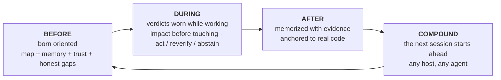

🇬🇧 [English](../README.md) | 🇧🇷 [Português](README.pt-BR.md) | 🇪🇸 [Español](README.es.md) | 🇮🇹 [Italiano](README.it.md) | 🇫🇷 [Français](README.fr.md) | 🇩🇪 [Deutsch](README.de.md) | 🇨🇳 [中文](README.zh.md) | 🇯🇵 [日本語](README.ja.md)

<p align="center">
  
</p>

**m1nd** 给你的 coding agent 提供每个代码仓库一个脑子：一个通过 MCP 服务的本地代码 grafo，与代码引用锚定的记忆，以及对每个回答的可信性裁决。"证据不足"是这里的一个真实答案，"暂时不要信任这个，这是修复的方法"也是。

数据不离开你的机器。一个 Rust 可执行文件。MIT。

将它看作你的代码仓库的 X 光片，agent 可以阅读：一个结合了所有东西的结构，说明每件事的位置，各个程序的用途，目前正在处理的任务，完成了的内容以及仍然未解决的事项。这样的全视图是其他工具无法为你的 agent 提供的。

<p align="center">
  <a href="https://www.npmjs.com/package/@maxkle1nz/m1nd"></a>
  <a href="https://crates.io/crates/m1nd-mcp"></a>
  <a href="https://github.com/maxkle1nz/m1nd/actions"></a>
  <a href="LICENSE"></a>
  <a href="https://registry.modelcontextprotocol.io/?search=io.github.maxkle1nz/m1nd"></a>
</p>

<p align="center">四个命令即可安装：<a href="#sixty-seconds">Sixty seconds</a>。先关闭标签页的理由：<a href="#when-not-to-use-m1nd">When not to use m1nd</a>。</p>

<p align="center">
  
</p>

<p align="center"><em>这个代码仓库的 6,453 节点 grafo 的实际会话 (m1nd-mcp 1.4.0)：<code>north</code> 指引方向，<code>seek</code> 通过 <code>reverify</code> 裁决进行回答，<code>memorize</code> 将发现锚定到代码。</em></p>

## 你的 agent 不再需要支付审计费用

这个流程你一定很熟悉。agent 打开一个文件，使用 grep，打开另一个文件，再次 grep，耗费了大部分上下文来重建整个代码仓库的结构，之后才开始实际任务。使用 m1nd，这一梳理变成了一个问题。不到一秒，agent 就得到了地图：什么调用了什么，什么中断了什么，每件事都在什么位置。这不仅仅是一堆匹配结果等待解析，而是已经组装好的连接结构。

它还会记住。在不同会话间，在不同 agents 间。一个 agent 今晚学到的东西，另一个 agent 明天便能继承，并且附加证据和一个标记，若代码发生了变化。每个结论都有记录，因此你或者任何其他 agent 都可以看到这段代码发生了什么以及原因。

接着 l1ght 更进一步：论文、文章、RFCs、草稿和笔记与代码中阐明其意图的部分相关联，形成同一结构。agent 获得的是正确的上下文，而不是听起来最近似的一个，上下文的现实性击败了不存在的代码发明：结构指定了实际存在的内容，而裁决还告诉你对这些信息的信任度。

在 m1nd 出现之前，一个函数只是一个函数，遗失在某些手册中。现在它成为 agent 智能的一部分，整合了代码、历史记录、文档和风险。我还没有在其他地方找到任何类似的东西。

## grep 回答好问题，m1nd 回答更深入的问题

你的 agent 现在可以询问并获得结构化答案的典型问题：

- 如果我修改这个函数，会导致什么中断？
- 在这个代码仓库中，token 刷新的具体位置在哪里？
- 为什么这两个文件连接在一起，这条路径是可靠的还是猜测？
- 上一次会话对这个代码学到了什么，现在是否仍然适用？
- 无需 import，这里哪些总是一起变化？
- 这个编辑是否跨越了我不该跨越的架构边界？
- 这篇文章中的哪一项声明由这个函数实现了？
- 我刚刚修复的 bug 是否以其他形式或图形隐藏在别的地方？
- 通常需要的模式这里是否遗漏了什么？
- 我确定自己在正确的代码仓库中吗？
- 我是否应该执行这个答案，还是需要先验证？

每个问题都是 MCP 表面上的一个动词 (`impact`、`seek`、`why`、`north`、`ghost_edges`、`xray_gate`、`antibody_scan`、`missing`、`trust_selftest`、`predict`)，而不是提示技巧。

## 不止是展示结构

抗体：修复后的 bug 变成命名结构模式，每次后续会话扫描整个代码仓库中是否匹配这种图形。一次修复，永久追踪。

幻影边：从你的 git 历史中挖掘出始终一起更改并且没有 import 的文件。不可见的耦合导致了重构失败。

结构漏洞：`missing` 寻找并标记缺失的代码。这种模式通常带有 guard、retry 或 timeout，这里却缺失了。

对 grafo 的假设：用普通语言声明 ("settings can reach boot without validation") 并在实时结构中进行测试。

震动：变更加速的文件，在 bug 报告提交前就被标记出来。

暖 grafo：确认的结果强化了边缘，遵循赫布式学习模型，从而对下一位 agent 更有帮助的路径排名更高。

所有这些只是标记和建议；你的编译器和测试仍然可以做最终证明。

## m1nd 不只是搜索。它也写入。

这里是让人难以置信的部分。可读取代码仓库的 grafo 也可以操作它。你的 agent 命名一个符号和目标，约 48 个 token，`transplant` 从 grafo 计算整个移动：扩展区域（doc 注释和属性随之移动），调用点标识其依赖项（私有的移动，共享的保留并添加反向 import），每个引用器在定义的所有文件中重新评级。然后它原子性写入，重新导入，并返回一个真实的接收报告：移动了什么，什么保留了，什么无法解析。`refs_unresolved` 遇到问题时从不会安静地返回空。

它分两步运行，`transplant_preview` 在 `transplant_commit` 之前，提交重新验证计划触及的每个文件的哈希，因此不会修改在其下发生过的代码仓库。代码仓库中的关键区域（如 backend、schema、payments、CI）受到服务器端保护，并且失败时闭合技术。拒绝不会触及代码，同时教会重试：冲突命名占用者，无效模块路径命名自己，跨 crate 移动命名两个 crate 根。

在真实案例中的测量：整个文件编辑成本 12,235 输出 token；而移植成本仅为 48 输入，并写入了三个文件，耗时 1.3 秒，其他 crate 已成功编译。rust-analyzer 自 2019 年以来提出了跨文件移动的要求问题。

v1 边界，明确陈述：仅适用于 Rust，顶级 `fn`，同一 crate，目标文件必须已存在，宏内生成的引用对它是不可见的。每个边界均经过深思熟虑并记录在 [docs/TRANSPLANT-PRD.md](../docs/TRANSPLANT-PRD.md)，以及 13 个测试文件中。

## 不只是一个 agent，而是五个？

在同一代码仓库运行多个 agent，grafo 成为它们协调的场所。每次会话都注册为一个状态，而当两者准备触及重叠工作时，二者会在下一次指向包裹中提前收到警告，避免发生改变。系统会警告；决定权交给你。

代码工作运行作为任务，任务提供独立报告，这种方式大多数团队常常忽略：每个任务工具都会报告 `non_claims`，即未被证明的列表。声明不能仅依靠 grafo 予以结束。需要文件读取、测试运行或运行时探测，执行的检测命名为 `graph_only_evidence_is_not_enough`。

防护栏不会乱报警。`xray_gate` 只能从人类批准的边界清单中说 `blocked`。其他的全部作为带有理由的警告出现，因此 agent 永远不会忽视自己的安全栏杆。

每个脑子都有一个邮箱。agent 如果发现真实缺陷但超出自身任务范围，不会立刻修复，也不会遗漏：它会把问题写成信投放到代码旁边的代码仓库邮箱中。下一个工作这种脑子的 agent 扫描邮箱，从其他 agent 找到的缺陷开始，附带上下文。关于问题的知识不再消失在聊天记录中。扫描是特定的动作（CLI 或 REST，绝不会在查询循环中），因此信件是补充而不是打断。

## 专为 agent 而生

无需账户，没有遥测，也没有碍事的 API，这也是为什么 grafo 能以微秒为单位回答。

m1nd 的开发方式也很不寻常。构建意味着建立一个完整的工作流，agent 指导、验证和证明工作，产品逻辑针对的是 agent 的痛点，而不是人的仪表盘。m1nd 在现场恶化时，使用它的 agents 会报告，确认的 bug 在修复前会转为测试。很少有程序从设计之初就是这样。所以 m1nd 从一开始就不同：动词、拒绝和包裹专为主要用户设计，不需要你提醒模型工具的存在。`m1nd hosts apply` 安装会话钩子 (`SessionStart`、`agentSpawn`、`TaskStart`，每个 host 的形式)，在生成时注入方向：你的 agent 以及它生成的每一个子 agent，都会在有人开始输入之前被指引。

每个代码仓库一个独立的脑子维护整个系统：一个 grafo，其记忆、持久性都绑定到仓库根目录。托管拥有多个脑子，并将每次会话路由到正确的地方；从未托管仓库的会话会收到拒绝而不是错误答案。

## 你的 agent 可以获得的内容

m1nd 将 agent 的整个流程围绕一个超越会话的代码仓库 grafo:



入口只要一次调用。`north(task)` 返回完整的方向包，在任何检索之前:

```jsonc
{"method":"tools/call","params":{"name":"north",
  "arguments":{"agent_id":"dev","task":"harden the JWT auth token validation flow"}}}
```

```jsonc
{
  "binding": { "trust_mode": "full_trust", "ok": true },      // verdict before retrieval
  "memory": [                                                 // recalled from a PRIOR session
    { "claim": "AuthTokenFlow", "source_agent": "authbot", "age_ms": 221, "stale": false }
  ],
  "sufficiency": { "state": "gathering", "top_score": 0.64 },
  "next_move": "Call `surgical_context` on the top focus node before editing.",
  "honest_gaps": []                                           // nothing withheld on this graph
}
```

工作过程中，`impact` 在编辑落地前显示影响范围，`why` 解释连接，并承认路径是否基于猜测，`xray_gate` 在变更跨越架构边界前发出警告。工作结束后，`memorize` 连同其支持的证据一起记录结论。下次会话从任何 MCP host 开始，就已经携带了上一次会话的结论：Claude Code、Codex、Cursor、Gemini、Zed、总涵盖 22 个 host。

你不需要亲自运行这些动词。由 agent 来操作。你的界面是一个简洁的设置 CLI，之后你还是和以前一样与 agent 对话。

## Sixty seconds

npm 包是安装器。原生运行时是单独的 Rust 可执行文件，第一步会作为签名发布来下载。

```bash
# 1 · 安装原生运行时（签名，验证，可回滚）
npx -y @maxkle1nz/m1nd update apply --yes

# 2 · 确认可见性（输出 JSON 回答；正常应类似于 "status": "ok"）
npx -y @maxkle1nz/m1nd doctor

# 3 · 配置 host：MCP 配置 + 让 m1nd 环境化的会话钩子
npx -y @maxkle1nz/m1nd hosts apply --host claude --project . --yes

# 4 · 第一次获取方向：针对你的代码仓库的方向包，纯读取，不更改 host 配置
npx -y @maxkle1nz/m1nd agent first-minute --repo . --query "map this repo" --json
```

第一步使用 [`cosign`](https://docs.sigstore.dev/cosign/system_config/installation/) 验证签名，所以如果 PATH 中没有它，请先安装。若偏爱源码注册表并接受跳过验证，`cargo install m1nd-mcp` 也可以。不喜欢写入前检查：`hosts plan` 会输出 `hosts apply` 将触及的所有内容，但不会写入。当前版本没有卸载命令；`hosts plan` 也可作为需要手动删除的列表。

步骤 3 的钩子是使 m1nd 环境化的原因：方向包会在每次会话和子 agent 生成时注入，之后 agent 自行驱动。从 agent 而不是终端安装？该部分的机器可读版本见 [`llms-install.md`](../llms-install.md)。

更改或截断的版本无法落地到你的机器，升级出问题时可以回滚：更新器会在动任何内容前进行多种验证，包括签名与构建身份、SHA-256 和文件大小。若验证失败，会直接拒绝，而不是回退到未验证路径。详细信息见 [docs/AGENT-PACKS.md](../docs/AGENT-PACKS.md)。

## 如果我消失了

m1nd 是 MIT 授权，没有服务器，所以不会丢失。运行时是已经在你磁盘上的一个 Rust 可执行文件。它写入的记忆是 `agent-memory/` 目录下的 markdown 文件，无需安装 m1nd 就可以阅读和 grep。grafo 是直接基于你的代码派生的，可以在任何机器上重新构建。如果这个项目明天终止，你仍然拥有文件，只是失去了一个工具。这是有意为之。这也是为什么参数使用 markdown 格式，并且你的 agent 与其知识之间没有云平台隔绝的原因。

## 为什么值得信任

这是我创建 m1nd 的原因。检索层善于回答问题，但几乎没有哪个善于拒绝。m1nd 将拒绝结果作为一个一级结果：

```jsonc
// 未绑定的运行时上的 trust_selftest。裁决也是修复指令:
{
  "ok": false,
  "verdict": "needs_ingest",          // 不再是单纯的 "no results"
  "next_action": "call_ingest",
  "recovery_playbook": {
    "steps": [ { "action": "Call ingest for the intended repository on this same binding." } ]
  }
}
```

一个 `seek` 命中的结果会包含充分性标记和可信度包。当尚未测量校准时，包会限制自己的裁决为 `reverify`，而不是夸大其词。`predict` 的门调整为覆盖度 (α=0.10)；基于代码仓库历史数据的结果显示，在 `act` 范围内大约三分之一的精度，且大多数时候拒绝给出答案，这是弱信号最诚实的输出。`abstain` 告诉 agent 停止。`insufficient_evidence` 意味着完全没有证据，这不同于中等风险值，两者在 API 内是分离的。

两个工具，`savings` 和 `resonate` 在 beta 时直接被删除（处理器、类型和状态文件均被移除），因为它们在给定的所有输入上都返回绝对成功，而对于一个从不失败的工具，它已经停止了对结果进行衡量。这是本文件中每一条声明必须达到的标准。

我已知的最近的邻近是 GitHub Copilot Memory (public preview, 2026): 它会存储包含代码引用的事实，并在使用之前重新检查它们是否与当前分支一致。这是实际的陈旧检测，值得赞扬。但它是在云端，二进制组件，且在 Copilot 内部运行。我没有在其他地方发现类似的裁决结果：一个包含分级 `act` / `reverify` / `abstain` 的 per-repo 校准、带有修复计划的 typed refusal、本地 grafo 可由任何 MCP agent 共享。我在 2026 年 7 月翻阅了 Mem0、Zep、Letta、Cognee、Supermemory 和 Copilot Memory 的公开文档。知道某个更接近的工具吗？开一个 Issue，我会链接在这里。

## 知道是否陈旧的记忆

大部分记忆层存储的是文本和期望。m1nd 将记忆锚定到 grafo。当 agent 调用 `memorize` 时，每个声明的 `evidence` 路径会解析到实际的代码节点，因此这些笔记会在 agent 触及这些代码时出现，无需有人记得它们存在：

```jsonc
memorize({
  "agent_id": "authbot",
  "node_label": "AuthTokenFlow",
  "claims": [{
    "label": "TokenValidator",
    "text": "TokenValidator validates JWTs via HMAC. Rotate keys via KMS only.",
    "confidence": "high", "evidence": ["src/auth/token.rs"]
  }]
})
```

因为记忆是锚定的，可以被实时验证。`cross_verify` 会重新计算所有引用文件的哈希，并指出哪些声明因代码更改而失效。声明具备年龄和作者信息，能够自动替代旧声明并逐渐过时。这一循环在本代码仓库中从头到尾获得验证：记忆转化为锚点→编辑引用文件→声明自己标记过时→取代内存时保持记录→自动加载下次重启。关闭进程，启动新进程，第一次调用 `north` 已经包含了前一次会话带有出处的声明。

## 一个 grafo 同时支持代码和知识 (l1ght)

l1ght 是同一引擎的第二跑道：文档在代码激活区变成 grafo 节点，因此单次查询同时覆盖两者。这不是一个额外的 RAG 文件夹。在此代码树中有 7,400 行专用适配器：Markdown、HTML、PDF、纯文本、RST 和 JSON，还有学术方面的路径如 BibTeX、DOI/Crossref、JATS 论文、RFC 与专利。

不同用户通过同一跑道获得不同产品：

- 研究员将一份 PDF 和 DOIs 文件夹放在分析代码旁边，询问哪个论文与代码实现了当前函数相矛盾。
- 学生将教材章节与练习代码作为同一 grafo，agent 以两者的关系进行解释。
- 老师只需要一次导入课程笔记；每个学生的 agent 从相同的已验证内容中作答而不是即兴回答。
- 工程师将 RFC 与设计文档绑定到实现它们的函数之一；规范分段就在代码旁边。
- "即兴编码者"的聊天记录和散乱笔记不再只是文件夹，而是 agent 工作中实际咨询的内存。

同样的可执行文件，同样的 MCP 动词，同样的可信度层。`seek` 在混合 grafo 上返回一次排名回答结果，包含代码与文档。

## When not to use m1nd

一些必须关闭标签页的理由：

- 小代码仓库。不到几百个文件时，grep 已经很高效，grafo 的边界优势渐趋微弱。对不到 110 个文件的代码仓库测试类似 grafo 工具，优势约为 20%。虽然真实，但启动运行时并不划算。
- 模糊问题。符号 grafo 回答 "什么连接到了什么"。它不回答 "为什么这段代码感觉慢"。agentic 搜索更适合开放式问题。
- 编译器与运行时真理。你的 LSP、单元测试与性能分析工具是完全正确的，而 m1nd 则会猜测。m1nd 提供方向，后者提供证明。
- 微小任务。一个文件与二十行代码无需重新解析。省略它。
- `predict` 今天大多数拒答。针对代码仓库自身历史进行调试时，`act` 范围内大约三分之一的精度，覆盖率较低。拒答是弱信号最诚实的输出，现在它也是多数结果。

m1nd 补充编译器、单元测试和安全工具，但不能取代它们。

## 证据

以上所述的一切都包含在最新版本中；`docs/` 文件夹中的标记为 PRD 的文件是设计意图，保持独立标记。每行论述都精确到已测量的内容。m1nd 不强调 token 节约或 ROI，这是有意为之：这些领域中的数字是最难伪造的。

| 声明 | 结果 | 复现/抵押 |
|---|---|---|
| grafo 延迟 | 在一个 1K 节点的合成 grafo 上 `activate` 大约 1.4µs，`impact` 大约 0.5µs | 在 Apple silicon 上运行 `cargo bench -p m1nd-core`。仅为量级，依赖硬件性能。 |
| grep 对比功能测试 | 37/37 全过；与 grep 直接比较 16 胜，12 平，0 负 | 对一个代码仓库运行 `python3 scratchpad/m1nd_battery.py ./target/release/m1nd-mcp . --suite m1nd`。一个仓库 (本仓库)，自建测试案例。 |
| 调整覆盖率的 `predict` | 在低覆盖率时约三分之一精度位于 `act` 区段 (α=0.10) | 基于此代码仓库的 git 历史记录进行衡量，约 9.2k 预测的保留结果。此门设计上大多数情况下拒答。 |
| 记忆自验证 | 6步流程实时验证。 | memorize → 锚点 → 被编辑文件上的更新标记 → 保持记录 → 启动自动加载。 |
| 多次启动与崩溃中的持久性 | 在四次干净启动和一次 kill -9 崩溃中通过 gate 驾驶实时程序。 | `m1nd-mcp/tests/persist_runtime_root.rs`。恢复启动修复任一部分导致错误信息命名回归显示为红色。 |

## 一个 grafo，多种 agent

对于单个 agent，[Sixty seconds](#sixty-seconds) 中提到的 stdio 服务器已经是你需要的全部解决方案，agent 可以直接在空 grafo 上调用 `ingest`。为了实际工作，运行一个以持久 grafo 为核心的托管资源，并通过共享内存将所有 agent 连接到它：

```bash
m1nd-mcp --serve --no-gui --port 1337 --runtime-dir /your/project/.m1nd
m1nd-mcp --attach auto --stdio     # 每个 agent：无需 grafo 加载，不占用租期，共享内存
```

一个 agent 记录的信息，其他 agent 会立即回忆，同时上述的存在感警告和碰撞警告将在这个所有者中运行。它亦持有 per-repo brains 并渲染 Web UI。查询保持在 localhost，直到存在认证传输之前会拒绝所有非回环绑定。`auto` 首选找到属于你自己运行时的所有者，否则找到已接触过的代码仓库的 live owners（包括来自 git 的工作树），因此单中心所有者通过其项目本身找到，而不是每个代码仓库都从空脑子开始。

有一个需要了解的 gate: 被托管的所有者会拒绝对其未托管的代码仓库的常规 `ingest` 调用。一个新脑子的创建是一个受控动作，而且从设计上完全关闭失败。针对新代码仓库初次会话，使用 stdio 或者 `m1nd agent first-minute`。一旦所有者托管了代码仓库，则可附加到它。完整部署指南：[docs/deployment.md](../docs/deployment.md)。

## 语言支持

专用提取器支持超过二十种语言，因此多语言代码仓库不会半途而废：Python 和 TypeScript，覆盖 Elixir、Haskell 和 Zig，其文件扩展名由 `m1nd-ingest` 路由。下表是更严格的声明，已在单次多语言处理代码仓库中通过端到端验证：调用 grafo 的边缘以及跨文件 import 的解析。

| 语言 | `calls` | 跨文件 imports |
|---|:---:|:---:|
| Rust | ✅ | ✅ |
| Python | ✅ | ✅ |
| JavaScript / TypeScript | ✅ | ✅ |
| Go | ✅ | ✅ |
| Java | ✅ | ✅ |
| C / C++ | ✅ | ✅ |
| Kotlin | ✅ | ✅ |
| PHP | ✅ | ✅ |
| Scala | ✅ | ✅ |
| Ruby | ⏳ | ✅ |
| C# | ✅ | 命名空间不映射到特定文件 |
| Swift | ✅ | 尚未 |

不可解析的 imports（外部库、stdlib、系统头文件）保持未解析状态而不是猜测。其他所有将回退到带有 `contains` 边缘的通用提取器。

## 人类是第二读者

大多数开发工具起初是为人类设计的，后来扩展出 API。m1nd 的路径完全相反：agent 是用户，而动词是它的动词。

这一选择塑造了设计方式，可以验证。拒答是有类型并带有修复方案，因为读取器是机器。需要人类解读的错误信息在这里是一个设计失误。同样，agent 读取方向包的 `north` 被以简短卡片形式呈现给你对话框，并在托管的 Web UI 中展示活跃的树（你的代码仓库被绘制为可导航的树，其中记忆笔记被钉住在上面）：从而计算仅完成一次，却为不同读者展现不同投影机制，因此人类视图不可能进入可用的第二真相。

人类是欢迎的。你只是第二读者，这一系统因此对两个读者都更诚实。

## 此代码仓库的构建方式

查看提交记录时，请保持审慎，然后阅读以下内容。我是 Max，我通过一套系统化 coding agent 的附加规则构建 m1nd，比我所经历的大多数人类团队更严格：

- 每次重大更改都会从明确的规范开始，与独立的 oracle 模型对峙，然后才写代码。异议记录在规范文件内部。
- 每次修复都会附带一个事先失败的测试。一个从未变红的测试并没有证明什么。
- 审查者永远不是作者。每个 agent 都在隔离的工作树内工作。
- 绿色门是候选。到最终落地之前，我需要对每一行代码负责。
- 法律是测试名称：`letter_cannot_color_the_store`、`gate_zero_cannot_land`、`graph_only_evidence_is_not_enough`。
- 树包含 2,462 个测试函数，完整门在 Linux、macOS 和 Windows 上均显示绿色。

怀疑的问题 ("没有人能这样快写这么多") 是正确的。没有人能完成。但人类指导系统化 agent 可以。这棵树就是产物。m1nd 的信任层自日常实践中诞生：我需要我的 agent 停止信任失效答案后，才能构建出这样规模与速度的产品。

## 建筑一览

三个核心 Rust crate 加上辅助: `m1nd-mcp` (MCP 服务器与运行时表层), `m1nd-core` (grafo 引擎：传播激活、赫布塑性神经网络、CSR 邻接矩阵、git 派生的幻影边缘), `m1nd-ingest` (代码、文档和记忆的提取器与适配器)。默认情况下你的 agent 会看到 48 个工具，而不是 130+，因此它更常选择正确的工具，并且对每次请求支付更少的工具清单成本；全表面只需一个环境变量 (`M1ND_TOOL_TIER=full`) 一变到位，分层仅修剪广告菜单，而非可用性层。

<p align="center">
  
</p>

深度内容参见 [wiki](https://m1nd.world/wiki/)、[docs/AGENT-PACKS.md](../docs/AGENT-PACKS.md)、[EXAMPLES.md](../EXAMPLES.md) 和 [CHANGELOG.md](../CHANGELOG.md)。

## 翻译

🇧🇷 [Português](i18n/README.pt-BR.md) · 🇪🇸 [Español](i18n/README.es.md) · 🇮🇹 [Italiano](i18n/README.it.md) · 🇫🇷 [Français](i18n/README.fr.md) · 🇩🇪 [Deutsch](i18n/README.de.md) · 🇨🇳 [中文](i18n/README.zh.md) · 🇯🇵 [日本語](i18n/README.ja.md)

翻译版本稍会落后于英文。当翻译有分歧时，英文是标准。

## 贡献

欢迎不同方向的贡献：提取器、适配器、MCP 工具、基准测试、文档和 grafo 算法。请查看 [CONTRIBUTING.md](../CONTRIBUTING.md)。若你想事先交谈，[CodeRooms](https://coderooms.com/github/maxkle1nz/m1nd) 提供了一个实时间，如果你阅读到这里并且想尝试：[四个命令](#sixty-seconds)。

## 许可证

MIT。参见 [LICENSE](../LICENSE)。
