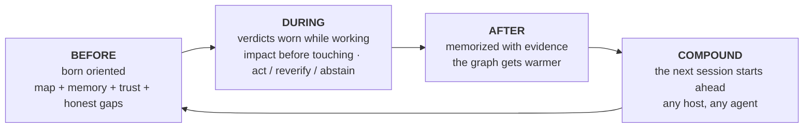

🇬🇧 [English](../README.md) | 🇧🇷 [Português](README.pt-BR.md) | 🇪🇸 [Español](README.es.md) | 🇮🇹 [Italiano](README.it.md) | 🇫🇷 [Français](README.fr.md) | 🇩🇪 [Deutsch](README.de.md) | 🇨🇳 [中文](README.zh.md) | 🇯🇵 [日本語](README.ja.md)

<p align="center">
  
</p>

<h1 align="center">面向代码智能体的操作智能</h1>

<p align="center">
  <strong>你的代码智能体不再盲目启动。</strong><br/>
  <em>本地优先。原生 MCP。为智能体宿主提供图记忆、信任机制和变更推理。</em>
</p>

<p align="center">
  <a href="https://www.npmjs.com/package/@maxkle1nz/m1nd"></a>
  <a href="https://crates.io/crates/m1nd-mcp"></a>
  <a href="https://github.com/maxkle1nz/m1nd/actions"></a>
  <a href="../LICENSE"></a>
  <a href="https://registry.modelcontextprotocol.io/?search=io.github.maxkle1nz/m1nd"></a>
  <a href="https://glama.ai/mcp/servers/maxkle1nz/m1nd"></a>
  <a href="https://docs.rs/m1nd-core"></a>
</p>

<p align="center">
  <a href="https://github.com/openai/codex"></a>
  <a href="https://claude.ai/download"></a>
  <a href="https://cursor.sh"></a>
  <a href="https://codeium.com/windsurf"></a>
  <a href="https://github.com/features/copilot"></a>
  <a href="https://zed.dev"></a>
  <a href="https://github.com/cline/cline"></a>
  <a href="https://roocode.com"></a>
  <a href="https://github.com/continuedev/continue"></a>
  <a href="https://opencode.ai"></a>
  <a href="https://aistudio.google.com"></a>
  <a href="https://aws.amazon.com/q/developer"></a>
</p>

---

**m1nd 是包裹你的代码智能体的外壳——它生活于其中的操作循环：行动之前先定向，工作之中带着诚实的裁决，完成之后留下带证据的记忆，并且跨会话复利。**

<p align="center">
  
</p>

<p align="center"><em>一次真实的会话——捕捉自一个实时的所有者（<code>m1nd-mcp 1.3.0</code>，一张覆盖本仓库的 6,453 节点图）：<code>north</code> 用信任 + 诚实的缺口为智能体做简报，<code>seek</code> 带着 <code>reverify</code> 裁决作答而非自信的猜测，<code>memorize</code> 把发现写回并锚定到代码。</em></p>

<p align="center"></p>

> grep 能找到文本。向量搜索能找到相似片段。`m1nd` 给智能体一张本地图，显示什么与什么相连、什么发生了变化、什么会崩溃、什么产生了漂移，以及从哪里恢复。

## 60 秒上手

三条命令。第一条证明 runtime 可见，第二条打印你的宿主的确切接线，第三条是你的智能体的——你再也不用手动调用它。

```bash
# 1 · 检查 runtime 是否已安装且可见（无需构建，无需配置）
npx -y @maxkle1nz/m1nd doctor
#    → 打印一个 JSON 裁决：找到 runtime + 版本，否则给出确切的修复方法
```

```bash
# 2 · 打印你的宿主的接线（claude · codex · gemini · cursor · cline · …）
npx -y @maxkle1nz/m1nd hosts plan --host claude --project .
#    → dry-run：可粘贴的 MCP 配置 JSON + session-start 钩子——不写入任何东西
```

```jsonc
// 3 · 从现在起由你的智能体来驾驶——它每个会话的第一步就是一次调用：
north({ "agent_id": "dev", "task": "harden the JWT auth token validation flow" })
//    → 一个数据包：binding 信任 · 焦点节点 + 锚点 · 先前记忆 · honest_gaps
```

准备好真正接线了吗（skills + MCP 配置，每个宿主）？→ [快速开始](#快速开始)。从智能体自安装？→ [`llms-install.md`](../llms-install.md)。

## m1nd 是什么：包裹智能体的外壳

*m1nd 用一个循环包裹你的代码智能体：行动之前为它定向，工作之中让它保持诚实，完成之后记住它学到的东西。*

- **如果你用智能体来构建** — 没有任何新东西要学：装一次，继续和你的智能体对话。它不再瞎猜、开始记忆，并在"不知道"是真话时说"不知道"。
- **如果你是工程师** — 一个本地优先的 Rust 图引擎，藏在一个 MCP 服务器之后：一张因果代码图（结构、语义、时间和因果边）、保形校准的裁决，以及带溯源、锚定在代码节点上的记忆。没有任何东西离开你的机器。

在真实代码库上工作的智能体失败，不是因为不会搜索——而是因为没有操作模型。每次会话都从头重建上下文，在不知道爆炸半径的情况下编辑，无法区分意味着"什么都不存在"的空结果和意味着"仓库错误"的空结果。m1nd 给智能体一个代码库的持久模型——一张带扩散激活和 Hebbian 可塑性的因果图——并把智能体的整个循环包在它周围。这里的功能不是一份目录；它们是这个外壳的各个站点：



**m1nd 由你的智能体来操作，而不是由你。** 下面的每个工具都由智能体自己调用——在它工作之前和之后自动进行。正常使用中人类从不运行它们；你安装一次（[快速开始](#快速开始)），然后像往常一样继续和你的智能体对话。

**一个外壳，三种读者。** 同一个定向数据包为即将行动的任何一方渲染：**主智能体**以 `north` 的形式读取它（已交付——见下方的前门）；**子智能体**将以 Delegation Packet 的形式接收它，即其孵化规格的检索半部（已设计——[docs/NEXTGEN-AGENT-PRD.md](../docs/NEXTGEN-AGENT-PRD.md)，§O.12）；**人类**将在 Living Tree 上以 Pre-Flight Card 的形式看到它——你的项目化作一棵可导航的树，贴着记忆便利贴，在编辑落地之前展示智能体验证了什么、猜测了什么（已设计，开发中——[docs/HUMAN-LAYER-PRD.md](../docs/HUMAN-LAYER-PRD.md)）。一个真相，只计算一次。

<p align="center"></p>

<p align="center">
  
</p>

### 当你发出一条消息时会发生什么

你请智能体修复某个东西。外壳围绕这条消息做的事情如下：

1. **在你的智能体行动之前**，m1nd 把项目的活地图、过去会话学到的内容、每条信息该信多少——以及它*不*知道什么——交到它手上（`north`）。
2. **在它工作时**，它佩戴着裁决：在碰代码*之前*先检查一次编辑会弄坏什么（`impact`）；在证据单薄之处，它得到一句诚实的"我不知道"，而不是一个自信的猜测（`abstain`）。
3. 它可以问两段代码为何相连，并在答案依赖猜测时被告知（`why`）；在跨越架构边界之前会被警告（`xray_gate`）。
4. **当它完成时**，决策连同支撑它的证据一起被记录下来（`memorize`）。
5. 这份记忆锚定在真实代码上——如果代码后来变了，记忆会自我标记为过期，而不是默默撒谎（`cross_verify`）。
6. **你的下一次会话开局就已知情**——任何智能体、任何工具：Claude Code、Codex、Cursor、Gemini。一个智能体学到的，下一个继承。

## BEFORE — 生来就有方向

*你的智能体每次会话开始时就已经了解你的项目——并且知道自己不知道什么。*

<p align="center"></p>

在 MCP 会话内，前门是一次调用——`north(task)` 将信任、任务上下文（focus 节点 + PageRank 锚点）、先前的跨会话记忆、一个充分性信号、一个 `next_move` 以及 `honest_gaps`（m1nd *尚不*知道的内容）整合成一个数据包，先于任何查询：

```jsonc
{"method":"tools/call","params":{"name":"north",
  "arguments":{"agent_id":"dev","task":"harden the JWT auth token validation flow"}}}
```

响应是一个定向数据包——信任裁决、上次会话留下的记忆，以及一份诚实的缺口清单。来自 `main` 二进制的一次真实捕获，略作裁剪：

```jsonc
{
  "binding": { "trust_mode": "full_trust", "ok": true },      // verdict before retrieval
  "memory": [                                                 // recalled from a PRIOR session
    { "claim": "AuthTokenFlow", "source_agent": "authbot", "age_ms": 221, "stale": false }
    // …other claims from the same authored note, trimmed…
  ],
  "sufficiency": { "state": "gathering", "top_score": 0.64,
    "why": "the strongest match left out still scores 0.30 — relevant context did not fit …" },
  "next_move": "Call `surgical_context` on the top focus node to ground the task before editing.",
  "honest_gaps": []                                           // nothing withheld on this graph
}
```

`north` 由 `trust_selftest` + `orient` + `boot_memory` + `focus` 组合而成——智能体只有在恰好只需要一件时才单独调用某个部件。`focus` 是这个站点的注意力运行时：为一个目标交付最小的、受预算约束的工作集，附带一条诚实的尾部列出它遗漏了什么，以及一个信号来判断上下文*是否已足够*。对于空图，`needs_ingest` 是一个真实的答案。

如果 `north` 报告 `needs: "needs_ingest"`，或者你使用的是 1.2.1 之前、没有 L1GHT-recall 整合的二进制，智能体会退回到显式的信任循环——在相信任何检索结果*之前*先建立信任：

```jsonc
// 0. Trust the binding in one call (verdict before retrieval)
{"method":"tools/call","params":{"name":"trust_selftest","arguments":{"agent_id":"dev"}}}

// 1. If the verdict is not full_trust, ask for the deterministic recovery path
{"method":"tools/call","params":{"name":"recovery_playbook","arguments":{"agent_id":"dev"}}}

// 2. Build graph truth
{"method":"tools/call","params":{"name":"ingest","arguments":{"path":"/your/project","agent_id":"dev"}}}

// 3. Ask a structural question — empty results say *why*, never just "no results"
{"method":"tools/call","params":{"name":"activate","arguments":{"query":"authentication flow","agent_id":"dev"}}}
```

**首次会话循环，四步完成：** `north`（或 `trust_selftest` → `ingest`）→ `seek`/`audit` → `memorize` 持久化发现，让下次会话提前起跑。

## DURING — 工作时佩戴的裁决

*在它工作时，每个答案都附带可信程度——而"我不知道"是一个真实的答案。*

<p align="center"></p>

智能体不是查询 m1nd；它把 m1nd 穿在身上。工作过程中的每个答案都是校准过的裁决，而不是感觉：

- **动手前先 `impact`**，看清你没读到的爆炸半径；`ghost_edges` 会找出那些总是一起变动但没有任何 import 关系的文件。
- **`why` 附带一个 `closure` 裁决**——`blocked` 意味着该路径依赖于一条未解析或猜测的边：在依赖这条路径之前先验证那条边。
- **`predict` 经过保形校准**——`calibrate_predict` 为每个仓库装配一道闸门；此后裁决读作 `act` / `reverify` / `abstain`，其中 `abstain` 意味着*未校准或不充分*——一个停止信号，而不是弱肯定。默认隐藏出厂：在你校准之前，裁决最高只到 `reverify`。共变更耦合采用平滑化 Jaccard 归一化，而不是原始提交计数（经校准证明 +3 个点）。*注意：*在 `ghost_edges` 加载 git 共变更矩阵之前，`predict` 仅有结构回退——需要真实共变更可能性时请先运行它。
- **`xray_gate` 守卫架构边界**——在编辑之前调用，它回答"这次变更是否跨越了被禁止的模块边界？"，给出 `clear` / `caution` / `blocked`；只有经过批准的清单才能阻止（防护栏疲劳对策）。
- **Mission Control 是证明纪律**——`mission_next` 恰好返回一个动作加 `do_not` 护栏；在 `bug_hunt` 模式下，关闭前要求一次最终的直接扫查，以便智能体检查负空间。

同样的诚实也贯穿检索。一次 `seek` 命中附带一份 `sufficiency` 读数和一个 `trust_envelope`——当信封还没有测量过任何校准行时，它会限制自己的裁决而不是夸大。一次真实捕获，略作裁剪（首个命中是上次会话撰写的一条记忆）：

```jsonc
{
  "results": [
    { "label": "AuthTokenFlow", "source_agent": "authbot", "authored_ms_ago": 101161, "score": 0.48 }
    // …code-node hits, trimmed…
  ],
  "sufficiency": { "state": "gathering", "top_score": 0.48,
    "why": "the strongest match left out still scores 0.25 — relevant context did not fit …" },
  "trust_envelope": {
    "calibrated": false,               // no calibration row measured
    "verdict": "reverify",             // …so the verdict is capped below `act`
    "next_repair_call": "trust_selftest"
  }
}
```

<p align="center"></p>

## AFTER — 图谱越来越热

*当工作落地时，所学的内容连同支撑它的证据一起被记录下来——并且在代码继续演进时保持诚实。*

<p align="center"></p>

大多数工具给智能体更好的*检索*。在这个站点，智能体**撰写持久的、机器可读的知识**，这些知识跨会话复利，并对代码保持诚实。L1GHT 将撰写的知识转化为图原生结构，当其所引用的代码发生变化时自动标记——高置信度的声明比不确定的声明传播更多激活。

1. **得出结论** — 智能体得到持久性结论（一个决策、一个经过验证的发现、代码为何如此设计），并用结构化声明和 `evidence` 路径调用 `memorize`。

```jsonc
memorize({
  "agent_id": "authbot",
  "node_label": "AuthTokenFlow",
  "claims": [
    { "label": "TokenValidator",
      "text": "TokenValidator validates JWTs via HMAC — rotate keys via KMS only",
      "confidence": "high", "evidence": ["src/auth/token.rs"] }
  ]
})
```

调用返回落地的证明——这是一条真实捕获的响应，略作裁剪：

```jsonc
{
  "ok": true,
  "claims_written": 1,
  "light_evidence_resolved": 1, "light_evidence_unresolved": 0,   // the evidence path bound to a real code node
  "path": ".../agent-memory/authtokenflow.light.md",
  "next_action": "Memory anchored to code and will auto-load next session; cross_verify(check:[\"evidence_freshness\"]) flags it if the cited code changes."
}
```

2. **锚定** — m1nd 在 `<runtime>/agent-memory/` 下写入图原生 `.light.md`，摄入它（`adapter=light mode=merge`），并通过 `grounded_in` 边将每条 `evidence` 路径解析到真实代码节点——让知识与代码处于同一激活空间，并在 `seek` / `activate` / `impact` 中浮现。
3. **自动加载** — 在每次未来会话开始时，`m1nd` 自动摄入 `agent-memory/` 并在 `session_handshake.agent_memory` 中报告。过去的发现在 `mode=replace` 摄入后依然存活，随时*就在那里*。
4. **自动标记过期** — `cross_verify(check: ["evidence_freshness"])` 对每个引用文件重新哈希，并指出哪些声明因其代码变更而过期——这样记忆会在它撒谎时告诉你，而不是误导你。记忆还带有一条溯源脊柱：声明陈述真实的年龄 + 作者、取代更旧的声明、随时间老化，并遵守一个新近度上限——被记住的知识陈述自己的新鲜度，而不是悄然过期。

这个循环已被端到端实时验证：`memorize` → `grounded_in` 边 → 编辑文件上的新鲜度标志 → 在 `mode=replace` 后存活 → 启动自动加载。关闭一个有界任务？向 `mission_close` 传入 `write_light_memory: true`，以同样方式持久化其经过验证的声明。

**COMPOUND — 下一次会话诞生在预热好的外壳里。** 杀掉那个进程，对着同一个运行时启动一个**全新的**进程，它的第一次 `north(task)` 就已携带前一次会话的声明——这是一次真实捕获的交换（上面两次调用运行在不同进程中），略作裁剪：

```jsonc
// north.memory, from a process that never called memorize itself:
"memory": [
  { "claim": "AuthTokenFlow",                   "source_agent": "authbot", "age_ms": 221, "stale": false },
  { "claim": "𝔻 evidence: src/auth/token.rs",   "source_agent": "authbot", "age_ms": 221, "stale": false },
  { "claim": "⍂ entity: TokenValidator",        "source_agent": "authbot", "age_ms": 221, "stale": false },
  { "claim": "𝔻 confidence: high",              "source_agent": "authbot", "age_ms": 221, "stale": false }
  // …the authored-note file node, trimmed…
]
```

`source_agent` 记录撰写者，`stale` 重新检查所引用的代码——下一次会话继承的是知识*连同*它的溯源，而不是一个裸字符串。

### 一张图，多个智能体

<p align="center"></p>

下面的快速开始为每个宿主连接了一个 stdio 服务器——对单个智能体来说没问题，但每个进程都加载自己的图并持有自己的租约。m1nd 为之而生的部署形态是一个所有者、多个附着的智能体。一个所有者进程持有活图：

```bash
m1nd-mcp --serve --no-gui --port 1337 --runtime-dir /your/project/.m1nd
```

随后每个智能体都作为一个轻量的 stdio↔HTTP 桥接附着——它**不**加载图、不构建引擎、也**不**持有租约：

```bash
m1nd-mcp --attach http://127.0.0.1:1337 --stdio    # or set M1ND_ATTACH_URL and omit the flag
```

任意数量的桥接都指向那一个所有者并共享其单一的活图，因此一个智能体 `memorize` 的内容，另一个能立即调回——无需重新摄入，无需每个智能体各存一份。查询走 localhost，因此它保持本地优先（除非你选择加入 `--bind 0.0.0.0`，否则 bind 保持 `127.0.0.1`）。在单台机器上的一张小图上，经桥接的热 `seek` 测得 ≈0.7ms——这是数量级参考，而非保证：附着会增加一次 localhost 往返，延迟随图规模和负载而变化。

## 材料：诚实

*整个外壳由一种材料制成——m1nd 宁愿告诉你的智能体"别信这个"，也不让它去猜。*

这是 m1nd 最无可替代的事情，没有竞争对手提供它。教义：**可信度来自诚实，而非永远获胜。** 诚实的"不"胜过自信的猜测——上面的每个站点都由这种材料构成。

- **`trust_selftest`** 在任何检索*之前*返回裁决：`full_trust`、`needs_ingest`、`wrong_workspace_binding`、`stale_binding_suspected` 或 `degraded_host_tool_surface`。智能体由此知道是继续、摄入、重新绑定还是降级。
- **`agent_runtime_contract`** 附在每个检索响应上，携带一个 `trust_mode`。空结果得到明确区分——绑定到错误仓库还是真的什么都没有——绝不会静默报告为"无结果"。
- **`trust_band: insufficient_evidence` 意味着没有证据——不是中等风险。** 这是诚实的冷启动答案，与低/中/高截然不同。
- **`non_claims` 数组** 附在每个任务工具上。m1nd 告诉智能体它*没有*证明什么。
- **`mission_verify` 可以说不——并且在经过测试的代码中确实如此。** 它拒绝纯图证据：一个声明在没有文件读取、测试运行或运行时探针的情况下无法关闭。该测试的名称字面上就是 `graph_only_evidence_is_not_enough`。
- **`recovery_playbook`** 返回一份修复绑定的确定性、有序步骤列表。

用展示说话，而非空谈。在一个未绑定的运行时上调用 `trust_selftest`，裁决本身*就是*修复指令——一次真实捕获，略作裁剪：

```jsonc
{
  "ok": false,
  "status": "blocked",
  "verdict": "needs_ingest",          // not "no results" — it says why
  "next_action": "call_ingest",
  "checks": { "graph_populated": false, "needs_ingest": true, "recovery_playbook_attached": true },
  "recovery_playbook": {
    "recovery_goal": "Populate this binding's active graph for the intended repository.",
    "steps": [ { "action": "Call ingest for the intended repository on this same binding." } /* …trimmed… */ ]
  }
}
```

对这一承诺的证明是为此牺牲的东西：`savings` 和 `resonate` 在 beta.7 中从公告的界面中撤下，因为一个总声称获胜的工具不可信。没有竞争对手——不是 mem0、Zep、Letta、Sourcegraph，也不是任何代码图 MCP——提供一个告诉智能体*不该信任什么*以及如何恢复的层。

<p align="center"></p>

**现场分诊循环闭合于自身。** 智能体留在 `~/.m1nd/field-reports.jsonl` 中的会话遥测（仅本地——m1nd 从不回传数据）并不是被动日志：报告会被分诊，一个*已确认*的现场 bug 会在修复**之前**变成一个红色的电池用例，因此该回归是被证明的，而非仅仅被描述。那个循环已经通过一次完整的现场分诊扫查端到端运行：四个现场上报的 bug 变成了失败的电池用例，随后是合并的修复，全部随 **1.2.1** 交付——`north` 现在将 L1GHT recall 整合进其记忆数据包，`temp` 图哨兵解析到一个真实的临时目录而不是弄乱工作目录，`memorize` 接受数值型 `confidence`，闭合歧义标签现在只在真正的平局时触发（狼来了效应：ambiguous-blocked 从 9/11 降到 0/11）。

## 快速开始

*装一次，接好你智能体的宿主，然后让开——从这里开始，方向盘在你的智能体手里。*

```bash
git clone https://github.com/maxkle1nz/m1nd.git && cd m1nd
npm install -g .
m1nd doctor
```

然后连接你的宿主——每个宿主使用相同的两条命令（`codex`、`claude`、`gemini`、`antigravity`、`generic`）：

| 宿主 | 安装智能体包 | 连接 MCP 配置 |
|---|---|---|
| Codex | `m1nd install-skills codex` | `m1nd mcp-config codex --project /your/project` |
| Claude Code | `m1nd install-skills claude --project /your/project` | `m1nd mcp-config claude --project /your/project` |
| Gemini | `m1nd install-skills gemini --project /your/project` | `m1nd mcp-config gemini --project /your/project` |
| Antigravity | `m1nd install-skills antigravity --project /your/project` | `m1nd mcp-config antigravity --project /your/project` |
| Generic | `m1nd install-skills generic --project /your/project` | `m1nd mcp-config generic --project /your/project` |

或通过 npm：`npm install -g @maxkle1nz/m1nd`。`install-skills` 交付的是智能体包——操作循环本身，以五个命名协议的形式，而非装饰性文档。

**操作员的界面是这个 CLI；智能体的界面是 MCP。** 人类偶尔运行 `m1nd doctor`、`install-skills`、`mcp-config`——其余一切由智能体运行。当没有可供调用 `north` 的活跃 MCP 会话（已过期、绑定到错误仓库，或尚未加载）时，存在一个宿主中立的应急出口：它会启动一个隔离的运行时、将其绑定到仓库，并返回一个机器可读的信封，完成界定范围、建立信任、按需摄入、返回锚点，并交接给直接证明：

```bash
m1nd agent first-minute --repo /your/project --query "understand this system" --json
```

需要时可固定二进制版本：`--version` 打印 `1.2.x (<sha>)`，`M1ND_EXPECTED_VERSION` / `M1ND_EXPECTED_SHA`（+ `M1ND_STRICT_VERSION`）让宿主能够检测并拒绝一个漂移的二进制文件。

完整安装指南、宿主包、原生运行时构建和更新标志：[docs/AGENT-PACKS.md](../docs/AGENT-PACKS.md) · 逐客户端配置：[集成矩阵](../docs/IDE-INTEGRATIONS.md)。

## 证据

<p align="center"></p>

每一行的对冲范围恰好是所测量的内容。m1nd 不以节省或 ROI 数字作为引导——这正是要点所在。

| 声明 | 结果 | 来源 / 对冲 |
|---|---|---|
| `activate` / `impact` 延迟 | 在 1K 节点合成图上 `activate` ~1µs，`impact` 亚微秒 | Criterion 基准——**自己复现它：`cargo bench -p m1nd-core`**（在一台 Apple 芯片 Mac 上测得 `activate_1k_nodes` ≈1.4µs，`impact_depth3` ≈0.5µs）；[方法论](https://m1nd.world/wiki/benchmarks.html)；数量级参考，取决于硬件。 |
| 语言矩阵 | 10 种语言的 calls + 跨文件 imports（+ Ruby 跨文件） | 在单次多语言摄入中端到端验证；每种语言的测试在 `m1nd-ingest` 中。见[语言覆盖](#语言覆盖)。 |
| 写后验证样本 | 12/12 分类正确 | 内部运行时检查。 |
| 种子 bug 搜寻 | 在第一轮被接受的 `humanize` 种子缺陷测试中 16/20（m1nd 训练）；`m1nd-basic` 和直接模式各 8/15 | 内部产品证据，`public_claim_worthy=false`——非通用基准。 |
| 记忆自我验证 | 端到端实时验证 | `memorize` → `grounded_in` → 编辑文件上的新鲜度标志 → 在 replace 后存活 → 启动自动加载。 |
| 能力电池 vs grep | 37/37 通过；正面交锋 16 个 m1nd 胜 / 12 个平局 / **0 个 grep 胜** | 仓库内测试框架 `scratchpad/m1nd_battery.py`（37 个用例，全新摄入 + 真值 PASS/FAIL + 与 `rg` 正面交锋）。**复现：`python3 scratchpad/m1nd_battery.py ./target/release/m1nd-mcp . --suite m1nd`。** 对冲：单个仓库（m1nd 自身）、自撰用例；约 5 个平局是结构性工具，被拿来与一个无法表达它们所回答内容的字面 grep 代理评分。 |
| 保形校准（`predict`） | act 等级 ≈32% 精确率 @ ≈13.5% 覆盖率（α=0.10） | 在 m1nd 自己的 git 历史上（n≈9.2k 个留出预测），在平滑化 Jaccard 变更后比原始计数高出 +3pts。对冲：单个仓库、一个粗糙的基于计数的信号——这道闸门如今大多选择弃权，**这是有意为之**：弃权是弱信号的诚实输出，而非失败。 |

<details>
<summary><strong>更多视觉图——完整的机制系列</strong></summary>
<br/>
<p align="center">
  
  
</p>
<p align="center">
  
  
</p>
</details>

## 局限性

`m1nd` 是对你的 LSP、编译器、测试运行器、安全扫描器和可观测性栈的补充，而非替代。它在搜索、审查或变更之前，以及在文档、影响或连续性重要时，最为有用。

在以下情况**用处较小**：

- 精确文本搜索已能回答问题
- 编译器或运行时真相是你唯一需要的
- 任务是无结构不确定性的简单本地文件操作

**需要喂数据：** `trust` 和 `tremor` 从中性先验开始，直到 `learn` 反馈 / `ghost_edges` 数据积累起来，而 `predict` 需要先加载 `ghost_edges`，其共变更信号才有意义。这些会随使用而改善；它们对启动时的无信息状态保持诚实。

## m1nd 不是什么

`m1nd` 不只是：

- 一个索引更大的代码搜索工具
- 一个只检索文件或片段的仓库 RAG 层
- 一个把工作流决策留给客户端的图数据库
- 一个替代编译器、测试或安全工具的静态分析工具
- 一个无关工具的 MCP 捆绑包
- 一个人类必须学会的工具界面——那些动词属于智能体；属于你的是那个小小的[安装 CLI](#快速开始)

它是将这些界面转化为智能体可以推理并据以行动的操作系统的那一层。不适用于单文件查找、简单 grep 或编译器真相——那些情况请用普通工具。

## 语言覆盖

图推理（`impact`、`why`、`predict`、`trace`、`taint_trace`）的好坏取决于提取器。m1nd 为每种语言解析 **`calls` 边**（调用图）和**跨文件 `imports`**（文件→文件依赖解析）。下表在单次多语言摄入中得到实时验证：

| 语言 | `calls` | 跨文件 imports |
|---|:---:|:---:|
| Rust | ✅ | ✅ (`mod`/`use crate::`) |
| Python | ✅ | ✅ |
| JavaScript / TypeScript | ✅ | ✅ |
| Go | ✅ | ✅（包） |
| Java | ✅ | ✅（FQCN + 通配符） |
| C / C++ | ✅ | ✅ (`#include "..."`) |
| Kotlin | ✅ | ✅（包） |
| PHP | ✅ | ✅（PSR-4） |
| Scala | ✅ | ✅（包） |
| Ruby | ⏳ | ✅ (`require_relative`) |
| C# | ✅ | —（命名空间不能 1:1 映射到文件） |
| Swift | ✅ | — |

所有 ✅ 行均经过端到端验证（一条 `caller`→`callee` import 可解析且调用者生成 call 边）。其他语言回退到通用提取器（仅 `contains`）。无法解析的 import（外部包、gem、标准库、系统头文件）会如实留作未解析，而不是猜测。

## 架构概览

三个核心 Rust crate 加一个辅助桥接：

- **`m1nd-mcp`** — MCP 服务器和操作运行时界面。
- **`m1nd-core`** — 图引擎：一个执行扩散激活、Hebbian 可塑性、CSR 邻接和 git 派生幽灵边的 `WavefrontEngine`。
- **`m1nd-ingest`** — 提取、路由和图构建适配器（代码、通用文档、L1GHT）。
- **`m1nd-openclaw`** — 辅助 OpenClaw 桥接（Unix socket 通道，独立版本）。

当前 crate 版本：`m1nd-core`、`m1nd-ingest`、`m1nd-mcp` 均为 `1.2.0`（`m1nd-openclaw` 独立版本化，为 `0.1.0`）。

<p align="center">
  
</p>

Live MCP 界面随版本演进——使用 `tools/list` 获取你所用构建中确切的工具数量和名称。**核心菜单：** 默认公告约 15 个工具——所有者批准的核心，加上主机绑定基线——因为六周实测流量显示：公告 141 个，实际被调用的只有 13 个。设置 `M1ND_TOOL_TIER=full` 可公告完整注册表（140+ 工具：RETROBUILDER、perspectives、federation、daemon）。没有任何东西被移除：隐藏工具仍可通过 `tools/call` 按名调用，且 `help` 在任何层级都会编目并解释整个注册表——它就是入口。逐工具目录不在这份 README 中：深入内容见[官方 wiki](https://m1nd.world/wiki/)、[docs/AGENT-PACKS.md](../docs/AGENT-PACKS.md) 和 [EXAMPLES.md](../EXAMPLES.md)，版本历史见 [CHANGELOG.md](../CHANGELOG.md)。

## 贡献

欢迎在提取器与适配器、MCP/运行时工具、基准、文档和图算法方面做出贡献。详见 [CONTRIBUTING.md](../CONTRIBUTING.md)。

## 许可证

MIT。详见 [LICENSE](../LICENSE)。
