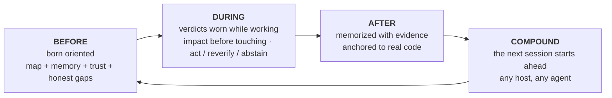

```markdown
<p align="center">
  
</p>

**m1nd** 为你的代码代理每个代码库提供一个大脑：通过 MCP 提供的本地代码图，锚定到引用代码的记忆，以及每个答案的可信度判断。在这里，“证据不足”是一个真实的答案，“暂时不可信，这是修复方法”也是。

所有操作都在本地完成，仅需一个 Rust 可执行文件。MIT 许可证。

把它想象成你的代码库的 X 光：一个综合结构，指示每个部分的位置、作用、正在处理的内容、已完成的任务以及未完成的内容。这幅全景图是其他工具无法为代理提供的。

<p align="center">
  <a href="https://www.npmjs.com/package/@maxkle1nz/m1nd"></a>
  <a href="https://crates.io/crates/m1nd-mcp"></a>
  <a href="https://github.com/maxkle1nz/m1nd/actions"></a>
  <a href="LICENSE"></a>
  <a href="https://registry.modelcontextprotocol.io/?search=io.github.maxkle1nz/m1nd"></a>
</p>

<p align="center">四步安装: <a href="#sixty-seconds">60 秒上手</a>。先关掉这个页面的原因：<a href="#when-not-to-use-m1nd">什么时候不适合使用 m1nd</a>.</p>

<p align="center">
  
</p>

<p align="center"><em>在此代码库上运行的真实会话 (m1nd-mcp 1.4.0): <code>north</code> 定位，<code>seek</code> 给予答案和 <code>reverify</code> 判断，<code>memorize</code> 将发现锚定到代码。</em></p>

## 你的代理不再需要付费的审计

你已经熟悉了这样的流程：代理打开一个文件，grep 搜索，再打开另一个文件再次 grep，花费大量上下文时间来重构这个代码库，然后才开始真正的任务。而有了 m1nd，这种搜索变成了一个问题。不到一秒钟，代理就有了完整的结构图：谁调用了谁，谁破坏了谁，所有东西的位置在哪里。不再是一大堆需要解析的信息，而是连通的已预组装结构。

它还会记忆。在会话之间以及不同代理之间。今晚一个代理学到的内容，明天另一个代理就能继承，并附加证据以及代码是否已改动的标记。每个结论都有一个轨迹，因此你或任何后来的代理始终可以了解代码发生了什么变化以及原因。

然后 l1ght 将其更进一步：论文、文章、RFC、草稿和笔记与代码的解释部分连接，这些都融合在相同的结构中。代理获取的是正确的上下文，而非最相近的上下文，凭空生成不存在的代码不再是最具吸引力的方式：结构告诉你什么已经存在，判断告诉你应该信任多少。

在 m1nd 出现之前，一个函数只是某个手册中的一个函数。现在，它已成为代理智能的一部分，与代码、历史、文档和风险结合在一起。我还没有在其他地方找到类似的东西。

## grep 回答好问题，m1nd 回答更深层次的问题

你的代理现在可以问这些问题并获得结构化的答案：

- 如果我更改这个函数，会有什么影响？
- 这个代码库中实际的 Token 刷新发生在什么地方？
- 为什么这两个文件有关联？这个关联是稳固的吗？
- 上一个会话中学到的有关此代码的内容是否仍然适用？
- 即使没有引用依赖，有哪些东西总是一起变化？
- 这个更改是否越过了架构的边界？
- 这部分代码实现了哪一篇论文中的内容？
- 我刚修复的错误是否可能以其他形态隐藏在别处？
- 这里缺少的内容通常会是什么样？
- 我是否在正确的代码库中？
- 我应该行动还是需要先验证这个答案？

每个问题都是 MCP 表面的一个动词 (`impact`, `seek`, `why`, `north`, `ghost_edges`, `xray_gate`, `antibody_scan`, `missing`, `trust_selftest`, `predict`)，而不是提示技巧。

## 它不止于展示结构

抗体：一个修复的 Bug 变成一个命名的结构模式，每次后续会话会扫描该仓库以寻找此模式。

幽灵边缘：从你的 git 历史中挖掘出总是一起变更但没有引用关系的文件。这是破坏代码重构的隐形耦合。

结构漏洞：`missing`会查找不存在的代码。这个实例缺少这个模式通常具有的守卫、重试和超时。

针对图的假设：用自然语言陈述一个声明（"settings can reach boot without validation"），并测试它在当前结构下的有效性。

震动：变更速度加速的文件在提交 Bug 报告之前就会被标记。

全图温度：已确认的结果强化了它们的边缘，赫布可塑性方式，已被证明有用的路径在下一个代理中排名更高。

以上每一个功能都会给出建议，你的编译器和测试仍然会提供最终的验证。

## m1nd 不只是搜索。它还会写代码。

最令人惊讶的是，m1nd 不只是读取代码库的图，还可以修改它。代理可以指定一个符号和目标（大约 48 个 token），`transplant` 就会根据图计算出整个迁移：扩大范围（包括文档注释和其属性），按调用边缘分类依赖关系（私有依赖随之迁移，共享的依赖留在原地并获得返回导入），重新限定所有引用者在每个提到它的文件中进行重新调整。随后原子性地写入，重新获取信息，并返回一个诚实的结果：什么东西迁移了，什么东西保留了，什么没解决的会明确显示，当发生错误时，`refs_unresolved` 从不空白无反馈。

它是一个两阶段操作，`transplant_preview` 在 `transplant_commit` 前运行，提交会重新验证每个计划修改文件的哈希值，因此不会对已更改的代码库落地任何更改。代码库的敏感区域（后端、架构、支付、CI）受到服务器端保护，并以关闭失败来终止。拒绝操作不会修改任何字节，并会引导重试时的改进：冲突会列出被占用的项目，无效的模块路径会标明自己，跨 crate 的移植会标明两个 crate 的根目录。

实际案例测试：总的文件编辑花费了 12,235 个 output token；而移植只用了 48 token 并且在 1.3 秒内修改了 3 个文件，同时 crate 编译完成。rust-analyzer 自 2019 年起在其问题跟踪器上提出的跨文件移动功能仍未实现。

如果想全面了解，请阅读[docs/TRANSPLANT-PRD.md](docs/TRANSPLANT-PRD.md)。

## 当它涉及多个代理时

如果在同一个代码库上运行多个代理，那么图就会成为它们协作的地方。系统会在它们触及重叠内容之前发出警告。运行受限的任务时，每个任务都会报告`non_claims`，即未被证实的部分（比如单独靠图无法提供证据的内容）。

每个大脑也有一个信箱。一个代理发现实际缺陷，但超出了自己任务范围时，它不会立即修复，也不会忽略，而是将其放进该代码库的信箱里。下一次使用该大脑的代理可以获取之前会话中发现的缺陷，带有具体上下文信息。

## 面向代理优化设计

无需账户，无需遥测通信，也无需中间 API。这也是图回答只需微秒的原因。

m1nd 的开发流程和工具逻辑集中解决的是代理的痛点，而非人类使用者的界面。设计从一开始就完全针对代理，从动词、拒绝行为到数据包形式都配合使用者的需求，开发中还引入 LLMs 驱动以注入方向信息。

单独的代码库有独立的大脑：一个图、它自己的记忆、持久化的数据都绑定到代码库的根目录。

## m1nd 为代理提供的功能

m1nd 将代理的整个操作流程围绕着持久化的代码库图展开：



前期引导通过`north(task)`提供：

```jsonc
{"method":"tools/call","params":{"name":"north",
  "arguments":{"agent_id":"dev","task":"harden the JWT auth token validation flow"}}}
```

```jsonc
{
  "binding": { "trust_mode": "full_trust", "ok": true },     
  "memory": [                                                 
    { "claim": "AuthTokenFlow", "source_agent": "authbot", "age_ms": 221, "stale": false }
  ],
  "sufficiency": { "state": "gathering", "top_score": 0.64 },
  "next_move": "Call `surgical_context` on the top focus node before editing.",
  "honest_gaps": []                                           
}
```

会话中，`impact`会在落地之前显示变更范围，而结束后`memorize`会保存结论及支持证据，保证下一个会话能从上一个会话的结论中获益。

---

后续部分依然是原封不动的 Markdown 结构，会保持不变。
```
