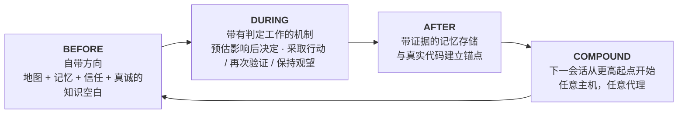

```markdown
<p align="center">
  
</p>

**m1nd** 为你的编程代理提供了每个代码仓库的“头脑”：通过 MCP 提供的本地代码图、与引用代码绑定的内存，以及针对每个回答的置信度判断。"证据不足" 也是一种真实的答案。"尚不可相信，可以通过以下方式修复" 也是同样。

所有数据都不会离开你的机器。一个 Rust 二进制文件。MIT 协议。

你可以将其视为你的项目仓库的 X 光图：一个将所有内容组合在一起并标明每个部分位置的结构，告诉你程序的用途、正在进行的内容、完成的内容以及仍未解决的问题。这种全景图是其他工具无法为你的代理提供的优势。

<p align="center">
  <a href="https://www.npmjs.com/package/@maxkle1nz/m1nd"></a>
  <a href="https://crates.io/crates/m1nd-mcp"></a>
  <a href="https://github.com/maxkle1nz/m1nd/actions"></a>
  <a href="LICENSE"></a>
  <a href="https://registry.modelcontextprotocol.io/?search=io.github.maxkle1nz/m1nd"></a>
</p>

<p align="center">安装四个命令: <a href="#sixty-seconds">六十秒完成</a>。选择先关闭此标签页的原因: <a href="#when-not-to-use-m1nd">不适合使用 m1nd 的情况</a>。</p>

<p align="center">
  
</p>

<p align="center"><em>这是基于此仓库 6,453 个节点图的真实会话 (m1nd-mcp 1.4.0): <code>north</code> 给予方向感，<code>seek</code> 提供答案，附上 <code>reverify</code> 判断，<code>memorize</code> 将发现内容锚定到代码。</em></p>

## 代理节省的审计成本

你了解这种流程。代理打开一个文件，搜索关键字，再打开另一个文件，继续搜索，浪费大部分的上下文仅仅是为了重新构建仓库是什么，然后才真正开始执行任务。有了 m1nd，这种过程只需一个问题。在不到一秒内，代理便获取了地图：代码中调用关系是什么，哪些地方会因改变而破坏，以及每个部分的位置。这不再是一堆匹配结果要解析，而是已经组装好的连接结构。

它还能记得东西。不同会话之间，乃至代理之间的信息都能被记住。今晚一个代理得出的结论，明天另一个代理就能继承，并附带证据，如果代码有什么改动还会有标记。每个结论都会留下痕迹，所以你，或者后来的任何代理，总能看到代码发生了什么以及为什么。

然后 l1ght 将其更进一步：论文、文章、RFC、草稿和笔记都与解释它们的代码部分连接在同一结构中。代理获取的是准确的上下文，而不是最相似的内容，杜撰不存在的代码不再是达到最低阻力的选择：结构显示了存在的内容，判断告诉你对其可信程度。

在 m1nd 之前，函数只是一个存在于某个手册中的函数。现在，它与代码、历史、文档和风险结合在一起，成为代理智能的一部分。我还没有在其他地方找到类似的东西。

## grep 回答好问题，m1nd 则回答更深层次的问题

你的代理现在可以提出以下问题，并获得结构化的答案：

- 如果我修改这个函数，会破坏什么？
- 令牌刷新实际发生在此仓库的哪里？
- 为什么这两个文件相连？这个连接是可靠的还是仅仅臆测的？
- 上一次会话了解到该代码的什么内容，这些内容还成立吗？
- 哪些总一起更改，即使它们之间没有任何导入关系？
- 这次修改是否越过了我不应该越界的软件架构边界？
- 此函数实现的论文中的哪个声明？
- 我刚刚修复的 bug 是否以某种形态隐藏在其他地方？
- 此处缺失的内容是什么？这种模式通常会有什么补充？
- 我在正确的仓库里吗？
- 我应该基于此答案采取行动，还是需要先验证？

每个问题都对应 MCP 界面上的一个动词 (`impact`, `seek`, `why`, `north`, `ghost_edges`, `xray_gate`, `antibody_scan`, `missing`, `trust_selftest`, `predict`)，而不是提示技巧。

## 它不仅仅展示结构

抗体：一个修复过的 bug 会变成一个命名的结构模式，后续每一个会话都会扫描整个代码库中是否存在这种模式。

幽灵边缘：根据 git 历史挖掘出总是一起更改却没有导入关系的文件。这些隐藏的耦合可能影响代码重构。

结构漏洞：`missing` 会查找不存在的代码。例如此模式通常带有的保护、重试或超时代码，而此实例却缺失它们。

针对图的假设：以平述的语言提出一个论断 ("settings can reach boot without validation")，并对其在实时结构上的可行性进行检验。

Tremor：通过监控文件的变更速率，将可能导致问题报告的部分提前标记。

有温度的图：每次确认的结果都会加强相应的边缘，从而让在过去证明有用的路径在下次代理中获得更高的排序。

以上的每个标记和建议都有指向作用；但你的编译器和测试仍负责最终的验证。

## m1nd 不仅搜索，还能修改代码

接下来是多数人需要确认的部分。m1nd 可不仅仅读取你的代码库的图表，它还能对其进行操作。代理仅需为一个符号命名目标地点，输入约 48 个 token，`transplant` 就能从图表中计算出整个移动过程：扩展的区域（doc 评论和属性将一起移动），按调用边缘对依赖分类（私有依赖会被迁移，公共依赖将保留并获得反向导入），所有引用都在命名其的文件中重新修订。之后，它会进行原子性写入、重新解析，并返回诚实的报告：哪些被移动，哪些被保留，哪些未能解析。`refs_unresolved` 在出现问题时绝不会空置。

这是一个两阶段的过程，在提交前会调用 `transplant_preview`，提交过程中会重新验证计划修改的每个文件的哈希值，所以不会使正在修改的仓库下沉到错误状态。仓库的关键区域（如后端、模式、支付、CI）在服务器端受到保护，并拒绝非法的修改操作。每次拒绝操作不会接触任何字节并能教育用户：如果发生冲突后，会指明占用者；如果模块路径无效，则会直接命名出问题点；如果发生跨 crate 的迁移，则明确指出两个 crate 的 root。

基于真实案例的测量：整个文件编辑成本 12,235 个输出 token；迁移时输入成本 48 token，用时 1.3 秒，完成后写入了 3 个文件，并且目标 rust crate 能成功编译。在 2019 年 rust-analyzer 就已经提交了一个关于跨文件迁移的功能请求，至今未解决。

v1 功能限制：仅支持 Rust、顶层 `fn`、同一个 crate，并且目标文件必须已经存在，宏内生成的引用对其当前不可见。所有边界限制均是经过深思熟虑的，并记录在 [docs/TRANSPLANT-PRD.md](docs/TRANSPLANT-PRD.md)，以及 13 个用于测试的文件。

## 不只一个代理，而是五个？

如果在同一仓库运行多个代理，则图将成为它们协同工作的地方。每次会话都作为一个存在被注册，如果两个代理即将操作重叠的工作区域，它们接下来的方向数据包中都会收到警报，在任何一方提交更改之前通知双方。系统发出警报，由你做决定。

受限工作的运行任务具有自检能力，这是大多数人类团队忽略的部分：每个工具都报告 `non_claims`（未验证内容列表）。在仅基于图证据的情况下，某些声明关闭不了，必须通过文件读取、测试运行或运行时探测来完成。相关测试被命名为 `graph_only_evidence_is_not_enough`。

并且护栏不会随便发出虚假报警。`xray_gate` 只能根据人类核准的边界清单返回 `blocked`，其他情况则只是附有理由的警告，因此代理不会学会忽略自己的安全护栏。

每个“脑袋”都有自己的信箱。一个代理如果发现了其任务范围之外的真实缺陷，它既不会立即修复，也不会忽视：它会将这些问题记录到项目的信箱中，存在于与代码相邻的磁盘文件里。下次当其他代理对接入项目时，它将能够直接读取上下文，并获悉其他代理发现的问题。关于错误的知识不再会随着聊天记录的消失而丢失。这种记录是一个较为刻意的动作（CLI 或 REST，但永远不嵌入到查询循环中），因此它会为工作提供信息，而不会中途打断它。

## 面向代理的初心

没有账户，无需遥测，也没有中间的 API。这也是为什么图案能在毫秒级内响应。

m1nd 的开发流程本身也不是很常见。构建时需要创建完全由代理驱动、验证并证明工作的整体流程，而产品的逻辑是专为解决代理的痛点设计的，而非为了人类的仪表盘。当 m1nd 在实际中出现问题时，使用它的代理会提交报告，确认的 bug 会在修复上线前转为测试用例。很少有程序在最初设计时会从这些方面开始。由此，m1nd与众不同：动词，拒绝和数据包完全专为真正的用户——即调用它的代理——而设计，你甚至无需提醒模型工具的存在。通过 `m1nd hosts apply` 命令安装的会话钩子（例如 `SessionStart`, `agentSpawn`, `TaskStart`，每个主机各一）从一开始便将方向注入：你的代理，及其可能产生的子代理，都将在任何人输入之前启动并获启导。

与代码仓库一一匹配的“脑子”将所有事物联系起来：一张完整的图，其自身的记忆，其自身的持久化，固定在单一的仓库根目录。一个“托管者”可以承载多种“脑”，将每次会话路由到正确位置；如果会话未被托管，它将拒绝请求而不是给出错误答案。

## 你的代理将得到什么

m1nd 将代理的整个循环包裹在一个远超会话寿命的仓库图中：



其入口是一个调用。`north(task)` 在进行任何检索之前，就通过一个包返回完整的方向信息：

```jsonc
{"method":"tools/call","params":{"name":"north",
  "arguments":{"agent_id":"dev","task":"加强 JWT 令牌验证流程"}}}
```

```jsonc
{
  "binding": { "trust_mode": "full_trust", "ok": true },      // 检索前的初步判定
  "memory": [                                                 // 从先前会话中回忆
    { "claim": "AuthTokenFlow", "source_agent": "authbot", "age_ms": 221, "stale": false }
  ],
  "sufficiency": { "state": "gathering", "top_score": 0.64 },
  "next_move": "在编辑之前，调用 `surgical_context` 用于聚焦最重要的节点。",
  "honest_gaps": []                                           // 此图中没有被隐瞒内容
}
```

工作过程中，`impact` 在编辑完成之前展示冲击范围，`why` 解释关联的原因并声明路径是否可靠，`xray_gate` 在越界修改架构之前发出警告。工作完成后，`memorize` 将结论连同它依据的证据记载下来。下一次会话带着上一次得到的结论开始，不论在哪个 MCP 主机上：Claude Code, Codex, Cursor, Gemini, Zed, 以及其他 22 个主机。

你永远不会自己调用这些动词。代理会帮你完成。你的界面是一个简单的 CLI 设置；其后，你只需如常与代理沟通。

## 六十秒完成

npm 包是一键安装程序。本地运行时是一个单独的 Rust 二进制文件，第 1 步会将其作为签名发布版本获取。

```bash
# 1 · 安装本地运行时 (签名、验证，并支持回滚)
npx -y @maxkle1nz/m1nd update apply --yes

# 2 · 确认其可见性 (输出 JSON 判定结果；如果显示 "status": "ok"，则成功)
npx -y @maxkle1nz/m1nd doctor

# 3 · 与宿主绑定: MCP 配置 + 使 m1nd 环境化的会话钩子
npx -y @maxkle1nz/m1nd hosts apply --host claude --project . --yes

# 4 · 第一次使用: 针对 YOUR 仓库的方向信息包，纯只读，无需更改宿主配置
npx -y @maxkle1nz/m1nd agent first-minute --repo . --query "map this repo" --json
```

第 1 步使用 [`cosign`](https://docs.sigstore.dev/cosign/system_config/installation/) 验证签名，因此若路径中没有此工具，则需先行安装。如果更倾向于使用源注册表并接受跳过验证，也可使用 `cargo install m1nd-mcp`。如果希望预览修改内容：`hosts plan` 将打印所有 `hosts apply` 会触碰到的内容，而不会进行实际写入。尚无卸载命令；`hosts plan` 可作为手动移除的参考列表。

第 3 步中的钩子是让 m1nd 实现环境化的关键步骤：在每次会话及子代理启动时注入方向数据包，其后的工作完全由代理自己驱动。从代理而非终端安装？[`llms-install.md`](llms-install.md) 提供了机器可读版本的说明。

被篡改或截断的发行版不会在你的机器上安装，出现问题还可以一键回滚：更新模块严格检查签名、大小及 SHA-256 哈希值，在验证通过之前不会触碰任何文件。详见 [docs/AGENT-PACKS.md](docs/AGENT-PACKS.md)。

## 如果我消失了

m1nd 遵循 MIT 协议，而且并没有服务器会丢失。运行时是一个已经保存在你磁盘上的 Rust 二进制文件。它写入的记忆是简单的 markdown 文件，存于 `agent-memory/` 目录下，无需安装 m1nd 就可以直接读取或搜索。图是从你的代码衍生而出的，只要在任何机器上即可重新构建。即便该项目明天停止，你仍然保有文件，只是失去了一个工具。这是经过深思熟虑的。它即为记忆使用 markdown 的原因，也是代理与知识直接交互的原因所在。

## 为什么信任这些答案

以下是我开发 m1nd 的原因之一。检索层善于回答问题，但几乎从未擅长于拒绝。m1nd 将拒绝视为一种重要的、第一类的结果：

```jsonc
// 尚未绑定运行时的 trust_selftest 检测。判定即为修复指令：
{
  "ok": false,
  "verdict": "needs_ingest",          // 从不只返回简单的 "未找到结果"
  "next_action": "call_ingest",
  "recovery_playbook": {
    "steps": [ { "action": "在当前绑定的运行时调用 ingest 以加载目标仓库。" } ]
  }
}
```

一个 `seek` 命中会带有完整性读取和信任包裹。当尚未测量到校准时，该包裹将自我判定为 `reverify`，以避免过度声称。`predict` 的门槛针对覆盖率进行了调整（α=0.10）；在本仓库的历史中，约三分之一的命中率位于 `act` 分类中，大部分时间保持观望，这是弱信号的诚实输出。`abstain` 表示代理应停止。`insufficient_evidence` 表示完全没有可用证据，与中等风险是截然不同的，而 API 能清楚分辨两者。

两个工具，`savings` 和 `resonate`，已在测试阶段彻底移除（包括处理程序、类型和状态文件），因为在所有输入情况下它们始终显示 "胜利"。一个从不失败的工具实际上已经停止了度量。这也是本文件中的每项声明所需要达到的最低门槛。

我所知的最近的类似工具是 GitHub Copilot Memory（公开预览，2026 年）：它存储附带代码引用的事实，并在使用前重新检查这些内容是否与当前代码分支相符。那是可靠的陈旧性检测，当之无愧值得称赞。但它也存在于云端、是二进制格式、且内嵌于 Copilot。我仍未找到任何其他提供完整判定（ `act` / `reverify` / `abstain` 的分级判断、携带修复计划的拒绝类型、多代理可共享的本地图）工具，截至 2026 年 7 月，已核查 Mem0, Zep, Letta, Cognee, Supermemory 和 Copilot Memory 的公共文档。如果你了解更接近的产品，请提交 issue，我将将链接更新到这里。

## 具有时效性的记忆

大部分记忆层都仅存储文本并寄希望它生效。m1nd 将记忆锚定到图，它在 `memorize` 调用时会将每个声明的 `evidence` 路径解析为实际代码节点，因此无论何时代理触及到该代码，它总会自动显示该记忆，而无须额外记住它的存在：

```jsonc
memorize({
  "agent_id": "authbot",
  "node_label": "AuthTokenFlow",
  "claims": [{
    "label": "TokenValidator",
    "text": "TokenValidator 验证 JWT 令牌通过 HMAC。请仅通过 KMS 轮换密钥。",
    "confidence": "high", "evidence": ["src/auth/token.rs"]
  }]
})
```

由于记忆已锚定，因此它可以根据实际进行审核。`cross_verify` 会重新对每个引用的文件进行哈希并标明哪些声明由于代码变更而过期。声明会携带时间戳和作者信息，取代旧声明并自动更新。这一个环已在项目中得到端到端实证：记忆、锚点、编辑引用文件、过时标记、完全重解析后仍能生效、下次启动时自动加载。终止进程并重启后，第一次调用 `north` 已包含早先会话的声明及其出处信息。

## 一个代码与知识的图 (l1ght)

l1ght 是这个引擎的第二条赛道：文档也成为相同激活空间内的图节点，因此一次查询就能同时穿越代码和文档。它不是附加式的 RAG 文件夹。这段代码树中有 7,400 行专门的适配器：Markdown, HTML, PDF, 纯文本, RST 和 JSON，以及针对 BibTeX, DOI/Crossref, JATS 论文, RFC 和专利的学术路径。

不同的人从相同赛道中获取了不同产品：

- 一位研究员能将一组 PDF 和 DOI 放到分析代码旁边，并询问是哪篇论文通过某函数与研究结论相悖。
- 一位学生将教科书章节和练习代码连接为一个图表，代理解释它们之间的关系。
- 一位讲师仅需导入一次课程笔记；每位学生的代理就能从相同的基础内容出发回答问题，而不是即兴创作。
- 一位工程师绑定 RFC 和设计文档到实现它们的实际函数；规范部分的内容与代码只有一步之遥。
- 一位迷恋自由编码的人将随机堆叠的聊天记录和分散笔记从文件夹中变为代理在实际编辑中确实会查询的记忆。

同一二进制文件，同一 MCP 动词，同一信任层。在混合图上调用 `seek` 会在一个排名结果中返回代码和文档。

## 不适合使用 m1nd 的情况

以下是一些值得你选择直接关闭此标签页的诚实理由：

- 小型仓库。文件小于几百个的仓库，grep 本身已经足够高效，图的优势边际越来越小。对一个约 110 文件规模的仓库进行独立测量后，类似工具的优势约为 20 百分点。显然有帮助，但不足以 justify 为此运行一个运行时系统。
- 模糊问题。一个符号图回答的是 "谁与谁相关"，而非回答"为何速度慢"。更灵活的搜索工具对于开放问题表现更优。
- 编译器和运行时的真实数据。LSP、测试和性能分析工具的结果是绝对可信的，而 m1nd 的结论只是猜测。m1nd 提供指引，它们才是最终的证明。
- 极小的任务。仅涉及一个文件约二十行的任务无需使用导入功能，直接跳过。
- `predict` 现阶段主要保持观望。通过校准本项目的历史结果，它在 `act` 分类下的精确率约为三分之一，覆盖率偏低。观望是弱信号的诚实输出；目前它占据了绝大部分的结果。

m1nd 是对编译器、测试运行器和安全工具的补充，而不是替代品。

## 证据

以上所有内容均在当前版本中实现；`docs/` 下标记为 PRD 的文档为设计意图，并以特定标签方式与其他内容分隔存放。每条声明都通过测量加以保留约束。m1nd 的首次展示未主打 token 节省或 ROI，这是刻意的选择：这些数字在该领域内是最容易摆脱证据压力的。

| 声明 | 结果 | 可复现 / 限制条件 |
|---|---|---|
| 图计算延迟 | ~1.4µs `activate`, ~0.5µs `impact` 在一个 1K 节点合成图上 | `cargo bench -p m1nd-core` (苹果芯片，仅表示数量级，实际依赖硬件性能)。 |
| 功能集合 vs grep | 37/37 通过测试；正面对比下 16 场胜出，12 次平局，grep 无胜出 | `python3 scratchpad/m1nd_battery.py ./target/release/m1nd-mcp . --suite m1nd`。一个代码仓 (本仓库)，作者独立案例。 |
| 调优覆盖率的 `predict` | 大约三分之一的精准度 (act 分布)，低覆盖率下表现 (α=0.10) | 基于本代码历史进行测量，n≈9.2k 独立 held-out 预测结果。判定门主要保持观望，刻意调整结果。 |
| 记忆自验证回路 | 6 步的生命周期内确保运行合格 | 记忆 → 锚点 → 编辑引用文件 → 过时标记 → 替换后生效 → 启动自动加载。|
| 在崩溃或断电后的持久性能 | gate 会通过 stdio 下的微服务模拟 N 轮穿越 clean 启动启动或者直接 kill 杀进程强制跑完 | 程序自测位于：`m1nd-mcp/tests/persist_runtime_root.rs`。通过 revert 模仿恢复重回车红线。 |

## 一个维系不同代理共识的平台

对单个代理来说，参考 [六十秒章节](#sixty-seconds)，通信终端即上述标准 stdio 表路结果+ MPC #初始化流`。
